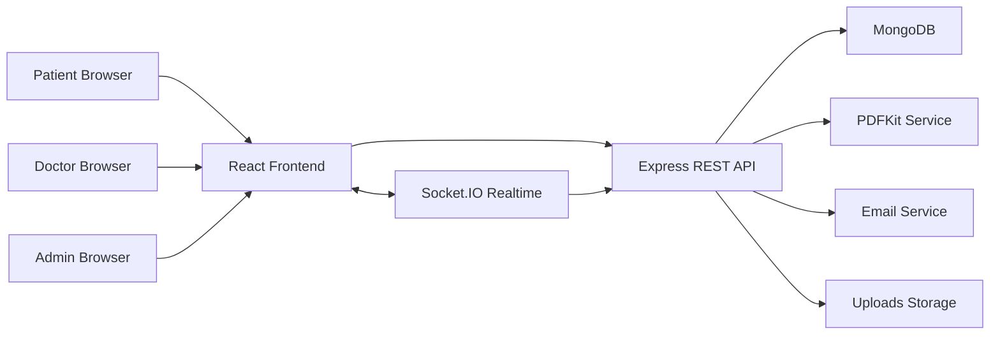
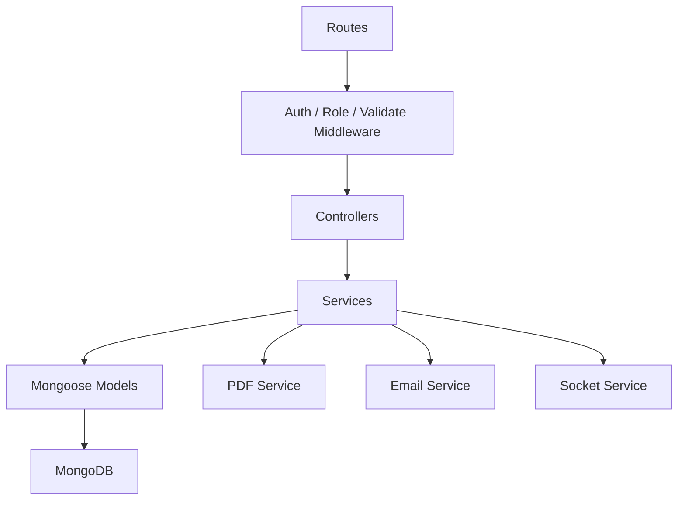
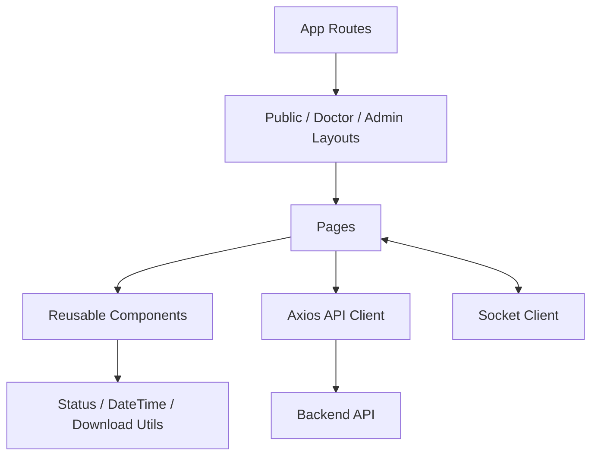

# 01 - Architecture

## Tong quan

Clinic Booking la he thong dat lich kham truc tuyen gom 3 cong thong tin:

- Patient Portal: dat lich, quan ly lich hen, ho so kham, tai PDF, danh gia bac si.
- Doctor Portal: dashboard van hanh, hang doi kham, xu ly lich hen, tao ho so kham, quan ly lich lam viec.
- Admin Portal: quan tri co so, chuyen khoa, bac si, lich hen, goi kham, bai viet, audit log.

## Technology Stack

Frontend:

- React 19
- React Router
- TanStack React Query
- Axios
- Socket.IO Client
- Recharts
- Vite

Backend:

- Node.js
- Express
- Mongoose
- MongoDB
- Socket.IO
- PDFKit
- Nodemailer
- JWT Authentication

## System Context

## Backend Layers

## Frontend Layers

## Security Model

- JWT dung cho xac thuc API.
- `ProtectedRoute` bao ve route frontend theo role.
- Backend middleware `authMiddleware` va `roleMiddleware` bao ve endpoint.
- Doctor chi xu ly lich hen thuoc bac si do.
- Patient chi xem lich hen, ho so, PDF cua chinh minh.
- Admin co quyen quan tri va xem audit log.

## Realtime Model

- Socket.IO phat notification theo user hoac role.
- Cac thay doi lich hen, huy lich, doi lich, ho so kham co the cap nhat UI thong qua notification/status refresh.

## PDF Model

PDF duoc render o backend bang PDFKit:

- Appointment confirmation document.
- Queue ticket.
- Medical record result PDF.

Frontend tai PDF qua API va lay filename tu `Content-Disposition`.
