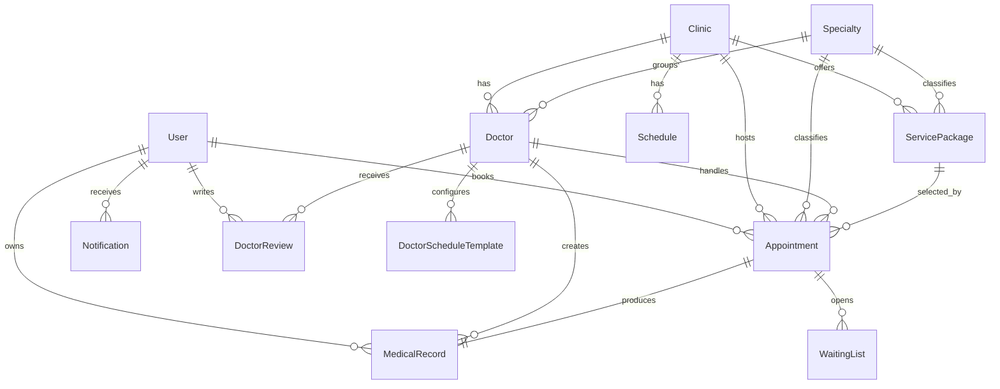

# 02 - Database Diagram

## ERD Tong Quan

## Main Collections

### User

Quan ly tai khoan patient, doctor, admin.

Field chinh:

- `name`, `email`, `phone`, `password`
- `role`
- `doctorId`, `clinicId`
- `isEmailVerified`, OTP fields
- `insuranceEnabled`, `insuranceNumber`, `insuranceExpiryDate`

### Doctor

Ho so bac si va thong tin chuyen mon.

Field chinh:

- `doctorCode`
- `name`, `personalEmail`, `loginEmail`, `phone`
- `avatar`, `degree`, `position`, `bio`
- `clinicId`, `specialtyId`
- `workingDays`, `workingHours`
- `ratingAverage`, `ratingCount`, `isActive`

### Appointment

Lich hen kham.

Field chinh:

- `patientId`, `doctorId`, `clinicId`, `specialtyId`
- `date`, `timeSlot`, `reason`
- `servicePackageId`, `servicePackageSnapshot`
- `insuranceSnapshot`
- `status`
- `queueNumber`, `consultationStatus`
- `cancelRequest`, `rescheduleRequest`
- `isFollowUp`, `followUpRecordId`, `followUpType`

Trang thai chinh:

- `pending`
- `confirmed`
- `in_progress`
- `completed`
- `cancelled`
- `no_show`
- `cancel_requested`
- `reschedule_requested`

### MedicalRecord

Ket qua kham gan voi mot lich hen.

Field chinh:

- `appointmentId`, `patientId`, `doctorId`, `clinicId`, `specialtyId`
- `symptoms`, `vitals`, `allergies`
- `diagnosis`, `icd10Code`, `conclusion`
- `prescription`, `attachments`, `advice`
- `followUpRequired`, `followUpDate`, `followUpStatus`

### WaitingList

Danh sach cho khi slot da het hoac can doi lich.

### Notification

Thong bao realtime va lich su notification trong he thong.

### AuditLog

Luu lai actor, hanh dong, resource va metadata quan tri.

## Index Quan Trong

- Appointment co unique partial index theo `clinicId`, `doctorId`, `date`, `timeSlot` cho cac trang thai giu slot.
- MedicalRecord unique theo `appointmentId` de chan tao trung ho so.
- User unique theo `email`.
- Doctor unique theo `doctorCode` va `loginEmail`.
