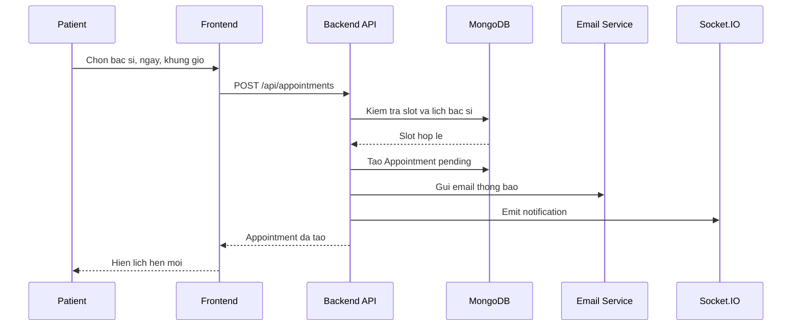
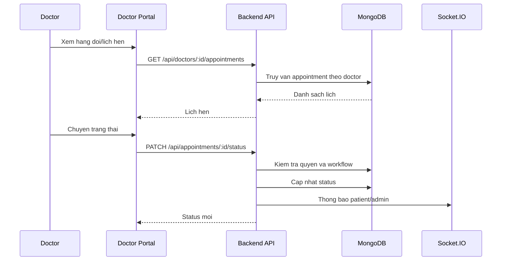
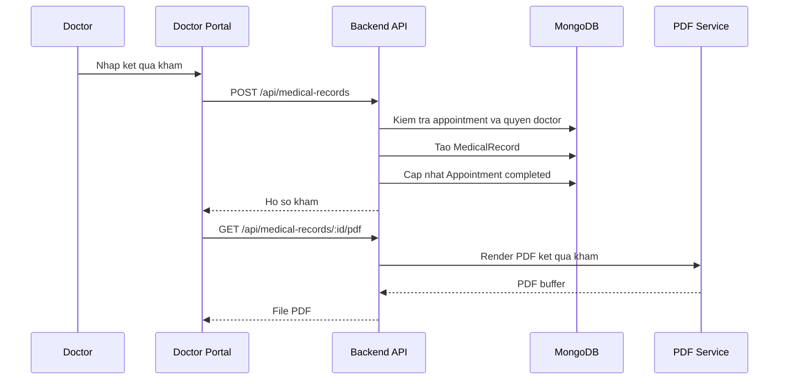
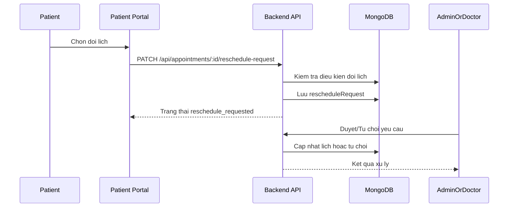
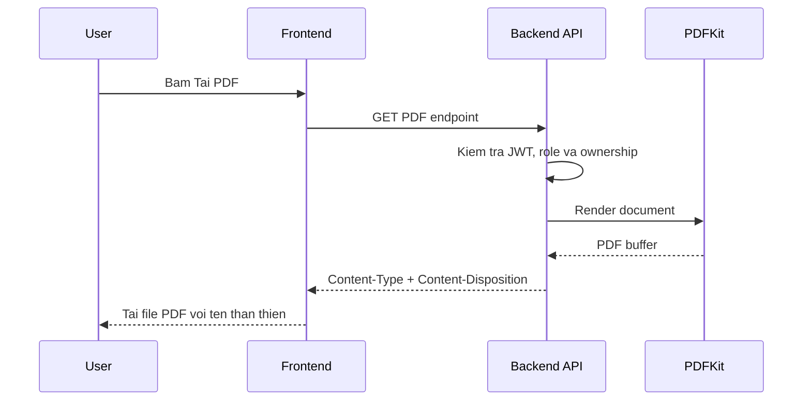

# 04 - Sequence Diagrams

## Dat Lich Kham

```mermaid
sequenceDiagram
  participant P as Patient
  participant FE as Frontend
  participant API as Backend API
  participant DB as MongoDB
  participant Mail as Email Service
  participant Socket as Socket.IO

  P->>FE: Chon bac si, ngay, khung gio
  FE->>API: POST /api/appointments
  API->>DB: Kiem tra slot va lich bac si
  DB-->>API: Slot hop le
  API->>DB: Tao Appointment pending
  API->>Mail: Gui email thong bao
  API->>Socket: Emit notification
  API-->>FE: Appointment da tao
  FE-->>P: Hien lich hen moi
```

## Doctor Xu Ly Lich Hen

```mermaid
sequenceDiagram
  participant D as Doctor
  participant FE as Doctor Portal
  participant API as Backend API
  participant DB as MongoDB
  participant Socket as Socket.IO

  D->>FE: Xem hang doi/lich hen
  FE->>API: GET /api/doctors/:id/appointments
  API->>DB: Truy van appointment theo doctor
  DB-->>API: Danh sach lich
  API-->>FE: Lich hen
  D->>FE: Chuyen trang thai
  FE->>API: PATCH /api/appointments/:id/status
  API->>DB: Kiem tra quyen va workflow
  API->>DB: Cap nhat status
  API->>Socket: Thong bao patient/admin
  API-->>FE: Status moi
```

## Tao Ho So Kham

```mermaid
sequenceDiagram
  participant D as Doctor
  participant FE as Doctor Portal
  participant API as Backend API
  participant DB as MongoDB
  participant PDF as PDF Service

  D->>FE: Nhap ket qua kham
  FE->>API: POST /api/medical-records
  API->>DB: Kiem tra appointment va quyen doctor
  API->>DB: Tao MedicalRecord
  API->>DB: Cap nhat Appointment completed
  API-->>FE: Ho so kham
  FE->>API: GET /api/medical-records/:id/pdf
  API->>PDF: Render PDF ket qua kham
  PDF-->>API: PDF buffer
  API-->>FE: File PDF
```

## Patient Gui Yeu Cau Doi Lich

```mermaid
sequenceDiagram
  participant P as Patient
  participant FE as Patient Portal
  participant API as Backend API
  participant DB as MongoDB
  participant A as AdminOrDoctor

  P->>FE: Chon doi lich
  FE->>API: PATCH /api/appointments/:id/reschedule-request
  API->>DB: Kiem tra dieu kien doi lich
  API->>DB: Luu rescheduleRequest
  API-->>FE: Trang thai reschedule_requested
  A->>API: Duyet/Tu choi yeu cau
  API->>DB: Cap nhat lich hoac tu choi
  API-->>A: Ket qua xu ly
```

## Xuat PDF

```mermaid
sequenceDiagram
  participant U as User
  participant FE as Frontend
  participant API as Backend API
  participant PDF as PDFKit

  U->>FE: Bam Tai PDF
  FE->>API: GET PDF endpoint
  API->>API: Kiem tra JWT, role va ownership
  API->>PDF: Render document
  PDF-->>API: PDF buffer
  API-->>FE: Content-Type + Content-Disposition
  FE-->>U: Tai file PDF voi ten than thien
```
