<!-- Converted from source DOCX: 22010342_Dinh-Xuan-Quyen.docx -->

|  |  |
| --- | --- |
| ĐINH XUÂN QUYỀN | BỘ GIÁO DỤC VÀ ĐÀO TẠO ĐẠI HỌC PHENIKAA |
| ĐINH XUÂN QUYỀN | ĐỒ ÁN TỐT NGHIỆP |
| ĐINH XUÂN QUYỀN | ỨNG DỤNG ĐẶT LỊCH KHÁM BỆNH CHO PHÒNG KHÁM NHỎ |
| CÔNG NGHỆ THÔNG TIN | Sinh viên: Đinh Xuân Quyền |
| CÔNG NGHỆ THÔNG TIN | Mã số sinh viên: 22010342 Khóa: K16 Ngành: Công nghệ thông tin Hệ: Đại học chính quy Giảng viên hướng dẫn: ThS. Vũ Thị Ngọc Anh |
| CÔNG NGHỆ THÔNG TIN |  |
| CÔNG NGHỆ THÔNG TIN |  |
| CÔNG NGHỆ THÔNG TIN | Hà Nội – Năm 2026 |

| BỘ GIÁO DỤC VÀ ĐÀO TẠO ĐẠI HỌC PHENIKAA |
| --- |
| ĐỒ ÁN TỐT NGHIỆP |
| ỨNG DỤNG ĐẶT LỊCH KHÁM BỆNH CHO PHÒNG KHÁM NHỎ |
| Sinh viên: Đinh Xuân Quyền |
| Mã số sinh viên: 22010342 Khóa: K16 Ngành: Công nghệ thông tin Hệ: Đại học chính quy Giảng viên hướng dẫn: ThS. Vũ Thị Ngọc Anh |
| Hà Nội – Năm 2026 |

## TÓM TẮT ĐỒ ÁN TỐT NGHIỆP

Đồ án tốt nghiệp với đề tài “Ứng dụng đặt lịch khám bệnh cho phòng khám nhỏ ” được thực hiện nhằm hỗ trợ quá trình đặt lịch khám, quản lý lịch hẹn và lưu trữ hồ sơ khám bệnh trong môi trường phòng khám. Trong thực tế, việc đặt lịch và quản lý thông tin khám bệnh theo phương thức thủ công hoặc qua các kênh rời rạc như điện thoại, tin nhắn dễ gây ra tình trạng trùng lịch, khó theo dõi trạng thái lịch hẹn, mất thời gian xác nhận và hạn chế khả năng tra cứu lại lịch sử khám của người bệnh.

Hệ thống BookingCare Mini được xây dựng với mục tiêu tạo ra một nền tảng web giúp kết nối bệnh nhân, bác sĩ và quản trị viên trong cùng một quy trình thống nhất. Bệnh nhân có thể tìm kiếm bác sĩ, chuyên khoa, cơ sở khám, lựa chọn khung giờ phù hợp, đặt lịch khám, theo dõi lịch hẹn, xem hồ sơ khám bệnh và lịch tái khám. Bác sĩ có thể quản lý lịch làm việc, theo dõi lịch hẹn, nhập và cập nhật hồ sơ khám bệnh, kê đơn thuốc, đính kèm kết quả cận lâm sàng và hoàn tất buổi khám. Quản trị viên có thể quản lý thông tin bác sĩ, cơ sở, chuyên khoa, gói khám, cẩm nang sức khỏe, lịch hẹn và theo dõi hoạt động tổng quan của hệ thống.

Về mặt kỹ thuật, hệ thống được phát triển theo mô hình ứng dụng web với phần giao diện người dùng xây dựng bằng ReactJS, phần máy chủ sử dụng Node.js và Express.js, cơ sở dữ liệu sử dụng MongoDB. Hệ thống áp dụng cơ chế xác thực và phân quyền theo vai trò nhằm đảm bảo mỗi nhóm người dùng chỉ truy cập được các chức năng phù hợp. Ngoài ra, hệ thống còn hỗ trợ tải ảnh/file, xuất phiếu kết quả khám dưới dạng PDF, gửi thông báo cho người bệnh khi hồ sơ được cập nhật và cung cấp các dashboard thống kê cho bác sĩ và quản trị viên.

Kết quả đạt được của đồ án là xây dựng được một hệ thống đặt lịch khám có đầy đủ các chức năng cốt lõi, giao diện trực quan, dễ sử dụng và phù hợp với quy trình vận hành của phòng khám nhỏ. Hệ thống góp phần giảm thao tác thủ công, tăng tính minh bạch trong quản lý lịch hẹn, hỗ trợ bác sĩ quản lý hồ sơ khám bệnh hiệu quả hơn và giúp bệnh nhân chủ động theo dõi quá trình khám chữa bệnh của mình. Đây là nền tảng có thể tiếp tục mở rộng trong tương lai với các chức năng như thanh toán trực tuyến, nhắc lịch tự động, tư vấn từ xa và ứng dụng trí tuệ nhân tạo trong gợi ý chuyên khoa theo triệu chứng.

## LỜI CAM ĐOAN

Tên tôi là: ……………………………………………………………………….........

Mã sinh viên: ………………………….. Lớp: ………………………………….......

Ngành: ………………………………………………………………………………

Tôi đã thực hiện đồ án/khóa luận tốt nghiệp với đề tài: ………………………………………………………………………………………………………………………………………………………………………………

Tôi xin cam đoan đây là đề tài nghiên cứu của riêng tôi và được sự hướng dẫn của: …………………………………………………………………………………….

Các nội dung nghiên cứu, kết quả trong đề tài này là trung thực và chưa được các tác giả khác công bố dưới bất kỳ hình thức nào. Nếu phát hiện có bất kỳ hình thức gian lận nào tôi xin hoàn toàn chịu trách nhiệm trước pháp luật.

| GIẢNG VIÊN HƯỚNG DẪN (Ký, ghi rõ họ tên) | Hà Nội, ngày … tháng … năm 20… SINH VIÊN (Ký, ghi rõ họ tên) |
| --- | --- |

## LỜI CẢM ƠN

Trong suốt quá trình học tập tại Trường Đại học Phenikaa, tôi đã nhận được sự giảng dạy, định hướng và hỗ trợ tận tình từ nhà trường cũng như quý thầy cô trong Trường Công nghệ thông tin. Tôi xin gửi lời cảm ơn chân thành đến Ban Giám hiệu nhà trường và toàn thể quý thầy cô đã tạo điều kiện học tập thuận lợi, giúp tôi từng bước xây dựng nền tảng kiến thức chuyên môn, rèn luyện tư duy lập trình và khả năng giải quyết vấn đề trong lĩnh vực công nghệ thông tin.

Tôi xin bày tỏ lòng biết ơn sâu sắc đến giảng viên hướng dẫn, ThS. Vũ Thị Ngọc Anh, người đã đồng hành, góp ý và định hướng cho tôi trong quá trình thực hiện đồ án tốt nghiệp. Những nhận xét, chỉ dẫn và sự hỗ trợ của cô đã giúp tôi nhìn nhận đề tài một cách hệ thống hơn, từ việc xác định bài toán, phân tích yêu cầu, thiết kế chức năng cho đến hoàn thiện sản phẩm và nội dung báo cáo.

Tôi cũng xin cảm ơn bạn bè, anh chị và những người đã chia sẻ kinh nghiệm, đóng góp ý kiến, hỗ trợ tôi trong quá trình tìm hiểu nghiệp vụ, xây dựng hệ thống và kiểm thử sản phẩm. Những sự giúp đỡ đó đã giúp tôi có thêm góc nhìn thực tế và hoàn thiện đồ án tốt hơn.

Đặc biệt, tôi xin gửi lời cảm ơn đến gia đình, những người luôn quan tâm, động viên và tạo điều kiện để tôi yên tâm học tập, nghiên cứu và hoàn thành đồ án. Sự ủng hộ của gia đình là nguồn động lực lớn giúp tôi vượt qua những khó khăn trong quá trình thực hiện đề tài.

Mặc dù tôi đã cố gắng hoàn thành đồ án với tinh thần nghiêm túc và trách nhiệm, nhưng do kiến thức và kinh nghiệm thực tế còn hạn chế, báo cáo cũng như hệ thống không tránh khỏi những thiếu sót. Tôi rất mong nhận được những ý kiến đóng góp từ quý thầy cô và các bạn để có thể tiếp tục hoàn thiện kiến thức, kỹ năng và phát triển đề tài tốt hơn trong tương lai.

Xin trân trọng cảm ơn!

## MỤC LỤC

## DANH MỤC HÌNH ẢNH

## DANH MỤC BẢNG BIỂU

## DANH MỤC TỪ VIẾT TẮT

## DANH MỤC THUẬT NGỮ

## MỞ ĐẦU

Trong những năm gần đây, công nghệ thông tin đã và đang được ứng dụng mạnh mẽ trong nhiều lĩnh vực của đời sống, đặc biệt là lĩnh vực y tế. Việc chuyển đổi số trong hoạt động khám chữa bệnh không chỉ giúp các cơ sở y tế nâng cao hiệu quả quản lý mà còn góp phần cải thiện trải nghiệm của người bệnh. Thay vì phải trực tiếp đến phòng khám để đăng ký, chờ đợi và theo dõi lịch hẹn bằng các phương thức thủ công, người bệnh ngày càng có nhu cầu sử dụng các nền tảng trực tuyến để tìm kiếm thông tin bác sĩ, lựa chọn chuyên khoa phù hợp và chủ động đặt lịch khám.

Tuy nhiên, tại nhiều phòng khám nhỏ, quy trình đặt lịch và quản lý thông tin khám bệnh vẫn còn phụ thuộc nhiều vào các phương thức truyền thống như ghi chép sổ sách, trao đổi qua điện thoại hoặc tin nhắn. Cách làm này dễ dẫn đến tình trạng trùng lịch, bỏ sót lịch hẹn, khó kiểm soát trạng thái khám và mất nhiều thời gian trong quá trình xác nhận lịch. Bên cạnh đó, bệnh nhân cũng gặp khó khăn khi cần tra cứu lại lịch sử khám bệnh, kết quả khám hoặc thông tin tái khám. Về phía bác sĩ và người quản trị phòng khám, việc thiếu một hệ thống quản lý tập trung có thể làm giảm hiệu quả vận hành, gây khó khăn trong việc theo dõi lịch làm việc, cập nhật hồ sơ khám bệnh và thống kê hoạt động khám chữa bệnh.

Xuất phát từ thực tế đó, đồ án “Ứng dụng đặt lịch khám bệnh cho phòng khám nhỏ” được thực hiện nhằm xây dựng một hệ thống web hỗ trợ quy trình đặt lịch khám, quản lý lịch hẹn và lưu trữ hồ sơ khám bệnh một cách khoa học, thuận tiện. Hệ thống hướng tới ba nhóm người dùng chính gồm bệnh nhân, bác sĩ và quản trị viên. Trong đó, bệnh nhân có thể tìm kiếm bác sĩ, chuyên khoa, cơ sở khám, lựa chọn khung giờ phù hợp, đặt lịch khám và theo dõi hồ sơ khám bệnh; bác sĩ có thể quản lý lịch làm việc, xử lý lịch hẹn, nhập và cập nhật hồ sơ khám bệnh; quản trị viên có thể quản lý thông tin phòng khám, bác sĩ, chuyên khoa, lịch hẹn, gói khám và theo dõi hoạt động tổng quan của hệ thống.

Đồ án tập trung vào việc phân tích yêu cầu nghiệp vụ, thiết kế hệ thống và xây dựng các chức năng cốt lõi phục vụ hoạt động đặt lịch khám tại phòng khám nhỏ. Hệ thống được phát triển theo mô hình ứng dụng web, sử dụng các công nghệ hiện đại nhằm đảm bảo giao diện trực quan, thao tác thuận tiện, dữ liệu được tổ chức rõ ràng và có khả năng mở rộng trong tương lai. Bên cạnh chức năng đặt lịch khám, hệ thống còn hỗ trợ quản lý hồ sơ khám bệnh, kết quả cận lâm sàng, đơn thuốc, lịch tái khám, xuất phiếu kết quả khám dưới dạng PDF và cung cấp các thống kê tổng quan phục vụ công tác quản lý.

Thông qua quá trình thực hiện đề tài, tôi có cơ hội vận dụng các kiến thức đã học vào một bài toán thực tế, từ khảo sát nhu cầu, phân tích yêu cầu, thiết kế cơ sở dữ liệu, xây dựng giao diện, phát triển chức năng cho đến kiểm thử hệ thống. Kết quả của đồ án không chỉ là một sản phẩm phần mềm có khả năng ứng dụng trong môi trường phòng khám nhỏ mà còn là cơ sở để tiếp tục nghiên cứu, mở rộng và hoàn thiện các giải pháp hỗ trợ chuyển đổi số trong lĩnh vực y tế.

# CHƯƠNG 1: GIỚI THIỆU TỔNG QUAN ĐỀ TÀI

## 1.1. Đặt vấn đề

Trong bối cảnh công nghệ thông tin ngày càng phát triển, việc ứng dụng các hệ thống phần mềm vào lĩnh vực y tế đã trở thành một xu hướng tất yếu. Các cơ sở khám chữa bệnh không chỉ cần nâng cao chất lượng chuyên môn mà còn phải cải thiện quy trình phục vụ, giảm thời gian chờ đợi và tạo sự thuận tiện cho người bệnh. Đặc biệt, đối với các phòng khám nhỏ, nhu cầu quản lý lịch khám, thông tin bác sĩ, hồ sơ bệnh nhân và quá trình tái khám ngày càng trở nên cần thiết nhằm đảm bảo hoạt động vận hành diễn ra chính xác, nhanh chóng và hiệu quả.

Trên thực tế, nhiều phòng khám nhỏ vẫn đang thực hiện việc đặt lịch khám và quản lý thông tin bằng các phương thức thủ công như ghi chép trên sổ sách, trao đổi qua điện thoại, tin nhắn hoặc các công cụ rời rạc. Cách làm này tuy đơn giản nhưng dễ phát sinh nhiều hạn chế như trùng lịch hẹn, bỏ sót thông tin bệnh nhân, khó kiểm soát trạng thái lịch khám và mất nhiều thời gian khi cần tra cứu lại dữ liệu. Bệnh nhân cũng gặp khó khăn trong việc tìm kiếm thông tin bác sĩ, lựa chọn khung giờ phù hợp, theo dõi lịch hẹn đã đặt hoặc xem lại kết quả khám bệnh sau mỗi lần thăm khám.

Bên cạnh đó, bác sĩ và người quản trị phòng khám cũng cần một công cụ hỗ trợ tập trung để theo dõi lịch làm việc, quản lý danh sách lịch hẹn, cập nhật hồ sơ khám bệnh, ghi nhận đơn thuốc, kết quả cận lâm sàng và kế hoạch tái khám. Nếu các thông tin này không được tổ chức một cách khoa học, quá trình phối hợp giữa bệnh nhân, bác sĩ và bộ phận quản lý sẽ thiếu tính đồng bộ, làm giảm hiệu quả vận hành và ảnh hưởng đến trải nghiệm của người sử dụng dịch vụ.

Từ những vấn đề trên, việc xây dựng một ứng dụng đặt lịch khám bệnh dành cho phòng khám nhỏ là cần thiết và có ý nghĩa thực tiễn. Hệ thống không chỉ giúp bệnh nhân chủ động hơn trong quá trình đặt lịch và theo dõi thông tin khám bệnh, mà còn hỗ trợ bác sĩ và quản trị viên quản lý công việc một cách rõ ràng, chính xác. Đây cũng là hướng tiếp cận phù hợp với xu thế chuyển đổi số trong lĩnh vực y tế, góp phần nâng cao chất lượng phục vụ và tối ưu hóa hoạt động quản lý tại các phòng khám quy mô nhỏ.

## 1.2. Lý do chọn đề tài

Trong quá trình tìm hiểu thực tế, tôi nhận thấy hoạt động đặt lịch khám bệnh tại nhiều phòng khám nhỏ vẫn còn gặp nhiều khó khăn do chưa có một hệ thống quản lý tập trung. Việc tiếp nhận lịch hẹn qua điện thoại, tin nhắn hoặc ghi chép thủ công có thể phù hợp khi số lượng bệnh nhân còn ít, nhưng khi nhu cầu khám tăng lên, phương thức này dễ dẫn đến nhầm lẫn, trùng lịch, khó theo dõi trạng thái lịch hẹn và gây mất thời gian cho cả bệnh nhân lẫn nhân viên phòng khám.

Bên cạnh đó, người bệnh hiện nay có xu hướng mong muốn được chủ động hơn trong quá trình sử dụng dịch vụ y tế. Họ cần có thể tra cứu thông tin bác sĩ, chuyên khoa, cơ sở khám, lựa chọn khung giờ phù hợp và theo dõi lại lịch sử khám bệnh của mình một cách thuận tiện. Nếu các thông tin này chỉ được lưu trữ rời rạc hoặc phụ thuộc vào nhân viên phòng khám, trải nghiệm của người bệnh sẽ bị hạn chế, đồng thời làm tăng khối lượng công việc hành chính cho phòng khám.

Đối với bác sĩ và quản trị viên, một hệ thống đặt lịch khám trực tuyến không chỉ hỗ trợ quản lý lịch làm việc và lịch hẹn, mà còn giúp quá trình nhập hồ sơ khám bệnh, ghi nhận kết quả cận lâm sàng, kê đơn thuốc và theo dõi tái khám trở nên khoa học hơn. Việc số hóa các quy trình này giúp dữ liệu được lưu trữ có tổ chức, dễ dàng tra cứu, giảm sai sót trong quá trình xử lý thông tin và nâng cao hiệu quả vận hành của phòng khám.

Về mặt học tập và nghiên cứu, đề tài “Ứng dụng đặt lịch khám bệnh cho phòng khám nhỏ” phù hợp với kiến thức chuyên ngành công nghệ thông tin, đặc biệt là các nội dung liên quan đến phân tích yêu cầu, thiết kế cơ sở dữ liệu, xây dựng ứng dụng web, phát triển giao diện người dùng, thiết kế API, xác thực, phân quyền và kiểm thử phần mềm. Thông qua đề tài này, tôi có cơ hội vận dụng các kiến thức đã học vào một bài toán có tính thực tiễn, đồng thời rèn luyện khả năng tư duy hệ thống và giải quyết vấn đề trong quá trình phát triển phần mềm.

Vì vậy, tôi lựa chọn đề tài này với mong muốn xây dựng một ứng dụng có khả năng hỗ trợ phòng khám nhỏ quản lý hoạt động đặt lịch và hồ sơ khám bệnh hiệu quả hơn, đồng thời đem lại trải nghiệm thuận tiện hơn cho người bệnh. Đây là đề tài có ý nghĩa thực tiễn, phù hợp với xu hướng chuyển đổi số trong lĩnh vực y tế và có tiềm năng tiếp tục phát triển, mở rộng trong tương lai.

## 1.3. Mục tiêu của đề tài

Mục tiêu tổng quát của đề tài “Ứng dụng đặt lịch khám bệnh cho phòng khám nhỏ” là xây dựng một hệ thống web hỗ trợ quá trình đặt lịch khám, quản lý lịch hẹn và lưu trữ hồ sơ khám bệnh theo hướng tập trung, khoa học và thuận tiện. Hệ thống hướng tới việc giảm bớt các thao tác thủ công trong quá trình vận hành phòng khám, giúp bệnh nhân dễ dàng tiếp cận dịch vụ khám chữa bệnh, đồng thời hỗ trợ bác sĩ và quản trị viên quản lý công việc hiệu quả hơn.

Để đạt được mục tiêu tổng quát trên, đề tài tập trung thực hiện các mục tiêu cụ thể sau:

- Xây dựng chức năng cho phép người bệnh tìm kiếm và xem thông tin về bác sĩ, chuyên khoa, cơ sở khám và các gói khám phù hợp với nhu cầu.
- Hỗ trợ chức năng tư vấn triệu chứng bằng AI nhằm gợi ý chuyên khoa phù hợp để người dùng có thêm thông tin tham khảo trước khi đặt lịch.
- Hỗ trợ người bệnh đặt lịch khám trực tuyến theo ngày và khung giờ còn trống, giúp hạn chế tình trạng chờ đợi hoặc trùng lịch.
- Cung cấp chức năng để người bệnh theo dõi lịch hẹn đã đặt, kiểm tra trạng thái lịch khám, xem hồ sơ khám bệnh và thông tin tái khám sau mỗi lần thăm khám.
- Xây dựng khu vực dành cho bác sĩ để quản lý lịch làm việc, danh sách lịch hẹn, hàng đợi khám và quá trình xử lý từng lượt khám.
- Hỗ trợ bác sĩ nhập, lưu trữ và cập nhật hồ sơ khám bệnh, bao gồm thông tin triệu chứng, chẩn đoán, kết luận điều trị, đơn thuốc, kết quả cận lâm sàng và kế hoạch tái khám.
- Xây dựng khu vực quản trị giúp quản trị viên quản lý các dữ liệu quan trọng của hệ thống như bác sĩ, cơ sở khám, chuyên khoa, lịch hẹn, gói khám, bài viết cẩm nang và thông tin vận hành.
- Tích hợp chức năng thông báo để người dùng có thể nhận biết các cập nhật quan trọng liên quan đến lịch hẹn hoặc hồ sơ khám bệnh.
- Hỗ trợ xuất phiếu kết quả khám dưới dạng PDF, giúp bệnh nhân và phòng khám có thể lưu trữ hoặc sử dụng lại thông tin khám bệnh khi cần thiết.
- Cung cấp các thống kê và biểu đồ tổng quan nhằm hỗ trợ bác sĩ, quản trị viên theo dõi hoạt động khám chữa bệnh và tình trạng lịch hẹn trong hệ thống.
- Thiết kế giao diện trực quan, dễ sử dụng, phù hợp với nhiều nhóm người dùng và có khả năng hiển thị tốt trên các kích thước màn hình phổ biến.
Thông qua các mục tiêu trên, đề tài hướng đến việc xây dựng một ứng dụng có tính thực tiễn, phù hợp với mô hình phòng khám nhỏ, đồng thời tạo nền tảng để có thể mở rộng thêm các chức năng nâng cao trong tương lai như thanh toán trực tuyến, nhắc lịch tự động, tư vấn trực tuyến hoặc tích hợp trí tuệ nhân tạo hỗ trợ gợi ý chuyên khoa.

## 1.4. Phạm vi nghiên cứu

Đề tài “Ứng dụng đặt lịch khám bệnh cho phòng khám nhỏ” tập trung nghiên cứu và xây dựng một hệ thống web hỗ trợ các nghiệp vụ cơ bản trong quá trình đặt lịch khám, quản lý lịch hẹn và lưu trữ hồ sơ khám bệnh tại phòng khám quy mô nhỏ. Hệ thống hướng đến việc số hóa một phần quy trình vận hành, giúp giảm thao tác thủ công, hạn chế sai sót trong quản lý lịch và tạo sự thuận tiện cho người bệnh khi sử dụng dịch vụ khám chữa bệnh.

Về phạm vi người dùng, hệ thống phục vụ bốn nhóm đối tượng chính gồm khách truy cập, bệnh nhân, bác sĩ và quản trị viên. Khách truy cập có thể xem thông tin công khai về bác sĩ, chuyên khoa, cơ sở khám, gói khám và bài viết cẩm nang. Bệnh nhân có thể đăng ký, đăng nhập, đặt lịch khám, theo dõi lịch hẹn, xem hồ sơ khám bệnh và nhận thông báo từ hệ thống. Bác sĩ có thể quản lý lịch làm việc, lịch hẹn, hàng đợi khám, nhập và cập nhật hồ sơ khám bệnh. Quản trị viên có nhiệm vụ quản lý dữ liệu hệ thống, theo dõi hoạt động vận hành và hỗ trợ điều phối thông tin trong phòng khám.

Về phạm vi chức năng, đề tài tập trung vào các chức năng chính như xác thực và phân quyền người dùng, tìm kiếm bác sĩ, tư vấn triệu chứng bằng AI, đặt lịch khám, quản lý lịch hẹn, quản lý hồ sơ khám bệnh, đơn thuốc, kết quả cận lâm sàng, lịch tái khám, xuất phiếu kết quả khám dưới dạng PDF, quản lý bác sĩ, cơ sở, chuyên khoa, gói khám, bài viết cẩm nang, thông báo và thống kê tổng quan cho bác sĩ, quản trị viên.

Về phạm vi dữ liệu, hệ thống quản lý các thông tin liên quan đến người dùng, bác sĩ, bệnh nhân, chuyên khoa, cơ sở khám, lịch làm việc, lịch hẹn, hồ sơ khám bệnh, đơn thuốc, tệp đính kèm, bài viết và thông báo. Dữ liệu trong đồ án được xây dựng nhằm phục vụ mục đích mô phỏng, thử nghiệm và đánh giá hệ thống trong môi trường học tập.

Do giới hạn về thời gian và phạm vi đồ án, hệ thống chưa triển khai các nghiệp vụ phức tạp của bệnh viện lớn như quản lý nội trú, viện phí chi tiết, bảo hiểm y tế, kho thuốc, xét nghiệm chuyên sâu hoặc kết nối với hệ thống y tế quốc gia. Các chức năng như thanh toán trực tuyến, tư vấn video call, nhắc lịch qua SMS/Zalo và ứng dụng trí tuệ nhân tạo sẽ được xem xét như hướng phát triển trong tương lai.

## 1.5. Đối tượng nghiên cứu

Đối tượng nghiên cứu của đề tài là quy trình đặt lịch khám bệnh và quản lý thông tin khám bệnh tại các phòng khám quy mô nhỏ. Trong đó, đề tài tập trung tìm hiểu cách thức bệnh nhân tìm kiếm thông tin bác sĩ, lựa chọn chuyên khoa, đặt lịch khám, theo dõi trạng thái lịch hẹn và xem lại hồ sơ khám bệnh sau khi hoàn tất buổi khám.

Bên cạnh quy trình của bệnh nhân, đề tài cũng nghiên cứu các nghiệp vụ liên quan đến bác sĩ trong quá trình tiếp nhận và xử lý lịch hẹn, quản lý lịch làm việc, nhập kết quả khám, kê đơn thuốc, đính kèm kết quả cận lâm sàng và thiết lập lịch tái khám cho bệnh nhân. Đây là những nghiệp vụ quan trọng giúp phòng khám lưu trữ thông tin khám bệnh một cách có hệ thống và hỗ trợ quá trình theo dõi sức khỏe của người bệnh.

Ngoài ra, đề tài còn nghiên cứu hoạt động quản trị hệ thống trong phạm vi phòng khám nhỏ, bao gồm quản lý thông tin bác sĩ, chuyên khoa, cơ sở khám, gói khám, bài viết cẩm nang, lịch hẹn, thông báo và các dữ liệu thống kê tổng quan. Các nội dung này giúp đảm bảo hệ thống có thể vận hành ổn định, dữ liệu được tổ chức rõ ràng và phù hợp với nhu cầu quản lý thực tế.

Về mặt kỹ thuật, đề tài nghiên cứu cách xây dựng một ứng dụng web có phân quyền người dùng, kết nối giữa giao diện người dùng và máy chủ thông qua API, lưu trữ dữ liệu bằng cơ sở dữ liệu, hỗ trợ tải tệp, xuất phiếu kết quả khám dưới dạng PDF và hiển thị các thống kê cơ bản. Những nội dung này là cơ sở để triển khai hệ thống đặt lịch khám bệnh có tính ứng dụng và khả năng mở rộng trong tương lai.

## 1.6. Đối tượng sử dụng hệ thống

Hệ thống “Ứng dụng đặt lịch khám bệnh cho phòng khám nhỏ” được xây dựng nhằm phục vụ nhiều nhóm người dùng khác nhau trong quá trình tìm kiếm thông tin, đặt lịch khám, xử lý lịch hẹn và quản lý hồ sơ khám bệnh. Mỗi nhóm người dùng có nhu cầu và phạm vi sử dụng riêng, được hệ thống phân quyền để đảm bảo tính phù hợp và an toàn dữ liệu.

Nhóm người dùng đầu tiên là khách truy cập. Đây là những người chưa đăng nhập vào hệ thống nhưng có nhu cầu tìm hiểu thông tin về phòng khám, bác sĩ, chuyên khoa, gói khám hoặc các bài viết cẩm nang sức khỏe. Khách truy cập có thể xem các thông tin công khai, từ đó lựa chọn dịch vụ phù hợp trước khi đăng ký tài khoản hoặc thực hiện đặt lịch khám.

Nhóm thứ hai là bệnh nhân. Đây là nhóm người dùng chính của hệ thống, có nhu cầu đặt lịch khám và theo dõi quá trình khám bệnh của bản thân. Bệnh nhân có thể đăng ký, đăng nhập, tìm kiếm bác sĩ, chọn ngày và khung giờ khám, gửi yêu cầu đặt lịch, theo dõi trạng thái lịch hẹn, xem hồ sơ khám bệnh, kết quả cận lâm sàng, đơn thuốc, lịch tái khám và nhận thông báo khi có cập nhật từ bác sĩ hoặc hệ thống.

Nhóm thứ ba là bác sĩ. Bác sĩ sử dụng hệ thống để quản lý công việc khám bệnh hằng ngày, bao gồm theo dõi lịch làm việc, xem danh sách lịch hẹn, quản lý hàng đợi khám, tiếp nhận bệnh nhân, nhập hồ sơ khám bệnh, kê đơn thuốc, đính kèm kết quả cận lâm sàng, thiết lập lịch tái khám và cập nhật hồ sơ khi cần thiết. Ngoài ra, bác sĩ có thể quản lý một số thông tin liên quan đến bài viết hoặc nội dung tư vấn sức khỏe nếu được hệ thống cho phép.

Nhóm cuối cùng là quản trị viên. Quản trị viên chịu trách nhiệm quản lý và vận hành hệ thống, bao gồm quản lý tài khoản người dùng, thông tin bác sĩ, cơ sở khám, chuyên khoa, lịch làm việc, lịch hẹn, gói khám, bài viết cẩm nang, thông báo và các dữ liệu thống kê tổng quan. Đây là nhóm người dùng có quyền truy cập cao nhất, đóng vai trò đảm bảo hệ thống hoạt động ổn định, dữ liệu được cập nhật chính xác và phù hợp với nhu cầu vận hành của phòng khám.

Việc phân chia rõ các nhóm đối tượng sử dụng giúp hệ thống xác định được chức năng cần thiết cho từng vai trò, đồng thời hỗ trợ quá trình thiết kế giao diện, phân quyền truy cập và xây dựng các luồng nghiệp vụ phù hợp với thực tế sử dụng.

## 1.7. Định hướng giải pháp

Để giải quyết các vấn đề trong quá trình đặt lịch khám và quản lý thông tin khám bệnh tại phòng khám nhỏ, đề tài định hướng xây dựng một hệ thống ứng dụng web có khả năng hỗ trợ nhiều nhóm người dùng khác nhau, bao gồm bệnh nhân, bác sĩ và quản trị viên. Hệ thống được thiết kế theo hướng tập trung dữ liệu, phân quyền rõ ràng và cung cấp các chức năng phù hợp với từng vai trò sử dụng.

Về mặt nghiệp vụ, hệ thống tập trung số hóa quy trình đặt lịch khám từ bước bệnh nhân tìm kiếm thông tin bác sĩ, chuyên khoa, cơ sở khám, lựa chọn ngày giờ phù hợp, gửi yêu cầu đặt lịch cho đến khi lịch hẹn được xử lý và hoàn tất. Sau buổi khám, bác sĩ có thể nhập hồ sơ khám bệnh, kê đơn thuốc, đính kèm kết quả cận lâm sàng và thiết lập lịch tái khám nếu cần. Bệnh nhân có thể theo dõi lại lịch sử khám, xem kết quả khám và nhận thông báo khi hồ sơ hoặc lịch hẹn có thay đổi.

Về mặt quản lý, hệ thống cung cấp khu vực dành cho quản trị viên để quản lý các dữ liệu nền tảng như bác sĩ, cơ sở khám, chuyên khoa, lịch làm việc, gói khám, bài viết cẩm nang và lịch hẹn. Ngoài ra, hệ thống hỗ trợ các màn hình tổng quan, thống kê và biểu đồ nhằm giúp bác sĩ, quản trị viên nắm bắt nhanh tình hình hoạt động, số lượng lịch khám, trạng thái xử lý và các công việc cần chú ý.

Về mặt kỹ thuật, hệ thống được định hướng phát triển theo mô hình ứng dụng web với phần giao diện người dùng tách biệt với phần xử lý phía máy chủ. Giao diện được xây dựng theo hướng trực quan, dễ sử dụng và phù hợp với từng vai trò. Phía máy chủ đảm nhiệm xử lý nghiệp vụ, xác thực người dùng, phân quyền, quản lý dữ liệu và cung cấp các API cho giao diện sử dụng. Cơ sở dữ liệu được tổ chức để lưu trữ thông tin người dùng, bác sĩ, lịch hẹn, hồ sơ khám bệnh, thông báo và các dữ liệu liên quan.

Bên cạnh các chức năng cơ bản, hệ thống còn định hướng bổ sung các tiện ích hỗ trợ như tải ảnh hoặc tệp đính kèm kết quả cận lâm sàng, xuất phiếu kết quả khám dưới dạng PDF, gửi thông báo đến người dùng và hiển thị thống kê trực quan. Những chức năng này giúp hệ thống không chỉ đáp ứng nhu cầu đặt lịch khám đơn thuần mà còn hỗ trợ tốt hơn quá trình quản lý và theo dõi thông tin khám bệnh tại phòng khám nhỏ.

Nhìn chung, giải pháp được đề xuất hướng đến việc xây dựng một nền tảng đơn giản, dễ sử dụng, có tính thực tiễn và có khả năng mở rộng. Hệ thống không thay thế hoàn toàn các nghiệp vụ chuyên sâu của bệnh viện lớn, mà tập trung vào các nhu cầu thiết yếu của phòng khám nhỏ, từ đó giúp nâng cao hiệu quả vận hành và cải thiện trải nghiệm của người bệnh.

## 1.8. Bố cục đồ án tốt nghiệp

Báo cáo đồ án tốt nghiệp với đề tài “Ứng dụng đặt lịch khám bệnh cho phòng khám nhỏ” được trình bày theo các phần chính như sau: (i) Chương 1: Giới thiệu tổng quan đề tài; (ii) Chương 2: Khảo sát và phân tích yêu cầu hệ thống; (iii) Chương 3: Cơ sở lý thuyết và công nghệ sử dụng; (iv) Chương 4: Thiết kế, phát triển và triển khai hệ thống; (v) Chương 5: Các giải pháp và đóng góp nổi bật. Ngoài ra, báo cáo còn có phần Kết luận và hướng phát triển, Tài liệu tham khảo và Phụ lục nếu cần thiết.

Chương 1. Giới thiệu tổng quan đề tài: trình bày bối cảnh thực hiện đề tài, lý do chọn đề tài, mục tiêu, phạm vi nghiên cứu, đối tượng nghiên cứu, đối tượng sử dụng hệ thống và định hướng giải pháp. Nội dung chương giúp người đọc có cái nhìn tổng quan về bài toán đặt lịch khám bệnh tại phòng khám nhỏ và hướng tiếp cận của đồ án.

Chương 2. Khảo sát và phân tích yêu cầu hệ thống: tập trung khảo sát hiện trạng, phân tích các vấn đề còn tồn tại trong quy trình đặt lịch và quản lý khám bệnh tại phòng khám nhỏ. Từ đó xác định các tác nhân, yêu cầu chức năng, yêu cầu phi chức năng, quy trình nghiệp vụ, biểu đồ Use Case, bảng đặc tả chức năng và thiết kế dữ liệu cho hệ thống.

Chương 3. Cơ sở lý thuyết và công nghệ sử dụng: giới thiệu các công nghệ, nền tảng và công cụ được sử dụng để xây dựng hệ thống, bao gồm công nghệ phía giao diện người dùng, phía máy chủ, cơ sở dữ liệu, xác thực, phân quyền, upload file, xuất PDF, thông báo và biểu đồ thống kê.

Chương 4. Thiết kế, phát triển và triển khai hệ thống: trình bày quá trình xây dựng các chức năng chính của hệ thống cho từng nhóm người dùng gồm bệnh nhân, bác sĩ và quản trị viên. Chương này cũng mô tả kết quả giao diện, quá trình kiểm thử và cách triển khai ứng dụng trong môi trường thực tế hoặc môi trường thử nghiệm.

Chương 5. Các giải pháp và đóng góp nổi bật nêu ra những khó khăn gặp phải trong quá trình thực hiện đồ án, các giải pháp đã áp dụng để xử lý các vấn đề về quản lý lịch hẹn, hồ sơ khám bệnh, phân quyền, thông báo, thống kê và trải nghiệm người dùng. Đồng thời, chương cũng tổng kết những đóng góp chính của đề tài.

Phần kết thúc: bao gồm Kết luận và hướng phát triển, Tài liệu tham khảo và Phụ lục nếu có. Trong đó, phần Kết luận và hướng phát triển tổng kết những kết quả đã đạt được, nêu ra các hạn chế còn tồn tại và đề xuất hướng nâng cấp hệ thống trong tương lai. Tài liệu tham khảo trình bày các nguồn tài liệu, sách, bài viết và đường dẫn công nghệ được sử dụng trong quá trình thực hiện đồ án. Phụ lục được sử dụng để bổ sung các bảng biểu, hình ảnh, kịch bản kiểm thử hoặc các nội dung hỗ trợ khác nếu cần thiết.

# CHƯƠNG 2: KHẢO SÁT VÀ PHÂN TÍCH YÊU CẦU HỆ THỐNG

### 2.1. Khảo sát hiện trạng

#### 2.1.1. Thực trạng đặt lịch khám tại phòng khám nhỏ

Tại nhiều phòng khám nhỏ, quy trình đặt lịch khám bệnh vẫn được thực hiện chủ yếu thông qua các phương thức truyền thống như gọi điện thoại, nhắn tin qua các ứng dụng liên lạc hoặc đăng ký trực tiếp tại quầy tiếp nhận. Khi bệnh nhân có nhu cầu khám, họ thường phải liên hệ với phòng khám để hỏi thông tin về bác sĩ, chuyên khoa, thời gian làm việc và khung giờ còn trống. Sau đó, nhân viên phòng khám sẽ ghi nhận thông tin đặt lịch bằng sổ sách, bảng tính hoặc các công cụ quản lý đơn giản.

Phương thức này có ưu điểm là dễ triển khai, không đòi hỏi nhiều chi phí ban đầu và phù hợp với các phòng khám có quy mô nhỏ, số lượng bệnh nhân chưa quá lớn. Nhân viên có thể trao đổi trực tiếp với bệnh nhân, xác nhận nhanh một số thông tin cơ bản và linh hoạt điều chỉnh lịch trong các trường hợp cần thiết. Tuy nhiên, cách làm này phụ thuộc nhiều vào thao tác thủ công và kinh nghiệm của người quản lý lịch.

Khi số lượng bệnh nhân tăng lên, việc tiếp nhận lịch qua điện thoại hoặc tin nhắn dễ phát sinh tình trạng quá tải. Nhân viên phòng khám phải kiểm tra nhiều nguồn thông tin khác nhau để xác định khung giờ còn trống, dẫn đến mất thời gian và có nguy cơ nhầm lẫn. Nếu thông tin không được cập nhật kịp thời, phòng khám có thể gặp các vấn đề như trùng lịch hẹn, bỏ sót yêu cầu đặt lịch, ghi sai thông tin bệnh nhân hoặc khó xử lý khi bệnh nhân muốn đổi, hủy lịch.

Bên cạnh đó, bệnh nhân chưa có nhiều sự chủ động trong quá trình đặt lịch. Họ thường phải chờ phản hồi từ phòng khám để biết bác sĩ có làm việc hay không, còn khung giờ nào phù hợp hoặc lịch hẹn đã được xác nhận chưa. Điều này làm giảm tính thuận tiện, đặc biệt trong trường hợp bệnh nhân cần đặt lịch ngoài giờ hành chính hoặc muốn nhanh chóng so sánh nhiều bác sĩ, chuyên khoa, cơ sở khám trước khi lựa chọn.

Ngoài ra, việc quản lý lịch khám bằng phương thức thủ công cũng gây khó khăn trong việc thống kê và theo dõi hoạt động của phòng khám. Các thông tin như số lượng lịch khám trong ngày, số lịch đã hoàn thành, lịch bị hủy, bệnh nhân không đến khám hoặc yêu cầu đổi lịch thường không được tổng hợp tự động. Điều này khiến bác sĩ và quản trị viên khó nắm bắt tình hình vận hành một cách nhanh chóng, từ đó ảnh hưởng đến hiệu quả quản lý và chất lượng phục vụ người bệnh.

Từ thực trạng trên, có thể thấy các phòng khám nhỏ cần một hệ thống hỗ trợ đặt lịch trực tuyến, giúp bệnh nhân chủ động lựa chọn lịch khám, đồng thời giúp phòng khám quản lý lịch hẹn tập trung, rõ ràng và chính xác hơn.

#### 2.1.2. Khó khăn trong quản lý thủ công

Việc quản lý lịch khám và thông tin bệnh nhân bằng phương thức thủ công tuy đơn giản nhưng tồn tại nhiều hạn chế trong quá trình vận hành phòng khám. Khi lịch hẹn được ghi nhận qua sổ sách, tin nhắn hoặc bảng tính riêng lẻ, dữ liệu thường không được đồng bộ kịp thời giữa các bộ phận. Điều này dễ dẫn đến tình trạng trùng khung giờ khám, bỏ sót lịch hẹn hoặc khó xác định chính xác trạng thái của từng lịch như chờ xác nhận, đã xác nhận, đang khám, hoàn thành, đã hủy hoặc bệnh nhân không đến khám.

Một khó khăn khác là việc tra cứu và cập nhật thông tin mất nhiều thời gian. Khi bệnh nhân muốn đổi lịch, hủy lịch hoặc hỏi lại thông tin lịch đã đặt, nhân viên phòng khám phải kiểm tra thủ công trên nhiều nguồn dữ liệu khác nhau. Nếu thông tin bị ghi thiếu, ghi sai hoặc không được cập nhật ngay sau khi có thay đổi, quá trình xử lý sẽ trở nên chậm và dễ phát sinh nhầm lẫn.

Đối với hồ sơ khám bệnh, việc lưu trữ bằng giấy tờ hoặc các tệp rời rạc gây khó khăn trong quá trình theo dõi lịch sử khám của bệnh nhân. Bác sĩ có thể mất thời gian khi cần xem lại kết quả khám trước đó, đơn thuốc đã kê, kết quả cận lâm sàng hoặc lịch tái khám. Ngoài ra, hồ sơ giấy cũng có nguy cơ thất lạc, hư hỏng hoặc khó chia sẻ lại cho bệnh nhân khi cần thiết.

Việc quản lý thủ công cũng làm hạn chế khả năng thống kê và đánh giá hoạt động của phòng khám. Các số liệu như số lượng lịch khám trong ngày, số lịch hoàn thành, số lịch bị hủy, số bệnh nhân cần tái khám hoặc hiệu suất làm việc của bác sĩ thường phải tổng hợp bằng tay. Điều này không chỉ mất thời gian mà còn khó đảm bảo độ chính xác, đặc biệt khi dữ liệu ngày càng nhiều.

Bên cạnh đó, phương thức quản lý thủ công chưa đáp ứng tốt yêu cầu phân quyền và bảo mật thông tin. Dữ liệu bệnh nhân là thông tin nhạy cảm, cần được quản lý cẩn thận và chỉ cho phép những người có trách nhiệm truy cập. Nếu thông tin được lưu trữ rời rạc hoặc chia sẻ qua nhiều kênh không thống nhất, nguy cơ lộ lọt, mất mát hoặc chỉnh sửa sai dữ liệu có thể xảy ra.

Những khó khăn trên cho thấy phòng khám nhỏ cần một hệ thống quản lý tập trung, có khả năng lưu trữ, cập nhật, tra cứu và thống kê thông tin một cách tự động. Đây là cơ sở để đề tài xây dựng ứng dụng đặt lịch khám bệnh nhằm hỗ trợ quá trình vận hành phòng khám hiệu quả và chính xác hơn.

#### 2.1.3. Nhu cầu của bệnh nhân

Trong quá trình sử dụng dịch vụ khám chữa bệnh, bệnh nhân luôn mong muốn được tiếp cận thông tin một cách nhanh chóng, rõ ràng và thuận tiện. Trước khi đặt lịch khám, bệnh nhân thường cần tìm hiểu các thông tin như chuyên khoa phù hợp, danh sách bác sĩ, kinh nghiệm của bác sĩ, cơ sở khám, thời gian làm việc, gói khám và các khung giờ còn trống. Nếu các thông tin này không được cung cấp đầy đủ hoặc phải hỏi trực tiếp qua điện thoại, bệnh nhân sẽ mất nhiều thời gian để lựa chọn dịch vụ phù hợp.

Một nhu cầu quan trọng của bệnh nhân là có thể chủ động đặt lịch khám trực tuyến. Thay vì phải đến trực tiếp phòng khám hoặc chờ phản hồi qua điện thoại, bệnh nhân cần một công cụ cho phép lựa chọn ngày khám, khung giờ khám và gửi yêu cầu đặt lịch một cách nhanh chóng. Sau khi đặt lịch, bệnh nhân cũng cần theo dõi được trạng thái lịch hẹn như đang chờ xác nhận, đã xác nhận, đã hoàn thành, đã hủy hoặc cần xử lý thêm.

Bên cạnh việc đặt lịch, bệnh nhân còn có nhu cầu quản lý và tra cứu lại thông tin sau khi thăm khám. Các thông tin như hồ sơ khám bệnh, chẩn đoán, kết luận điều trị, đơn thuốc, kết quả cận lâm sàng và lịch tái khám cần được lưu trữ rõ ràng để bệnh nhân có thể xem lại khi cần. Điều này đặc biệt hữu ích trong trường hợp bệnh nhân phải tái khám, theo dõi quá trình điều trị hoặc cung cấp thông tin cho bác sĩ ở những lần khám sau.

Ngoài ra, bệnh nhân cũng cần được thông báo kịp thời khi có thay đổi liên quan đến lịch hẹn hoặc hồ sơ khám bệnh. Ví dụ, khi lịch khám được xác nhận, có yêu cầu điều chỉnh, hồ sơ khám được cập nhật hoặc có lịch tái khám, hệ thống cần gửi thông báo để bệnh nhân nắm bắt thông tin. Việc này giúp giảm nguy cơ bỏ lỡ lịch hẹn và tăng tính chủ động trong quá trình chăm sóc sức khỏe.

Từ các nhu cầu trên, có thể thấy bệnh nhân cần một hệ thống đặt lịch khám trực tuyến dễ sử dụng, cung cấp thông tin minh bạch, hỗ trợ theo dõi lịch hẹn và lưu trữ hồ sơ khám bệnh một cách thuận tiện. Đây là một trong những căn cứ quan trọng để xây dựng các chức năng dành cho bệnh nhân trong hệ thống.

#### 2.1.4. Nhu cầu của bác sĩ và quản trị viên

Bên cạnh nhu cầu của bệnh nhân, bác sĩ và quản trị viên cũng cần có các công cụ hỗ trợ phù hợp để quá trình vận hành phòng khám diễn ra hiệu quả. Đối với bác sĩ, nhu cầu quan trọng nhất là quản lý được lịch làm việc và danh sách lịch hẹn của mình một cách rõ ràng. Bác sĩ cần biết trong từng ngày có bao nhiêu bệnh nhân đặt lịch, bệnh nhân nào đang chờ khám, bệnh nhân nào đã hoàn thành và trường hợp nào cần được xử lý thêm.

Trong quá trình khám bệnh, bác sĩ cần một hệ thống hỗ trợ nhập và lưu trữ hồ sơ khám bệnh thay cho việc ghi chép rời rạc. Các thông tin như triệu chứng, bệnh sử, chẩn đoán, kết luận điều trị, lời dặn, đơn thuốc, kết quả cận lâm sàng và lịch tái khám cần được tổ chức rõ ràng để dễ dàng cập nhật, tra cứu và sử dụng lại khi bệnh nhân quay lại tái khám. Ngoài ra, bác sĩ cũng cần có khả năng cập nhật hồ sơ trong trường hợp nhập thiếu hoặc cần bổ sung thông tin sau buổi khám.

Đối với quản trị viên, nhu cầu chính là quản lý tập trung các dữ liệu phục vụ hoạt động của phòng khám. Các thông tin như danh sách bác sĩ, chuyên khoa, cơ sở khám, lịch làm việc, lịch hẹn, gói khám, bài viết cẩm nang và tài khoản người dùng cần được quản lý trong một hệ thống thống nhất. Việc này giúp hạn chế sai sót do dữ liệu bị phân tán, đồng thời giúp quá trình cập nhật và kiểm soát thông tin trở nên nhanh chóng hơn.

Quản trị viên cũng cần theo dõi tình hình vận hành thông qua các thống kê tổng quan như số lượng lịch khám, trạng thái lịch hẹn, số lịch đang chờ xác nhận, số lịch đã hoàn thành, yêu cầu đổi lịch hoặc hủy lịch. Những thông tin này giúp người quản lý nắm bắt được hoạt động của phòng khám, phát hiện các vấn đề cần xử lý và đưa ra quyết định điều phối phù hợp.

Ngoài ra, cả bác sĩ và quản trị viên đều cần hệ thống có giao diện dễ sử dụng, thao tác rõ ràng, phân quyền phù hợp và đảm bảo an toàn dữ liệu. Do thông tin khám bệnh là dữ liệu nhạy cảm, hệ thống cần giới hạn quyền truy cập theo từng vai trò để tránh việc xem, sửa hoặc xóa dữ liệu ngoài phạm vi trách nhiệm.

Từ các nhu cầu trên, có thể thấy hệ thống đặt lịch khám bệnh không chỉ phục vụ bệnh nhân trong việc đặt lịch, mà còn đóng vai trò là công cụ hỗ trợ bác sĩ xử lý chuyên môn và quản trị viên vận hành phòng khám một cách hiệu quả, chính xác và có tổ chức.

### 2.2. Khảo sát các hệ thống tương tự

#### 2.2.1. BookingCare

BookingCare là một nền tảng đặt lịch chăm sóc sức khỏe trực tuyến phổ biến tại Việt Nam, hỗ trợ người dùng tìm kiếm bác sĩ, chuyên khoa, cơ sở y tế và đặt lịch khám theo nhu cầu. Hệ thống tổ chức thông tin theo các nhóm như bác sĩ, chuyên khoa, cơ sở khám, gói khám và cẩm nang sức khỏe, giúp bệnh nhân dễ dàng tra cứu và lựa chọn dịch vụ phù hợp.

Điểm nổi bật của BookingCare là giao diện thông tin rõ ràng, quy trình đặt lịch thuận tiện và khả năng kết nối với nhiều bác sĩ, bệnh viện, phòng khám. Tuy nhiên, do phạm vi hoạt động rộng, hệ thống có quy mô lớn và nhiều chức năng không hoàn toàn phù hợp với mô hình phòng khám nhỏ.

Từ việc khảo sát BookingCare, đề tài rút ra một số định hướng áp dụng như: trình bày thông tin bác sĩ rõ ràng, tổ chức chuyên khoa và cơ sở khám dễ tìm kiếm, xây dựng quy trình đặt lịch đơn giản và bổ sung nội dung cẩm nang sức khỏe để hỗ trợ người bệnh trước khi thăm khám.

#### 2.2.2. Medpro

Medpro là nền tảng hỗ trợ đặt lịch khám trực tuyến tại các bệnh viện và phòng khám. Người dùng có thể lựa chọn cơ sở y tế, chuyên khoa, ngày khám, khung giờ khám và đăng ký lịch trước khi đến khám. Một số dịch vụ của Medpro còn hỗ trợ lấy số thứ tự, quản lý hồ sơ bệnh nhân, nhắc lịch và tư vấn khám từ xa.

Điểm mạnh của Medpro là quy trình đặt lịch được chia thành các bước rõ ràng, giúp người bệnh dễ thao tác và giúp cơ sở y tế điều phối số lượng bệnh nhân theo từng khung giờ. Ngoài ra, hệ thống cũng chú trọng đến việc lưu trữ thông tin người bệnh và hỗ trợ theo dõi các lịch đã đăng ký.

Đối với đề tài này, Medpro là cơ sở tham khảo cho việc xây dựng quy trình đặt lịch theo từng bước, quản lý trạng thái lịch hẹn và cung cấp khu vực để bệnh nhân theo dõi lịch khám. Tuy nhiên, hệ thống trong đồ án chỉ tập trung vào các nghiệp vụ phù hợp với phòng khám nhỏ như đặt lịch, quản lý lịch hẹn, lịch làm việc bác sĩ, hồ sơ khám bệnh và tái khám.

#### 2.2.3. YouMed

YouMed là nền tảng chăm sóc sức khỏe trực tuyến hỗ trợ người dùng tìm kiếm bác sĩ, phòng khám, bệnh viện và đặt lịch khám. Ngoài chức năng đặt lịch, YouMed còn cung cấp nhiều bài viết tư vấn sức khỏe, giúp người dùng tìm hiểu thêm về triệu chứng, bệnh lý và phương pháp chăm sóc trước khi đi khám.

Điểm nổi bật của YouMed là sự kết hợp giữa đặt lịch khám và cung cấp nội dung y tế tham khảo. Thông tin bác sĩ, chuyên khoa, địa điểm khám và lịch khám được trình bày tương đối rõ ràng, giúp bệnh nhân dễ so sánh và lựa chọn dịch vụ phù hợp.

Từ việc khảo sát YouMed, đề tài rút ra một số điểm có thể áp dụng như: xây dựng giao diện tìm kiếm bác sĩ và chuyên khoa dễ sử dụng, trình bày hồ sơ bác sĩ đầy đủ, quy trình đặt lịch ngắn gọn và bổ sung phần bài viết cẩm nang sức khỏe để tăng giá trị hỗ trợ cho người bệnh.

#### 2.2.4. Bảng so sánh và nhận xét

Dựa trên quá trình khảo sát các hệ thống BookingCare, Medpro và YouMed, có thể tổng hợp một số đặc điểm chính của các nền tảng này như sau:

| Tiêu chí | BookingCare | Medpro | YouMed |
| --- | --- | --- | --- |
| Mục tiêu chính | Đặt lịch khám với bác sĩ, chuyên khoa, cơ sở y tế | Đặt lịch khám tại bệnh viện, phòng khám, hỗ trợ lấy số thứ tự | Tìm kiếm thông tin y tế, bác sĩ, phòng khám và đặt lịch |
| Tìm kiếm bác sĩ/chuyên khoa | Có | Có | Có |
| Đặt lịch khám trực tuyến | Có | Có | Có |
| Quản lý lịch đã đặt | Có hỗ trợ | Có hỗ trợ | Có hỗ trợ |
| Cẩm nang sức khỏe | Có | Có ở mức hỗ trợ thông tin | Có, khá nổi bật |
| Hồ sơ/kết quả khám | Có hỗ trợ tùy dịch vụ | Có hỗ trợ một số thông tin bệnh nhân | Có hỗ trợ tùy dịch vụ |
| Phạm vi hoạt động | Nhiều bác sĩ, bệnh viện, phòng khám | Nhiều bệnh viện, phòng khám | Nhiều bác sĩ, phòng khám, cơ sở y tế |
| Mức độ phù hợp với phòng khám nhỏ | Cần đơn giản hóa | Cần rút gọn nghiệp vụ | Có thể tham khảo cách trình bày thông tin |

Qua bảng so sánh, có thể thấy các hệ thống trên đều tập trung vào việc hỗ trợ người bệnh tìm kiếm thông tin y tế và đặt lịch khám trực tuyến. Các chức năng như tìm kiếm bác sĩ, lựa chọn chuyên khoa, đặt lịch theo ngày giờ và theo dõi lịch hẹn là những chức năng cơ bản, cần thiết đối với một hệ thống đặt lịch khám bệnh.

Tuy nhiên, các nền tảng này thường có quy mô lớn, phục vụ nhiều bệnh viện, phòng khám và nhiều nhóm dịch vụ khác nhau. Vì vậy, khi áp dụng vào đề tài “Ứng dụng đặt lịch khám bệnh cho phòng khám nhỏ”, cần chọn lọc các chức năng phù hợp, tránh xây dựng hệ thống quá phức tạp so với nhu cầu thực tế của phòng khám nhỏ.

Từ kết quả khảo sát, hệ thống trong đồ án sẽ tập trung vào các điểm chính: giao diện dễ sử dụng, thông tin bác sĩ và chuyên khoa rõ ràng, quy trình đặt lịch đơn giản, quản lý trạng thái lịch hẹn, hỗ trợ bác sĩ nhập hồ sơ khám bệnh, cho phép bệnh nhân xem lại kết quả khám và cung cấp khu vực quản trị tập trung cho phòng khám. Đây là những chức năng cần thiết để ứng dụng vừa có tính thực tiễn, vừa phù hợp với phạm vi triển khai của đồ án.

### 2.3. Quy trình nghiệp vụ của hệ thống

Quy trình nghiệp vụ của hệ thống “Ứng dụng đặt lịch khám bệnh cho phòng khám nhỏ” được xây dựng dựa trên cách vận hành thực tế tại một phòng khám quy mô nhỏ, trong đó các hoạt động chính bao gồm tìm kiếm thông tin khám bệnh, tư vấn ban đầu, đặt lịch khám, tiếp nhận và xử lý lịch hẹn, nhập hồ sơ khám bệnh và theo dõi sau khám. Hệ thống được thiết kế nhằm kết nối thống nhất các nhóm người dùng gồm khách truy cập, bệnh nhân, bác sĩ và quản trị viên, giúp quá trình trao đổi thông tin diễn ra tập trung, rõ ràng và thuận tiện hơn.

Ở giai đoạn đầu, người dùng có thể truy cập hệ thống để tra cứu các thông tin công khai như danh sách bác sĩ, chuyên khoa, cơ sở khám, gói khám và các bài viết cẩm nang sức khỏe. Bên cạnh đó, hệ thống còn hỗ trợ chức năng tư vấn triệu chứng bằng AI để gợi ý chuyên khoa hoặc dịch vụ khám phù hợp, giúp người dùng định hướng ban đầu trước khi đặt lịch. Nếu cần thực hiện các thao tác cá nhân như đặt lịch hoặc theo dõi lịch hẹn, người dùng cần đăng ký tài khoản và đăng nhập vào hệ thống.

Đối với bệnh nhân, quy trình bắt đầu khi người dùng lựa chọn bác sĩ hoặc gói khám phù hợp, sau đó xem thông tin chi tiết, lịch làm việc và các khung giờ còn trống. Bệnh nhân chọn ngày khám, khung giờ, nhập lý do khám và gửi yêu cầu đặt lịch. Hệ thống tiếp nhận yêu cầu, kiểm tra tính hợp lệ của thông tin, trạng thái làm việc của bác sĩ và sự phù hợp của khung giờ khám. Khi lịch hẹn được ghi nhận, bệnh nhân có thể theo dõi trạng thái lịch hẹn trong tài khoản cá nhân, nhận thông báo khi có thay đổi và xem lại hồ sơ khám bệnh, đơn thuốc, kết quả cận lâm sàng hoặc lịch tái khám sau buổi khám.

Ở phía bác sĩ, sau khi lịch hẹn được ghi nhận, hệ thống cho phép bác sĩ theo dõi danh sách lịch khám theo ngày, quản lý hàng đợi bệnh nhân và xử lý từng lượt khám. Trong quá trình khám, bác sĩ có thể tiếp nhận bệnh nhân, nhập thông tin triệu chứng, chẩn đoán, kết luận điều trị, lời dặn, kê đơn thuốc, đính kèm kết quả cận lâm sàng và thiết lập lịch tái khám nếu cần. Sau khi hoàn tất, hồ sơ khám bệnh được lưu trên hệ thống để phục vụ tra cứu cho các lần khám tiếp theo và đồng thời đồng bộ thông tin cho bệnh nhân theo dõi.

Đối với quản trị viên, quy trình nghiệp vụ tập trung vào việc quản lý dữ liệu nền và điều phối hoạt động của hệ thống. Quản trị viên có thể cập nhật thông tin bác sĩ, chuyên khoa, cơ sở khám, lịch làm việc, gói khám, bài viết cẩm nang, cũng như theo dõi tình trạng lịch hẹn và các thống kê vận hành tổng quan. Các chức năng này giúp đảm bảo dữ liệu trong hệ thống luôn được cập nhật, đồng bộ và phù hợp với tình hình hoạt động thực tế của phòng khám.

Nhìn chung, quy trình nghiệp vụ của hệ thống được tổ chức theo hướng đơn giản, mạch lạc và phù hợp với mô hình phòng khám nhỏ. Các bước xử lý được số hóa nhằm giảm thao tác thủ công, hạn chế sai sót trong quá trình quản lý lịch hẹn và hỗ trợ lưu trữ hồ sơ khám bệnh một cách khoa học. Đây là cơ sở để phân tích các chức năng chính của hệ thống và xây dựng các sơ đồ nghiệp vụ ở những phần tiếp theo.

#### 2.3.1. Sơ đồ quy trình nghiệp vụ tổng quát

Sơ đồ quy trình nghiệp vụ tổng quát mô tả luồng hoạt động chính của hệ thống từ khi bệnh nhân truy cập để tìm kiếm thông tin khám bệnh, sử dụng tư vấn triệu chứng AI để định hướng chuyên khoa phù hợp, cho đến khi đặt lịch khám và theo dõi trạng thái lịch hẹn. Bên cạnh đó, sơ đồ còn thể hiện các bước hệ thống kiểm tra thông tin đặt lịch, ghi nhận lịch hẹn hợp lệ và gửi thông báo cho người dùng khi có thay đổi.

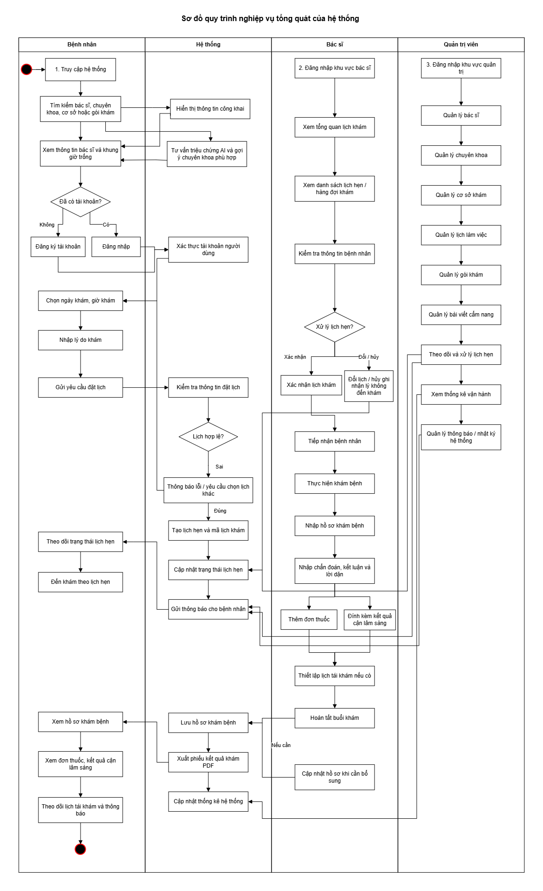

Hình 2.1. Sơ đồ quy trình nghiệp vụ tổng quát của hệ thống

Qua sơ đồ trên, có thể thấy hệ thống được tổ chức xoay quanh quy trình đặt lịch, khám bệnh và theo dõi sau khám của bệnh nhân. Bệnh nhân là người khởi tạo yêu cầu đặt lịch, trong khi hệ thống thực hiện kiểm tra thông tin, ghi nhận lịch hẹn và cập nhật trạng thái theo từng giai đoạn. Bác sĩ tiếp nhận lịch hẹn, xử lý khám bệnh, nhập hồ sơ khám bệnh, kê đơn thuốc, đính kèm kết quả cận lâm sàng và thiết lập lịch tái khám nếu cần. Quản trị viên tham gia vào việc quản lý dữ liệu nền tảng, theo dõi hoạt động vận hành, hỗ trợ xử lý các trạng thái lịch hẹn và gửi thông báo khi có phát sinh.

Sau khi buổi khám hoàn tất, hồ sơ khám bệnh được lưu trữ trên hệ thống để bệnh nhân có thể xem lại trong tài khoản cá nhân. Nhờ đó, quy trình nghiệp vụ không chỉ hỗ trợ đặt lịch và khám bệnh mà còn đảm bảo việc theo dõi, lưu trữ và quản lý thông tin được thực hiện thống nhất, thuận tiện và có hệ thống.

#### 2.3.2. Quy trình bệnh nhân đặt lịch khám

Quy trình bệnh nhân đặt lịch khám bắt đầu khi người dùng truy cập vào hệ thống để tìm kiếm thông tin khám bệnh. Tại đây, bệnh nhân có thể xem danh sách bác sĩ, chuyên khoa, cơ sở khám, gói khám, bài viết cẩm nang sức khỏe và chức năng tư vấn triệu chứng bằng AI để lựa chọn dịch vụ phù hợp với nhu cầu của mình. Đối với các thông tin công khai, người dùng có thể xem mà chưa cần đăng nhập; tuy nhiên, để thực hiện đặt lịch khám và sử dụng các chức năng cá nhân, bệnh nhân cần có tài khoản và đăng nhập vào hệ thống.

Sau khi đăng nhập, bệnh nhân lựa chọn bác sĩ hoặc gói khám mong muốn. Hệ thống hiển thị đầy đủ thông tin chi tiết như chuyên khoa, cơ sở khám, lịch làm việc, khung giờ còn trống và các thông tin liên quan khác để bệnh nhân dễ dàng đưa ra quyết định. Người dùng chọn ngày khám, khung giờ phù hợp, nhập lý do khám hoặc triệu chứng cần tư vấn, sau đó gửi yêu cầu đặt lịch lên hệ thống.

Khi yêu cầu được gửi đi, hệ thống tiến hành kiểm tra các điều kiện cần thiết như tính hợp lệ của thông tin người dùng, trạng thái hoạt động của bác sĩ, ngày khám và khung giờ còn trống. Nếu thông tin hợp lệ, hệ thống ghi nhận lịch hẹn, tạo mã lịch khám và cập nhật trạng thái tương ứng. Tùy theo quy trình xử lý của phòng khám, lịch hẹn có thể ở trạng thái chờ xác nhận hoặc đã được xác nhận ngay sau khi tạo.

Sau khi đặt lịch, bệnh nhân có thể theo dõi lịch hẹn trong khu vực “Lịch hẹn của tôi”. Tại đây, bệnh nhân xem được thông tin ngày giờ khám, bác sĩ phụ trách, cơ sở khám, trạng thái lịch hẹn và các thông tin liên quan khác. Nếu có thay đổi về lịch hẹn, hệ thống sẽ gửi thông báo để bệnh nhân kịp thời nắm bắt và chủ động sắp xếp thời gian.

Sau khi buổi khám hoàn tất, bệnh nhân có thể xem lại hồ sơ khám bệnh, kết quả cận lâm sàng, đơn thuốc, lời dặn của bác sĩ và lịch tái khám nếu có. Như vậy, quy trình đặt lịch không chỉ dừng lại ở thao tác đăng ký khám mà còn hỗ trợ bệnh nhân theo dõi toàn bộ quá trình trước, trong và sau buổi khám một cách thuận tiện.

Tóm tắt quy trình bệnh nhân đặt lịch khám:

Bệnh nhân truy cập hệ thống.

Tìm kiếm bác sĩ, chuyên khoa, cơ sở khám, gói khám hoặc sử dụng tư vấn AI.

Đăng ký hoặc đăng nhập tài khoản.

Chọn bác sĩ/gói khám và xem khung giờ còn trống.

Chọn ngày khám, giờ khám và nhập lý do khám.

Gửi yêu cầu đặt lịch.

Hệ thống kiểm tra thông tin và ghi nhận lịch hẹn.

Bệnh nhân theo dõi trạng thái lịch hẹn.

Sau buổi khám, bệnh nhân xem hồ sơ khám bệnh và lịch tái khám nếu có.

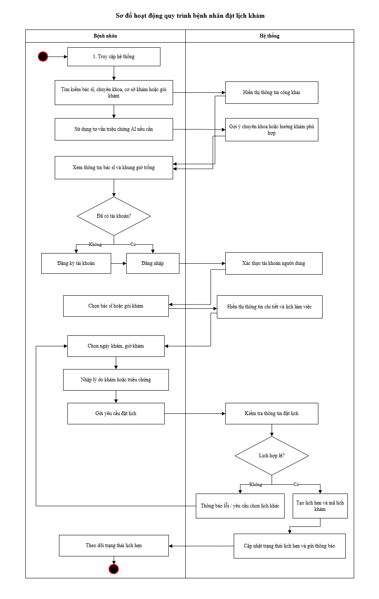

Hình 2.2. Sơ đồ quy trình bệnh nhân đặt lịch khám

#### 2.3.3. Quy trình bác sĩ xử lý lịch hẹn

Quy trình bác sĩ xử lý lịch hẹn bắt đầu khi bác sĩ đăng nhập vào khu vực làm việc của mình trong hệ thống. Sau khi đăng nhập thành công, bác sĩ có thể xem màn hình tổng quan để nắm bắt số lượng lịch khám trong ngày, danh sách bệnh nhân đang chờ, các lịch đang xử lý và những trường hợp cần chú ý. Hệ thống hiển thị lịch hẹn theo ngày hoặc theo khoảng thời gian, giúp bác sĩ chủ động theo dõi công việc khám bệnh.

Đối với các lịch hẹn mới, bác sĩ có thể kiểm tra thông tin bệnh nhân, lý do khám, thời gian khám, cơ sở khám và trạng thái hiện tại của lịch hẹn. Tùy theo quy trình của phòng khám, lịch hẹn có thể được xác nhận, chuyển sang trạng thái chờ khám, đang khám hoặc xử lý theo các trạng thái khác như hủy lịch, đổi lịch hoặc ghi nhận bệnh nhân không đến khám. Việc cập nhật trạng thái giúp thông tin giữa bác sĩ, bệnh nhân và quản trị viên được đồng bộ.

Khi đến thời gian khám, bác sĩ tiếp nhận bệnh nhân và thực hiện quá trình khám bệnh. Trong quá trình này, bác sĩ có thể xem thông tin liên quan đến lịch hẹn và hồ sơ trước đó nếu có. Sau khi khám, bác sĩ nhập các thông tin cần thiết vào hồ sơ khám bệnh như triệu chứng, bệnh sử, chẩn đoán, kết luận điều trị, lời dặn, đơn thuốc, kết quả cận lâm sàng và lịch tái khám nếu cần.

Sau khi hoàn tất hồ sơ, bác sĩ lưu thông tin khám bệnh lên hệ thống. Lúc này, lịch hẹn được cập nhật sang trạng thái hoàn thành, hồ sơ khám bệnh được lưu trữ để bệnh nhân có thể xem lại trong tài khoản cá nhân. Nếu sau đó phát hiện thông tin nhập thiếu hoặc cần bổ sung, bác sĩ có thể cập nhật lại hồ sơ khám bệnh theo quyền được cấp.

Tóm tắt quy trình bác sĩ xử lý lịch hẹn:

Bác sĩ đăng nhập vào hệ thống.

Xem tổng quan lịch khám và danh sách lịch hẹn.

Kiểm tra thông tin bệnh nhân và lý do khám.

Xác nhận hoặc cập nhật trạng thái lịch hẹn.

Tiếp nhận bệnh nhân khi đến lượt khám.

Thực hiện khám bệnh và nhập hồ sơ khám.

Kê đơn thuốc, đính kèm kết quả cận lâm sàng nếu có.

Thiết lập lịch tái khám nếu cần.

Lưu hồ sơ và hoàn tất lịch hẹn.

Cập nhật lại hồ sơ trong trường hợp cần bổ sung thông tin.

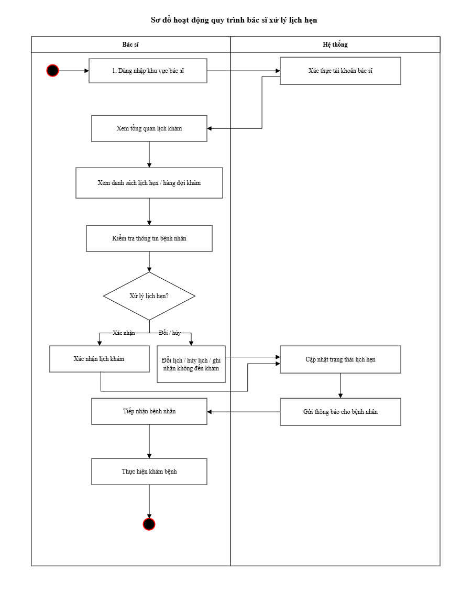

Hình 2.3. Sơ đồ quy trình bác sĩ xử lý lịch hẹn

#### 2.3.4. Quy trình nhập và cập nhật hồ sơ khám bệnh

Quy trình nhập hồ sơ khám bệnh được thực hiện sau khi bác sĩ tiếp nhận bệnh nhân và tiến hành thăm khám. Dựa trên thông tin từ lịch hẹn, hệ thống xác định bệnh nhân, bác sĩ phụ trách, thời gian khám và các dữ liệu liên quan. Bác sĩ mở biểu mẫu nhập hồ sơ khám bệnh để ghi nhận kết quả của buổi khám vào hệ thống.

Trong quá trình nhập hồ sơ, bác sĩ điền các thông tin chuyên môn như triệu chứng, bệnh sử, tiền sử dị ứng, mã bệnh nếu có, chẩn đoán, kết luận và hướng điều trị, lời dặn cho bệnh nhân. Nếu trong buổi khám có chỉ định cận lâm sàng, bác sĩ có thể nhập tên kết quả, loại kết quả và đính kèm tệp liên quan như hình ảnh, PDF hoặc đường dẫn kết quả. Ngoài ra, bác sĩ có thể nhập đơn thuốc với các thông tin như tên thuốc, liều dùng, số lần sử dụng trong ngày, thời gian dùng và ghi chú nếu cần.

Sau khi hoàn tất quá trình nhập liệu, bác sĩ kiểm tra lại thông tin và lưu hồ sơ khám bệnh. Hệ thống ghi nhận hồ sơ, liên kết hồ sơ với lịch hẹn tương ứng và cập nhật trạng thái lịch hẹn sang hoàn thành. Hồ sơ sau khi được lưu có thể được bệnh nhân xem lại trong khu vực hồ sơ khám bệnh của tài khoản cá nhân. Nếu có lịch tái khám, hệ thống cũng lưu thông tin ngày tái khám, lời dặn tái khám và hiển thị để bệnh nhân theo dõi.

Trong trường hợp bác sĩ phát hiện hồ sơ đã nhập còn thiếu thông tin hoặc có sai sót, hệ thống cho phép cập nhật hồ sơ theo quyền của bác sĩ. Bác sĩ có thể chỉnh sửa các nội dung cần thiết như chẩn đoán, kết luận, lời dặn, đơn thuốc, kết quả cận lâm sàng hoặc kế hoạch tái khám. Sau khi cập nhật, hệ thống lưu lại thông tin mới và gửi thông báo để bệnh nhân biết rằng hồ sơ khám bệnh đã được thay đổi.

Tóm tắt quy trình nhập và cập nhật hồ sơ khám bệnh:

Bác sĩ chọn lịch hẹn cần nhập hồ sơ.

Hệ thống hiển thị thông tin bệnh nhân và lịch khám.

Bác sĩ nhập triệu chứng, bệnh sử, chẩn đoán và kết luận điều trị.

Bác sĩ thêm đơn thuốc nếu có.

Bác sĩ đính kèm kết quả cận lâm sàng nếu có.

Bác sĩ thiết lập lịch tái khám nếu cần.

Hệ thống lưu hồ sơ và cập nhật trạng thái lịch hẹn.

Bệnh nhân có thể xem lại hồ sơ trong tài khoản cá nhân.

Nếu cần chỉnh sửa, bác sĩ cập nhật hồ sơ.

Hệ thống thông báo cho bệnh nhân sau khi hồ sơ được cập nhật.

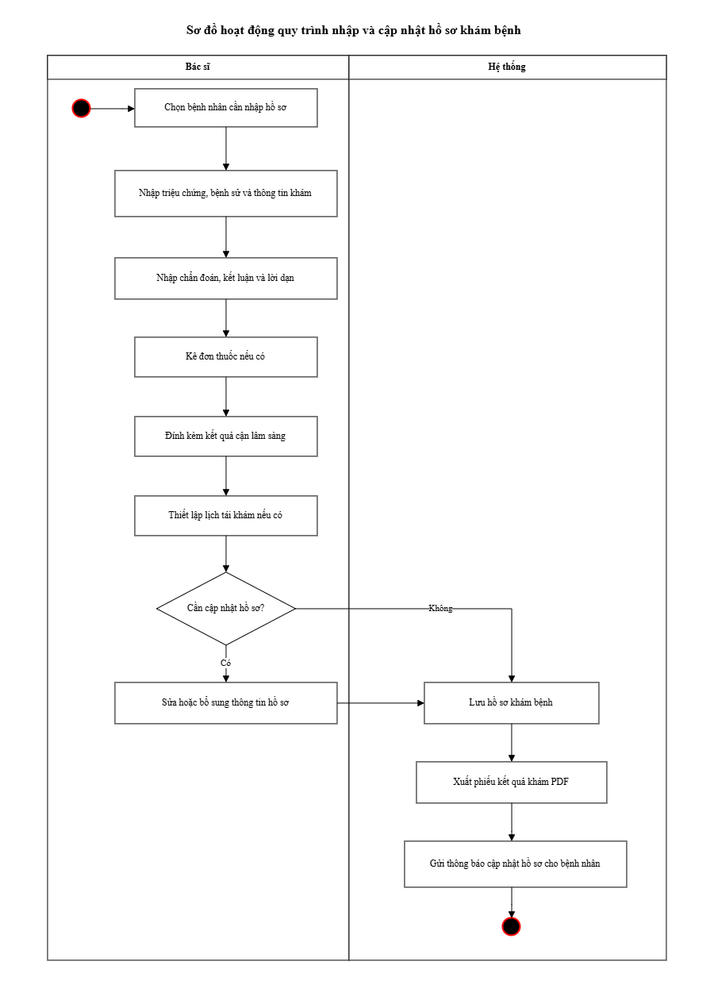

Hình 2.4. Sơ đồ quy trình nhập và cập nhật hồ sơ khám bệnh

#### 2.3.5. Quy trình quản trị hệ thống

Quy trình quản trị hệ thống được thực hiện bởi quản trị viên nhằm đảm bảo các dữ liệu và hoạt động của phòng khám được quản lý tập trung, chính xác và ổn định. Sau khi đăng nhập vào khu vực quản trị, quản trị viên có thể xem màn hình tổng quan để nắm bắt tình hình vận hành như số lượng lịch hẹn, trạng thái xử lý, số lịch chờ xác nhận, lịch đang khám, lịch hoàn thành hoặc các yêu cầu cần chú ý.

Một nhiệm vụ quan trọng của quản trị viên là quản lý dữ liệu nền tảng của hệ thống. Các dữ liệu này bao gồm thông tin cơ sở khám, chuyên khoa, bác sĩ, lịch làm việc, gói khám và bài viết cẩm nang. Khi có sự thay đổi về bác sĩ, chuyên khoa, thời gian làm việc hoặc dịch vụ khám, quản trị viên cập nhật thông tin lên hệ thống để bệnh nhân có thể tra cứu và đặt lịch chính xác.

Đối với lịch hẹn, quản trị viên có thể theo dõi danh sách lịch khám, lọc theo trạng thái, ngày khám, bác sĩ hoặc cơ sở khám. Trong một số trường hợp phát sinh như bệnh nhân yêu cầu đổi lịch, hủy lịch hoặc lịch hẹn cần được xác nhận, quản trị viên có thể hỗ trợ xử lý và cập nhật trạng thái phù hợp. Việc quản lý tập trung giúp hạn chế sai sót và đảm bảo thông tin lịch hẹn được đồng bộ giữa bệnh nhân, bác sĩ và phòng khám.

Ngoài ra, quản trị viên còn có thể quản lý các nội dung hỗ trợ người dùng như bài viết cẩm nang sức khỏe, gói khám và thông báo hệ thống. Các nội dung này giúp bệnh nhân có thêm thông tin tham khảo trước khi thăm khám, đồng thời hỗ trợ phòng khám truyền tải thông tin cần thiết đến người dùng một cách nhanh chóng.

Hệ thống cũng cung cấp các thống kê và biểu đồ tổng quan để quản trị viên đánh giá hoạt động của phòng khám. Thông qua các số liệu như tổng số lịch khám, tỷ lệ lịch hoàn thành, lịch bị hủy, bệnh nhân không đến khám hoặc số lượng lịch theo bác sĩ, quản trị viên có thể theo dõi hiệu quả vận hành và đưa ra điều chỉnh phù hợp khi cần thiết.

Tóm tắt quy trình quản trị hệ thống:

Quản trị viên đăng nhập vào hệ thống.

Xem màn hình tổng quan vận hành.

Quản lý thông tin cơ sở khám, chuyên khoa và bác sĩ.

Cập nhật lịch làm việc của bác sĩ.

Quản lý lịch hẹn và xử lý các yêu cầu phát sinh.

Quản lý gói khám và bài viết cẩm nang.

Theo dõi thông báo và nhật ký hoạt động nếu có.

Xem thống kê, biểu đồ để đánh giá tình hình vận hành.

Cập nhật dữ liệu khi có thay đổi để đảm bảo hệ thống hoạt động ổn định.

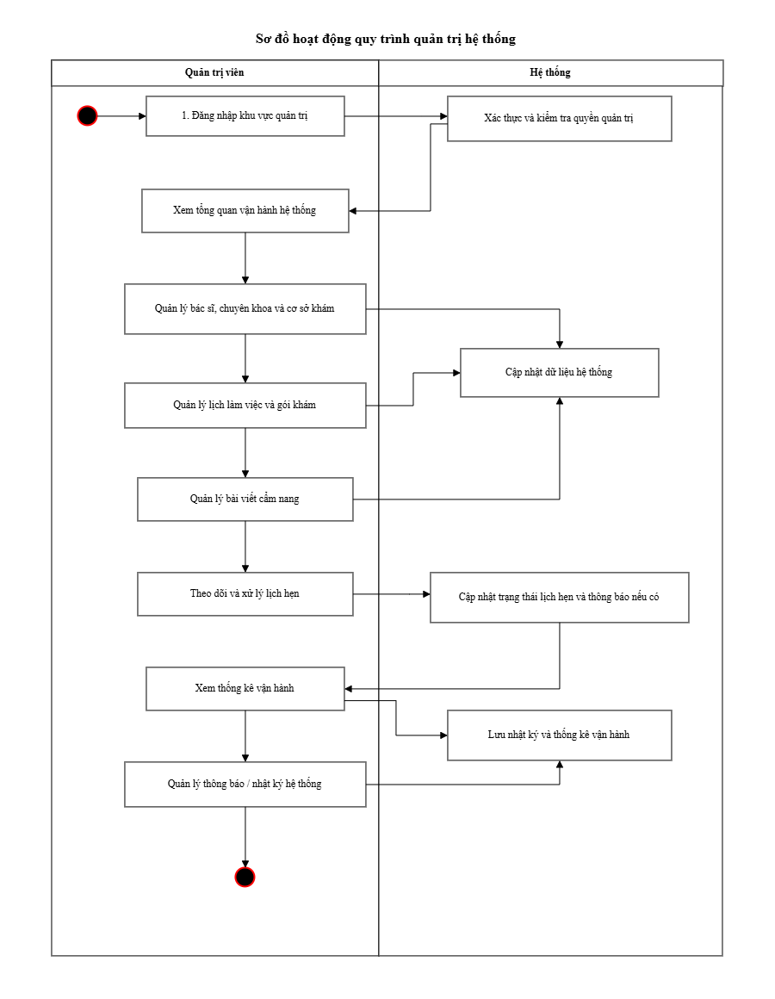

Hình 2.5. Sơ đồ quy trình quản trị hệ thống

### 2.4. Xác định tác nhân hệ thống

Từ kết quả khảo sát hiện trạng và phân tích quy trình nghiệp vụ, hệ thống cần đáp ứng các yêu cầu chính phục vụ quá trình tìm kiếm thông tin khám bệnh, tư vấn triệu chứng, đặt lịch khám, quản lý lịch hẹn, nhập hồ sơ khám bệnh và hỗ trợ quản trị phòng khám.

Hệ thống được xây dựng phục vụ cho bốn nhóm người dùng chính gồm: khách truy cập, bệnh nhân, bác sĩ và quản trị viên. Mỗi nhóm có quyền truy cập và chức năng khác nhau, phù hợp với vai trò trong quy trình đặt lịch và khám bệnh.

Khách truy cập có thể xem thông tin công khai như bác sĩ, chuyên khoa, cơ sở khám, gói khám và cẩm nang sức khỏe. Bệnh nhân sau khi đăng nhập có thể đặt lịch khám, theo dõi lịch hẹn, xem hồ sơ khám bệnh, đơn thuốc và lịch tái khám. Bác sĩ sử dụng hệ thống để quản lý lịch khám, tiếp nhận bệnh nhân, nhập hồ sơ khám bệnh và theo dõi quá trình điều trị. Quản trị viên có nhiệm vụ quản lý dữ liệu nền, lịch làm việc, bác sĩ, chuyên khoa, cơ sở khám và theo dõi hoạt động hệ thống.

#### 2.4.1. Khách truy cập

Khách truy cập là người dùng chưa đăng nhập vào hệ thống. Nhóm người dùng này có thể xem các thông tin công khai của phòng khám như danh sách cơ sở khám, chuyên khoa, bác sĩ, gói khám và các bài viết cẩm nang sức khỏe. Ngoài ra, khách truy cập có thể tìm kiếm bác sĩ hoặc chuyên khoa phù hợp, xem thông tin chi tiết của bác sĩ, lịch làm việc và các khung giờ khám còn trống.

Khi muốn đặt lịch khám hoặc sử dụng các chức năng cá nhân như theo dõi lịch hẹn và xem hồ sơ khám bệnh, khách truy cập cần đăng ký tài khoản hoặc đăng nhập vào hệ thống. Việc giới hạn một số chức năng cho người dùng đã xác thực giúp hệ thống đảm bảo tính bảo mật và quản lý chính xác thông tin bệnh nhân.

#### 2.4.2. Bệnh nhân

Bệnh nhân là người dùng đã có tài khoản và đăng nhập vào hệ thống để sử dụng các chức năng phục vụ quá trình đặt lịch và theo dõi khám bệnh. Sau khi đăng nhập, bệnh nhân có thể tìm kiếm bác sĩ, chuyên khoa, cơ sở khám hoặc gói khám; xem thông tin chi tiết; sử dụng tư vấn triệu chứng bằng AI; lựa chọn ngày khám, khung giờ khám và gửi yêu cầu đặt lịch lên hệ thống.

Sau khi đặt lịch, bệnh nhân có thể theo dõi trạng thái lịch hẹn như chờ xác nhận, đã xác nhận, hoàn thành, đã hủy hoặc không đến khám. Ngoài ra, bệnh nhân còn có thể xem lại lịch sử khám bệnh, hồ sơ khám, đơn thuốc, kết quả cận lâm sàng, lịch tái khám và nhận thông báo từ hệ thống khi có thay đổi liên quan đến lịch hẹn hoặc hồ sơ khám bệnh.

#### 2.4.3. Bác sĩ

Bác sĩ là người dùng có tài khoản chuyên môn và được phân quyền để quản lý quá trình khám bệnh. Sau khi đăng nhập vào khu vực bác sĩ, bác sĩ có thể xem tổng quan lịch khám theo ngày, tuần, tháng hoặc các khoảng thời gian khác; theo dõi danh sách lịch hẹn và hàng đợi khám; kiểm tra thông tin bệnh nhân trước khi tiếp nhận khám.

Trong quá trình làm việc, bác sĩ có thể xác nhận lịch khám, xử lý yêu cầu đổi lịch hoặc hủy lịch, ghi nhận trường hợp bệnh nhân không đến khám. Khi thực hiện khám bệnh, bác sĩ có thể nhập hồ sơ khám, ghi chẩn đoán, kết luận, lời dặn, kê đơn thuốc, đính kèm kết quả cận lâm sàng và thiết lập lịch tái khám nếu cần. Ngoài ra, bác sĩ cũng có thể cập nhật hồ sơ khám bệnh trong trường hợp nhập sai hoặc cần bổ sung thông tin sau khi hoàn tất buổi khám.

#### 2.4.4. Quản trị viên

Quản trị viên là người dùng có quyền quản lý và vận hành toàn bộ hệ thống. Sau khi đăng nhập vào khu vực quản trị, quản trị viên có thể quản lý các dữ liệu nền như cơ sở khám, chuyên khoa, bác sĩ, lịch làm việc, gói khám và bài viết cẩm nang. Đây là các thông tin quan trọng được sử dụng để hiển thị cho người dùng và phục vụ quá trình đặt lịch khám.

Ngoài các chức năng quản lý dữ liệu, quản trị viên còn có thể theo dõi danh sách lịch hẹn, hàng đợi khám, trạng thái xử lý lịch khám, thông báo và nhật ký hệ thống. Hệ thống cũng cung cấp các thống kê tổng quan giúp quản trị viên nắm được tình hình vận hành, số lượng lịch hẹn, trạng thái khám và các vấn đề cần xử lý trong phòng khám.

### 2.5. Yêu cầu chức năng

Yêu cầu chức năng mô tả những chức năng cụ thể mà hệ thống cần cung cấp để đáp ứng nhu cầu sử dụng của từng nhóm người dùng. Trong hệ thống đặt lịch khám bệnh cho phòng khám nhỏ, các chức năng được phân chia theo vai trò gồm khách truy cập, bệnh nhân, bác sĩ và quản trị viên.

Đối với khách truy cập, hệ thống cho phép xem thông tin công khai về cơ sở khám, chuyên khoa, bác sĩ, gói khám và bài viết cẩm nang. Người dùng chưa đăng nhập cũng có thể tìm kiếm thông tin, xem lịch làm việc của bác sĩ và các khung giờ khám còn trống. Tuy nhiên, để đặt lịch khám và theo dõi thông tin cá nhân, người dùng cần đăng ký hoặc đăng nhập tài khoản.

Đối với bệnh nhân, hệ thống hỗ trợ đăng ký, đăng nhập, tìm kiếm thông tin khám bệnh, sử dụng tư vấn triệu chứng bằng AI, đặt lịch khám, theo dõi trạng thái lịch hẹn, nhận thông báo, xem hồ sơ khám bệnh, đơn thuốc, kết quả cận lâm sàng và lịch tái khám. Các chức năng này giúp bệnh nhân chủ động hơn trong quá trình đặt lịch và theo dõi quá trình khám bệnh.

Đối với bác sĩ, hệ thống cung cấp các chức năng xem lịch khám, quản lý hàng đợi, xác nhận hoặc xử lý lịch hẹn, tiếp nhận bệnh nhân, nhập và cập nhật hồ sơ khám bệnh, kê đơn thuốc, đính kèm kết quả cận lâm sàng, thiết lập lịch tái khám và theo dõi đánh giá của bệnh nhân.

Đối với quản trị viên, hệ thống cho phép quản lý các dữ liệu nền như cơ sở khám, chuyên khoa, bác sĩ, lịch làm việc, gói khám, bài viết cẩm nang; đồng thời theo dõi lịch hẹn, hàng đợi khám, thông báo, nhật ký hệ thống và thống kê vận hành. Nhóm chức năng này giúp quản trị viên kiểm soát hoạt động của hệ thống và hỗ trợ phòng khám vận hành hiệu quả hơn.

#### 2.5.1. Nhóm chức năng tài khoản và xác thực

Nhóm chức năng tài khoản và xác thực giúp hệ thống quản lý thông tin người dùng, kiểm soát đăng nhập và phân quyền truy cập theo từng vai trò. Hệ thống hỗ trợ các chức năng cơ bản như đăng ký tài khoản, đăng nhập, đăng xuất, cập nhật thông tin cá nhân, đổi mật khẩu và xác định quyền sử dụng tương ứng với từng nhóm người dùng gồm bệnh nhân, bác sĩ và quản trị viên.

Đối với bệnh nhân, hệ thống cho phép đăng ký tài khoản mới để thực hiện các chức năng cá nhân như đặt lịch khám, theo dõi lịch hẹn, xem hồ sơ khám bệnh và nhận thông báo. Đối với bác sĩ và quản trị viên, tài khoản được quản lý theo quyền hạn riêng để truy cập vào khu vực làm việc phù hợp. Sau khi đăng nhập, hệ thống kiểm tra thông tin xác thực, xác định vai trò người dùng và điều hướng đến giao diện tương ứng.

Chức năng xác thực và phân quyền giúp bảo vệ dữ liệu cá nhân, hồ sơ khám bệnh và thông tin vận hành của phòng khám. Nhờ đó, mỗi người dùng chỉ được truy cập và thao tác trong phạm vi được cấp quyền, góp phần đảm bảo tính an toàn và riêng tư cho hệ thống.

#### 2.5.2. Nhóm chức năng tìm kiếm và xem thông tin khám

Nhóm chức năng tìm kiếm và xem thông tin khám cho phép người dùng tra cứu các thông tin công khai của hệ thống trước khi đặt lịch. Người dùng có thể tìm kiếm theo bác sĩ, chuyên khoa, cơ sở khám, gói khám hoặc xem các bài viết cẩm nang sức khỏe để lựa chọn dịch vụ phù hợp với nhu cầu của mình.

Hệ thống cung cấp thông tin chi tiết về bác sĩ như họ tên, chuyên khoa, cơ sở làm việc, kinh nghiệm, đánh giá, lịch làm việc và các khung giờ khám còn trống. Ngoài ra, hệ thống còn hỗ trợ tư vấn triệu chứng bằng AI, giúp người dùng nhập triệu chứng ban đầu để nhận gợi ý chuyên khoa hoặc hướng khám phù hợp.

Chức năng này có thể được sử dụng bởi cả khách truy cập và bệnh nhân đã đăng nhập. Tuy nhiên, để gửi yêu cầu đặt lịch khám và theo dõi lịch hẹn cá nhân, người dùng cần đăng nhập vào hệ thống nhằm đảm bảo thông tin được gắn với đúng tài khoản bệnh nhân.

#### 2.5.3. Nhóm chức năng đặt lịch khám

Nhóm chức năng đặt lịch khám cho phép bệnh nhân lựa chọn bác sĩ, chuyên khoa, cơ sở khám hoặc gói khám phù hợp, sau đó chọn ngày khám và khung giờ còn trống để gửi yêu cầu đặt lịch. Khi đặt lịch, bệnh nhân có thể nhập lý do khám hoặc triệu chứng ban đầu để bác sĩ có thêm thông tin trước buổi khám.

Sau khi bệnh nhân gửi yêu cầu, hệ thống kiểm tra tính hợp lệ của lịch hẹn, bao gồm khung giờ còn trống, lịch làm việc của bác sĩ và các thông tin cần thiết của bệnh nhân. Nếu thông tin hợp lệ, hệ thống tạo lịch hẹn, sinh mã lịch khám và cập nhật trạng thái ban đầu của lịch. Nếu lịch không hợp lệ, hệ thống hiển thị thông báo để bệnh nhân chọn lại thời gian hoặc bổ sung thông tin cần thiết.

Chức năng đặt lịch khám giúp giảm thao tác đăng ký thủ công tại phòng khám, hạn chế trùng lịch và hỗ trợ bệnh nhân chủ động hơn trong việc lựa chọn thời gian khám phù hợp.

#### 2.5.4. Nhóm chức năng quản lý lịch hẹn của bệnh nhân

Nhóm chức năng quản lý lịch hẹn của bệnh nhân cho phép bệnh nhân theo dõi toàn bộ các lịch khám đã đặt trên hệ thống. Bệnh nhân có thể xem danh sách lịch hẹn, thông tin bác sĩ, chuyên khoa, cơ sở khám, thời gian khám, mã lịch khám và trạng thái xử lý của từng lịch.

Hệ thống hiển thị các trạng thái lịch hẹn như chờ xác nhận, đã xác nhận, hoàn thành, đã hủy, không đến khám hoặc cần chú ý. Thông qua đó, bệnh nhân có thể nắm được tình trạng lịch khám của mình và chủ động theo dõi các thay đổi. Ngoài ra, bệnh nhân có thể xem chi tiết lịch hẹn, nhận thông báo khi lịch được xác nhận, thay đổi, hủy hoặc khi có lịch tái khám.

Chức năng này giúp bệnh nhân quản lý quá trình khám bệnh rõ ràng hơn, tránh bỏ sót lịch hẹn và thuận tiện trong việc tra cứu lại lịch sử đặt khám.

#### 2.5.5. Nhóm chức năng hồ sơ khám bệnh và tái khám

Nhóm chức năng hồ sơ khám bệnh và tái khám cho phép bệnh nhân xem lại thông tin sau khi buổi khám hoàn tất. Hồ sơ khám bệnh bao gồm các thông tin như triệu chứng, bệnh sử, chẩn đoán, kết luận, hướng điều trị, lời dặn của bác sĩ, đơn thuốc và các kết quả cận lâm sàng được đính kèm.

Bên cạnh đó, hệ thống hỗ trợ hiển thị lịch sử khám bệnh của bệnh nhân theo từng lần khám, giúp bệnh nhân dễ dàng tra cứu lại thông tin điều trị khi cần. Nếu bác sĩ thiết lập lịch tái khám, bệnh nhân có thể xem thời gian tái khám được đề xuất, lời dặn tái khám và trạng thái xử lý của lịch tái khám.

Chức năng này giúp số hóa quá trình lưu trữ hồ sơ khám bệnh, giảm phụ thuộc vào giấy tờ thủ công và hỗ trợ bệnh nhân theo dõi quá trình điều trị một cách liên tục, rõ ràng hơn.

#### 2.5.6. Nhóm chức năng dành cho bác sĩ

Nhóm chức năng dành cho bác sĩ hỗ trợ bác sĩ quản lý quá trình khám bệnh và xử lý các lịch hẹn được phân công. Sau khi đăng nhập, bác sĩ có thể xem tổng quan lịch khám theo ngày, tuần, tháng hoặc khoảng thời gian lựa chọn; theo dõi hàng đợi khám và danh sách bệnh nhân cần xử lý.

Bác sĩ có thể xác nhận lịch hẹn, xử lý yêu cầu đổi lịch hoặc hủy lịch, ghi nhận trường hợp bệnh nhân không đến khám và cập nhật trạng thái của lịch khám. Khi tiếp nhận bệnh nhân, bác sĩ có thể nhập hồ sơ khám bệnh gồm triệu chứng, bệnh sử, chẩn đoán, kết luận, hướng điều trị và lời dặn. Hệ thống cũng hỗ trợ bác sĩ kê đơn thuốc, đính kèm kết quả cận lâm sàng, thiết lập lịch tái khám và cập nhật hồ sơ trong trường hợp cần chỉnh sửa hoặc bổ sung thông tin.

Nhóm chức năng này giúp bác sĩ giảm thao tác ghi chép thủ công, quản lý lịch khám rõ ràng hơn và lưu trữ thông tin khám bệnh một cách đầy đủ, có hệ thống.

#### 2.5.7. Nhóm chức năng dành cho quản trị viên

Nhóm chức năng dành cho quản trị viên hỗ trợ quản lý và vận hành toàn bộ hệ thống. Quản trị viên có thể quản lý các dữ liệu nền như cơ sở khám, chuyên khoa, bác sĩ, lịch làm việc, gói khám và bài viết cẩm nang. Các dữ liệu này được sử dụng để hiển thị cho người dùng và phục vụ quá trình đặt lịch khám.

Ngoài ra, quản trị viên có thể theo dõi và quản lý lịch hẹn, hàng đợi khám, trạng thái xử lý lịch khám, thông báo và nhật ký hệ thống. Hệ thống cũng cung cấp các chức năng thống kê vận hành như tổng số lịch hẹn, trạng thái lịch khám, số lượng bác sĩ, chuyên khoa, cơ sở khám và các thông tin liên quan đến hoạt động của phòng khám.

Nhóm chức năng này giúp quản trị viên kiểm soát dữ liệu, hỗ trợ xử lý các vấn đề phát sinh và đảm bảo hệ thống hoạt động ổn định, hiệu quả.

#### 2.5.8. Nhóm chức năng thống kê, thông báo và xuất PDF

Nhóm chức năng thống kê, thông báo và xuất PDF hỗ trợ người dùng theo dõi thông tin hệ thống một cách trực quan và thuận tiện hơn. Đối với bác sĩ và quản trị viên, hệ thống cung cấp các thống kê về số lượng lịch hẹn, trạng thái khám, hàng đợi khám, hồ sơ khám bệnh và các chỉ số vận hành theo ngày, tuần, tháng hoặc khoảng thời gian lựa chọn. Các thống kê này giúp người dùng nắm bắt nhanh tình hình hoạt động và đưa ra quyết định xử lý phù hợp.

Hệ thống cũng hỗ trợ gửi thông báo cho bệnh nhân khi có thay đổi liên quan đến lịch hẹn, hồ sơ khám bệnh hoặc lịch tái khám. Đối với bác sĩ và quản trị viên, thông báo giúp theo dõi các yêu cầu cần xử lý như lịch chờ xác nhận, yêu cầu đổi lịch, hủy lịch hoặc các cập nhật quan trọng trong quá trình khám.

Bên cạnh đó, hệ thống cho phép xuất phiếu kết quả khám bệnh dưới dạng PDF. Phiếu PDF bao gồm các thông tin chính như thông tin bệnh nhân, bác sĩ, thời gian khám, chẩn đoán, kết luận, đơn thuốc, kết quả cận lâm sàng và kế hoạch tái khám. Chức năng này giúp bệnh nhân dễ dàng lưu trữ, in ấn hoặc sử dụng kết quả khám khi cần thiết.

### 2.6. Yêu cầu phi chức năng

Hệ thống cần có giao diện dễ sử dụng, thao tác rõ ràng và phù hợp với bệnh nhân, bác sĩ, quản trị viên. Ngoài ra, hệ thống cần đảm bảo bảo mật thông tin, phân quyền đúng vai trò, hoạt động ổn định, phản hồi nhanh và có khả năng mở rộng khi số lượng người dùng hoặc lịch hẹn tăng lên.

#### 2.6.1. Tính dễ sử dụng

Hệ thống cần có giao diện trực quan, bố cục rõ ràng và thống nhất giữa các màn hình để người dùng có thể thao tác thuận tiện. Các chức năng quan trọng như tìm kiếm thông tin khám, đặt lịch, theo dõi lịch hẹn, nhập hồ sơ khám bệnh và quản lý dữ liệu cần được sắp xếp hợp lý, dễ nhận biết và dễ sử dụng.

Đối với bệnh nhân, giao diện cần đơn giản, dễ hiểu, giúp người dùng nhanh chóng tìm được bác sĩ, chuyên khoa hoặc gói khám phù hợp và thực hiện đặt lịch mà không cần nhiều thao tác phức tạp. Đối với bác sĩ và quản trị viên, hệ thống cần hỗ trợ màn hình làm việc rõ ràng, dễ theo dõi, giúp xử lý lịch hẹn, hồ sơ khám bệnh và dữ liệu quản trị một cách hiệu quả.

#### 2.6.2. Tính bảo mật

Hệ thống cần đảm bảo an toàn cho thông tin cá nhân, tài khoản người dùng và hồ sơ khám bệnh của bệnh nhân. Các chức năng quan trọng như đặt lịch khám, xem hồ sơ khám bệnh, nhập kết quả khám, quản lý bác sĩ và quản trị hệ thống chỉ được thực hiện sau khi người dùng đăng nhập hợp lệ.

Hệ thống áp dụng cơ chế phân quyền theo vai trò, bao gồm bệnh nhân, bác sĩ và quản trị viên. Mỗi nhóm người dùng chỉ được truy cập và thao tác trên các chức năng phù hợp với quyền hạn của mình. Điều này giúp hạn chế truy cập trái phép, bảo vệ dữ liệu y tế và đảm bảo tính riêng tư trong quá trình sử dụng hệ thống.

#### 2.6.3. Tính hiệu năng

Hệ thống cần đảm bảo tốc độ phản hồi nhanh đối với các thao tác thường xuyên như tìm kiếm bác sĩ, xem lịch trống, đặt lịch khám, theo dõi lịch hẹn và truy cập hồ sơ khám bệnh. Các dữ liệu hiển thị cần được xử lý hợp lý để người dùng có thể sử dụng hệ thống thuận tiện mà không phải chờ đợi lâu.

Bên cạnh đó, hệ thống cần có khả năng xử lý nhiều yêu cầu trong cùng một thời điểm, đặc biệt trong các khung giờ cao điểm khi nhiều bệnh nhân truy cập để đặt lịch hoặc theo dõi thông tin khám. Việc tối ưu truy vấn dữ liệu, phân trang danh sách và giới hạn dữ liệu tải về là cần thiết để duy trì hiệu năng ổn định.

#### 2.6.4. Tính tin cậy

Hệ thống cần đảm bảo hoạt động ổn định trong quá trình sử dụng, đặc biệt đối với các chức năng quan trọng như đặt lịch khám, xác nhận lịch hẹn, nhập hồ sơ khám bệnh và xuất phiếu kết quả khám. Các thao tác của người dùng cần được xử lý chính xác, hạn chế lỗi làm sai lệch thông tin lịch hẹn hoặc hồ sơ bệnh án.

Ngoài ra, hệ thống cần kiểm tra dữ liệu đầu vào, thông báo lỗi rõ ràng khi người dùng nhập thiếu hoặc nhập sai thông tin. Các thay đổi quan trọng như cập nhật trạng thái lịch hẹn, hoàn tất buổi khám hoặc chỉnh sửa hồ sơ khám bệnh cần được ghi nhận đầy đủ để đảm bảo dữ liệu luôn nhất quán và có thể theo dõi khi cần thiết.

#### 2.6.5. Tính mở rộng

Hệ thống cần được thiết kế có khả năng mở rộng khi nhu cầu sử dụng tăng lên, chẳng hạn như tăng số lượng bệnh nhân, bác sĩ, chuyên khoa, cơ sở khám hoặc lịch hẹn. Việc tổ chức chức năng theo từng vai trò và phân tách rõ các nhóm nghiệp vụ giúp hệ thống dễ dàng bổ sung thêm chức năng mới trong tương lai.

Ngoài ra, cơ sở dữ liệu và cấu trúc ứng dụng cần được xây dựng linh hoạt để có thể mở rộng các nghiệp vụ như thanh toán trực tuyến, tư vấn từ xa, nhắc lịch tự động, quản lý nhiều chi nhánh hoặc tích hợp với các hệ thống y tế khác nếu cần. Điều này giúp hệ thống không chỉ đáp ứng nhu cầu hiện tại của phòng khám nhỏ mà còn có thể phát triển theo quy mô lớn hơn.

#### 2.6.6. Tính tương thích thiết bị

Hệ thống cần có khả năng hiển thị và hoạt động tốt trên nhiều loại thiết bị khác nhau như máy tính để bàn, máy tính xách tay, máy tính bảng và điện thoại di động. Giao diện cần được thiết kế đáp ứng để người dùng có thể sử dụng thuận tiện trên các kích thước màn hình khác nhau.

Đối với bệnh nhân, việc tương thích trên thiết bị di động là rất quan trọng vì người dùng thường tra cứu thông tin và đặt lịch khám bằng điện thoại. Đối với bác sĩ và quản trị viên, hệ thống cần hoạt động ổn định trên máy tính hoặc laptop để hỗ trợ thao tác quản lý, theo dõi lịch hẹn và nhập hồ sơ khám bệnh một cách hiệu quả.

### 2.7. Biểu đồ Use Case tổng quan

Biểu đồ Use Case tổng quan mô tả các tác nhân chính và các chức năng mà từng tác nhân có thể thực hiện trong hệ thống. Đối với đề tài “Ứng dụng đặt lịch khám bệnh cho phòng khám nhỏ”, hệ thống gồm bốn tác nhân chính: khách truy cập, bệnh nhân, bác sĩ và quản trị viên.

Khách truy cập có thể xem thông tin công khai như bác sĩ, chuyên khoa, cơ sở khám, gói khám và bài viết cẩm nang. Bệnh nhân có thể đặt lịch khám, theo dõi lịch hẹn, xem hồ sơ khám bệnh, đơn thuốc, kết quả cận lâm sàng và lịch tái khám. Bác sĩ có thể quản lý lịch khám, xử lý lịch hẹn, nhập hồ sơ khám bệnh, kê đơn thuốc và thiết lập lịch tái khám. Quản trị viên quản lý dữ liệu hệ thống, lịch hẹn, thông báo, nhật ký và thống kê vận hành.

Biểu đồ này là cơ sở để phân rã và đặc tả chi tiết các Use Case trong các phần tiếp theo.

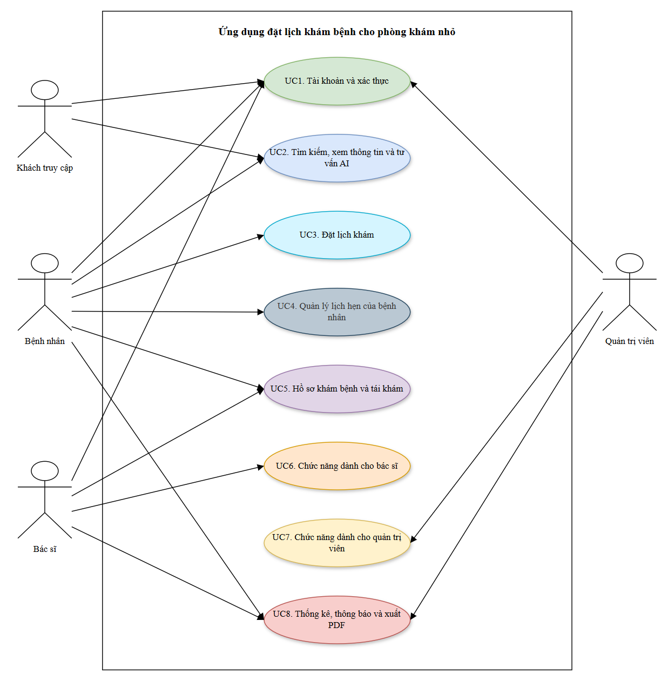

Hình 2.2. Sơ đồ Use Case tổng quan

### 2.8. Biểu đồ Use Case phân rã theo tác nhân

#### 2.8.1. Use Case của bệnh nhân

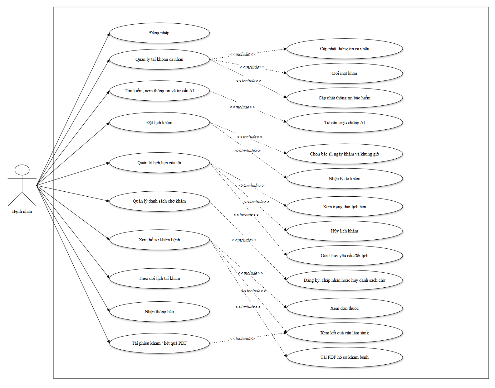

Hình 2.3. Sơ đồ Use Case Bệnh nhân

#### 2.8.2. Use Case của bác sĩ

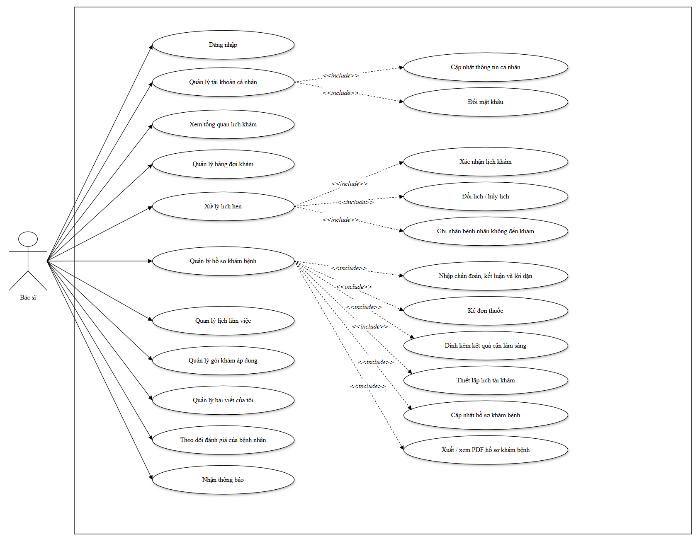

Hình 2.4. Sơ đồ Use Case Bác sĩ

#### 2.8.3. Use Case của quản trị viên

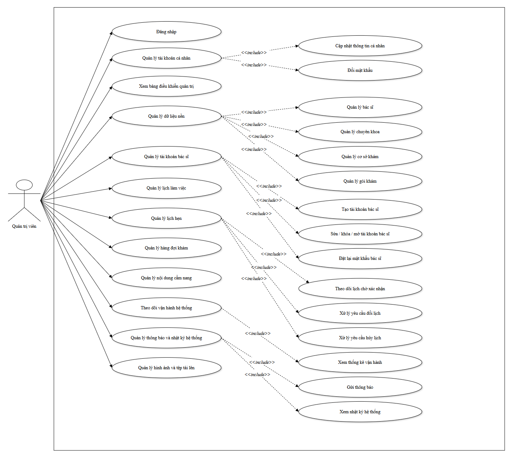

Hình 2.5. Sơ đồ Use Case Quản trị viên

#### 2.8.4. Use Case của khách truy cập

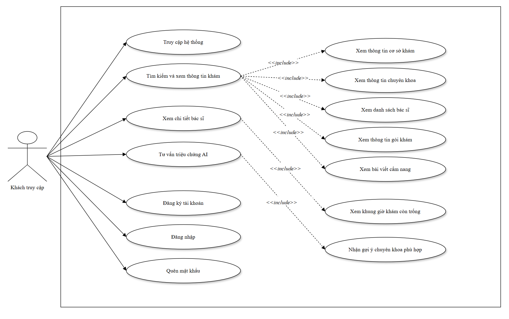

Hình 2.6. Sơ đồ Use Case khách truy cập

### 2.9. Đặc tả Use case chi tiết

#### 2.9.1. Nhóm UC1. Tài khoản và xác thực

##### 2.9.1.1. UC1.1. Đăng ký tài khoản

Bảng 2.1. Đặc tả Use case đăng ký tài khoản

| Mục | Đặc tả |
| --- | --- |
| Tên Use case | UC1.1. Đăng ký tài khoản |
| Mục tiêu | Cho phép người dùng tạo tài khoản mới để sử dụng các chức năng cá nhân của hệ thống. |
| Tác nhân chính | Khách truy cập |
| Tác nhân phụ | Hệ thống |
| Tiền điều kiện | Người dùng chưa có tài khoản và đang truy cập vào hệ thống. |
| Hậu điều kiện | Tài khoản được tạo thành công và lưu trong hệ thống. Người dùng có thể đăng nhập để sử dụng các chức năng tiếp theo. |
| Luồng chính | 1. Người dùng chọn chức năng đăng ký tài khoản. 2. Hệ thống hiển thị form đăng ký. 3. Người dùng nhập họ tên, số điện thoại, email, mật khẩu và xác nhận mật khẩu. 4. Hệ thống kiểm tra tính hợp lệ của dữ liệu. 5. Nếu dữ liệu hợp lệ, hệ thống tạo tài khoản mới. 6. Hệ thống thông báo đăng ký thành công. |
| Luồng thay thế/ngoại lệ | A1. Nếu người dùng nhập thiếu thông tin hoặc sai định dạng, hệ thống thông báo lỗi và yêu cầu nhập lại. A2. Nếu số điện thoại hoặc email đã tồn tại, hệ thống thông báo tài khoản đã được sử dụng. A3. Nếu xảy ra lỗi hệ thống khi lưu dữ liệu, hệ thống thông báo đăng ký thất bại và yêu cầu thử lại. |

##### 2.9.1.2. UC1.2. Đăng nhập / Đăng xuất

Bảng 2.2. Đặc tả Use case đăng nhập/đăng xuất

| Mục | Đặc tả |
| --- | --- |
| Tên Use case | UC1.2. Đăng nhập / Đăng xuất |
| Mục tiêu | Cho phép người dùng xác thực vào hệ thống để sử dụng các chức năng phù hợp với vai trò, đồng thời cho phép đăng xuất khi không còn nhu cầu sử dụng. |
| Tác nhân chính | Bệnh nhân, bác sĩ, quản trị viên |
| Tác nhân phụ | Hệ thống |
| Tiền điều kiện | Người dùng đã có tài khoản hợp lệ trong hệ thống. |
| Hậu điều kiện | Người dùng đăng nhập thành công sẽ được điều hướng đến giao diện tương ứng với vai trò; khi đăng xuất, phiên làm việc được kết thúc. |
| Luồng chính | 1. Người dùng chọn chức năng đăng nhập. 2. Hệ thống hiển thị form đăng nhập. 3. Người dùng nhập tài khoản và mật khẩu. 4. Hệ thống kiểm tra thông tin đăng nhập. 5. Nếu hợp lệ, hệ thống xác thực và tạo phiên làm việc. 6. Hệ thống điều hướng người dùng đến giao diện phù hợp. 7. Khi cần, người dùng chọn chức năng đăng xuất. 8. Hệ thống kết thúc phiên làm việc và quay về màn hình ban đầu. |
| Luồng thay thế/ngoại lệ | A1. Nếu thông tin đăng nhập không hợp lệ, hệ thống thông báo lỗi và yêu cầu nhập lại. A2. Nếu tài khoản bị khóa hoặc không tồn tại, hệ thống thông báo không thể đăng nhập. A3. Nếu hệ thống gặp lỗi trong quá trình xác thực, quá trình đăng nhập không được thực hiện. |

##### 2.9.1.3. UC1.3. Quản lý tài khoản cá nhân

Bảng 2.3. Đặc tả Use case quản lý tài khoản cá nhân

| Mục | Đặc tả |
| --- | --- |
| Tên Use case | UC1.3. Quản lý tài khoản cá nhân |
| Mục tiêu | Cho phép người dùng xem và cập nhật các thông tin cá nhân cơ bản trong tài khoản của mình để đảm bảo thông tin luôn chính xác và phục vụ cho việc sử dụng hệ thống. |
| Tác nhân chính | Bệnh nhân, bác sĩ, quản trị viên |
| Tác nhân phụ | Hệ thống |
| Tiền điều kiện | Người dùng đã đăng nhập vào hệ thống. |
| Hậu điều kiện | Thông tin cá nhân được cập nhật thành công và lưu vào hệ thống. |
| Luồng chính | 1. Người dùng truy cập vào khu vực tài khoản cá nhân. 2. Hệ thống hiển thị thông tin hiện tại của người dùng. 3. Người dùng chọn chức năng cập nhật thông tin. 4. Người dùng chỉnh sửa các trường thông tin cần thiết. 5. Hệ thống kiểm tra tính hợp lệ của dữ liệu. 6. Hệ thống lưu thông tin đã cập nhật. 7. Hệ thống thông báo cập nhật thành công. |
| Luồng thay thế/ngoại lệ | A1. Nếu người dùng nhập dữ liệu không hợp lệ, hệ thống thông báo lỗi và yêu cầu sửa lại. A2. Nếu người dùng không có quyền chỉnh sửa một số thông tin nhất định, hệ thống sẽ không cho phép thay đổi. A3. Nếu xảy ra lỗi khi lưu dữ liệu, hệ thống thông báo cập nhật thất bại. |

#### 2.9.2. Nhóm UC2. Tìm kiếm và xem thông tin và tư vấn AI

##### 2.9.2.1. UC2.1. Tìm kiếm và xem thông tin khám

Bảng 2.4. Đặc tả Use case tìm kiếm tông tin khám

| Mục | Đặc tả |
| --- | --- |
| Tên Use case | UC2.1. Tìm kiếm và xem thông tin khám |
| Mục tiêu | Cho phép người dùng tra cứu các thông tin công khai của hệ thống như bác sĩ, chuyên khoa, cơ sở khám, gói khám để lựa chọn dịch vụ phù hợp trước khi đặt lịch. |
| Tác nhân chính | Khách truy cập, bệnh nhân |
| Tác nhân phụ | Hệ thống |
| Tiền điều kiện | Người dùng truy cập vào hệ thống. |
| Hậu điều kiện | Thông tin được hiển thị đầy đủ để người dùng tham khảo và lựa chọn dịch vụ khám phù hợp. |
| Luồng chính | 1. Người dùng truy cập vào hệ thống. 2. Hệ thống hiển thị trang thông tin công khai. 3. Người dùng nhập từ khóa hoặc chọn tiêu chí tìm kiếm như bác sĩ, chuyên khoa, cơ sở khám hoặc gói khám. 4. Hệ thống lọc và hiển thị kết quả phù hợp. 5. Người dùng chọn một kết quả để xem chi tiết. 6. Hệ thống hiển thị thông tin chi tiết như chuyên khoa, cơ sở làm việc, lịch làm việc, kinh nghiệm, đánh giá hoặc mô tả gói khám. 7. Người dùng tiếp tục tra cứu hoặc chuyển sang chức năng đặt lịch khám nếu có nhu cầu. |
| Luồng thay thế/ngoại lệ | A1. Nếu không có kết quả phù hợp, hệ thống thông báo không tìm thấy dữ liệu. A2. Nếu người dùng nhập từ khóa không hợp lệ, hệ thống yêu cầu nhập lại. A3. Nếu xảy ra lỗi hệ thống trong quá trình truy vấn, hệ thống thông báo không thể hiển thị kết quả. |

##### 2.9.2.2. UC2.2. Tư vấn triệu chứng bằng AI

Bảng 2.5. Đặc tả Use case tư vấn triệu chứng bằng AI

| Mục | Đặc tả |
| --- | --- |
| Tên Use case | UC2.2. Tư vấn triệu chứng bằng AI |
| Mục tiêu | Cho phép người dùng nhập triệu chứng ban đầu để hệ thống AI phân tích và gợi ý chuyên khoa hoặc hướng khám phù hợp trước khi đặt lịch. |
| Tác nhân chính | Khách truy cập, bệnh nhân |
| Tác nhân phụ | Hệ thống, AI |
| Tiền điều kiện | Người dùng truy cập vào hệ thống và có kết nối internet ổn định. |
| Hậu điều kiện | Hệ thống hiển thị kết quả tư vấn ban đầu, giúp người dùng tham khảo và lựa chọn chuyên khoa hoặc dịch vụ khám phù hợp. |
| Luồng chính | 1. Người dùng chọn chức năng tư vấn triệu chứng bằng AI. 2. Hệ thống hiển thị form nhập triệu chứng. 3. Người dùng nhập mô tả triệu chứng hoặc nhu cầu khám. 4. Hệ thống gửi dữ liệu đến bộ xử lý AI. 5. AI phân tích nội dung và trả về kết quả gợi ý. 6. Hệ thống hiển thị chuyên khoa hoặc hướng khám phù hợp cho người dùng. |
| Luồng thay thế/ngoại lệ | A1. Nếu người dùng nhập thông tin quá ngắn hoặc không rõ nghĩa, hệ thống yêu cầu nhập lại chi tiết hơn. A2. Nếu AI không trả về kết quả phù hợp, hệ thống thông báo không thể tư vấn và gợi ý người dùng liên hệ bác sĩ. A3. Nếu xảy ra lỗi kết nối hoặc lỗi xử lý AI, hệ thống thông báo tạm thời không thể thực hiện tư vấn. |

#### 2.9.3. Nhóm UC3. Đặt lịch khám

##### 2.9.3.1. UC3.1. Đặt lịch khám

Bảng 2.6. Đặc tả Use case đặt lịch khám

| Mục | Đặc tả |
| --- | --- |
| Tên Use case | UC3.1. Đặt lịch khám |
| Mục tiêu | Cho phép bệnh nhân tạo yêu cầu đặt lịch khám với bác sĩ hoặc gói khám phù hợp theo ngày giờ còn trống. |
| Tác nhân chính | Bệnh nhân |
| Tác nhân phụ | Hệ thống |
| Tiền điều kiện | Bệnh nhân đã đăng nhập vào hệ thống và có thông tin cá nhân hợp lệ. |
| Hậu điều kiện | Lịch hẹn được ghi nhận trong hệ thống và bệnh nhân có thể theo dõi trạng thái lịch hẹn. |
| Luồng chính | 1. Bệnh nhân chọn bác sĩ hoặc gói khám muốn đặt. 2. Hệ thống hiển thị thông tin chi tiết, lịch làm việc và các khung giờ còn trống. 3. Bệnh nhân chọn ngày khám, giờ khám phù hợp. 4. Bệnh nhân nhập lý do khám hoặc triệu chứng cần tư vấn. 5. Bệnh nhân gửi yêu cầu đặt lịch. 6. Hệ thống kiểm tra thông tin đặt lịch. 7. Nếu hợp lệ, hệ thống tạo lịch hẹn và mã lịch khám. 8. Hệ thống cập nhật trạng thái lịch hẹn và gửi thông báo cho bệnh nhân. |
| Luồng thay thế/ngoại lệ | A1. Nếu khung giờ đã được đặt hoặc không còn trống, hệ thống thông báo và yêu cầu chọn lại lịch khác. A2. Nếu bác sĩ không làm việc trong ngày được chọn, hệ thống thông báo và không cho phép đặt lịch. A3. Nếu thông tin nhập vào không hợp lệ, hệ thống yêu cầu bệnh nhân bổ sung hoặc chỉnh sửa lại. A4. Nếu xảy ra lỗi hệ thống khi tạo lịch hẹn, yêu cầu đặt lịch không được ghi nhận. |

#### 2.9.4. Nhóm UC4. Quản lý lịch hẹn của bệnh nhân

##### 2.9.4.1. UC4.1. Xem và theo dõi lịch hẹn

Bảng 2.7. Đặc tả Use case xem và theo dõi lịch hẹn

| Mục | Đặc tả |
| --- | --- |
| Tên Use case | UC4.1. Xem và theo dõi lịch hẹn |
| Mục tiêu | Cho phép bệnh nhân xem danh sách lịch hẹn đã đặt và theo dõi trạng thái xử lý của từng lịch hẹn. |
| Tác nhân chính | Bệnh nhân |
| Tác nhân phụ | Hệ thống |
| Tiền điều kiện | Bệnh nhân đã đăng nhập vào hệ thống và đã có ít nhất một lịch hẹn. |
| Hậu điều kiện | Bệnh nhân xem được thông tin và trạng thái cập nhật của các lịch hẹn trong tài khoản cá nhân. |
| Luồng chính | 1. Bệnh nhân truy cập vào mục lịch hẹn của tôi. 2. Hệ thống hiển thị danh sách các lịch hẹn đã đặt. 3. Bệnh nhân chọn một lịch hẹn cụ thể để xem chi tiết. 4. Hệ thống hiển thị thông tin ngày giờ khám, bác sĩ, cơ sở khám và trạng thái lịch hẹn. 5. Bệnh nhân tiếp tục theo dõi khi có thay đổi từ hệ thống. |
| Luồng thay thế/ngoại lệ | A1. Nếu bệnh nhân chưa có lịch hẹn nào, hệ thống thông báo chưa có dữ liệu. A2. Nếu lịch hẹn bị thay đổi hoặc hủy, hệ thống cập nhật trạng thái mới để bệnh nhân theo dõi. A3. Nếu xảy ra lỗi khi tải dữ liệu, hệ thống thông báo không thể hiển thị lịch hẹn. |

##### 2.9.4.2. UC4.2. Hủy hoặc đổi lịch hẹn

Bảng 2.8. Đặc tả Use case hủy hoặc đổi lịch hẹn

| Mục | Đặc tả |
| --- | --- |
| Tên Use case | UC4.2. Hủy hoặc đổi lịch hẹn |
| Mục tiêu | Cho phép bệnh nhân hủy hoặc yêu cầu đổi lịch hẹn khi không thể đến khám đúng thời gian đã đặt. |
| Tác nhân chính | Bệnh nhân |
| Tác nhân phụ | Hệ thống |
| Tiền điều kiện | Bệnh nhân đã đăng nhập vào hệ thống và có lịch hẹn còn hiệu lực. |
| Hậu điều kiện | Lịch hẹn được hủy hoặc cập nhật lại thời gian khám mới; hệ thống ghi nhận thay đổi và thông báo cho các bên liên quan. |
| Luồng chính | 1. Bệnh nhân truy cập vào danh sách lịch hẹn. 2. Bệnh nhân chọn lịch hẹn cần hủy hoặc đổi. 3. Hệ thống hiển thị chi tiết lịch hẹn và các tùy chọn xử lý. 4. Bệnh nhân chọn hủy hoặc đổi lịch hẹn. 5. Nếu đổi lịch, bệnh nhân chọn ngày giờ mới phù hợp. 6. Hệ thống kiểm tra tính hợp lệ của yêu cầu. 7. Hệ thống cập nhật trạng thái lịch hẹn hoặc ghi nhận lịch mới. 8. Hệ thống gửi thông báo xác nhận cho bệnh nhân. |
| Luồng thay thế/ngoại lệ | A1. Nếu lịch hẹn đã quá thời hạn cho phép hủy hoặc đổi, hệ thống thông báo không thể thực hiện. A2. Nếu khung giờ mới không còn trống, hệ thống yêu cầu bệnh nhân chọn lại. A3. Nếu yêu cầu không hợp lệ hoặc thiếu thông tin, hệ thống thông báo lỗi và không cập nhật lịch hẹn. A4. Nếu xảy ra lỗi hệ thống, thay đổi lịch hẹn không được ghi nhận. |

#### 2.9.5. Nhóm UC5. Hồ sơ khám bệnh và tái khám

##### 2.9.5.1. UC5.1. Xem hồ sơ khám bệnh

Bảng 2.9. Đặc tả Use case xem hồ sơ khám bệnh

| Mục | Đặc tả |
| --- | --- |
| Tên Use case | UC5.1. Xem hồ sơ khám bệnh |
| Mục tiêu | Cho phép bệnh nhân xem lại hồ sơ khám bệnh sau khi buổi khám đã được bác sĩ hoàn tất và lưu trên hệ thống. |
| Tác nhân chính | Bệnh nhân |
| Tác nhân phụ | Hệ thống |
| Tiền điều kiện | Bệnh nhân đã đăng nhập vào hệ thống và có ít nhất một hồ sơ khám bệnh được lưu. |
| Hậu điều kiện | Bệnh nhân xem được đầy đủ thông tin hồ sơ khám bệnh trên hệ thống. |
| Luồng chính | 1. Bệnh nhân truy cập vào mục hồ sơ khám bệnh. 2. Hệ thống hiển thị danh sách các hồ sơ khám đã có. 3. Bệnh nhân chọn một hồ sơ cụ thể. 4. Hệ thống hiển thị thông tin chi tiết hồ sơ khám bệnh. 5. Bệnh nhân xem các nội dung như triệu chứng, chẩn đoán, kết luận, lời dặn, đơn thuốc, kết quả cận lâm sàng và lịch tái khám nếu có. |
| Luồng thay thế/ngoại lệ | A1. Nếu bệnh nhân chưa có hồ sơ khám bệnh nào, hệ thống thông báo chưa có dữ liệu. A2. Nếu hồ sơ chưa được bác sĩ hoàn tất, hệ thống chưa cho phép hiển thị đầy đủ nội dung. A3. Nếu xảy ra lỗi khi tải dữ liệu, hệ thống thông báo không thể hiển thị hồ sơ khám bệnh. |

##### 2.9.5.2. UC5.2. Xem đơn thuốc và kết quả cận lâm sàng

Bảng 2.10. Đặc tả Use case xem đơn thuốc và kết quả cận lâm sàng

| Mục | Đặc tả |
| --- | --- |
| Tên Use case | UC5.2. Xem đơn thuốc và kết quả cận lâm sàng |
| Mục tiêu | Cho phép bệnh nhân xem lại đơn thuốc và các kết quả cận lâm sàng đã được bác sĩ lưu trong hồ sơ khám bệnh. |
| Tác nhân chính | Bệnh nhân |
| Tác nhân phụ | Hệ thống |
| Tiền điều kiện | Bệnh nhân đã đăng nhập vào hệ thống và có hồ sơ khám bệnh đã được lưu, trong đó có đơn thuốc hoặc kết quả cận lâm sàng. |
| Hậu điều kiện | Bệnh nhân xem được thông tin đơn thuốc và kết quả cận lâm sàng để lưu trữ hoặc sử dụng khi cần thiết. |
| Luồng chính | 1. Bệnh nhân truy cập vào hồ sơ khám bệnh. 2. Hệ thống hiển thị thông tin hồ sơ khám. 3. Bệnh nhân chọn mục đơn thuốc hoặc kết quả cận lâm sàng. 4. Hệ thống hiển thị danh sách thông tin liên quan. 5. Bệnh nhân xem chi tiết tên thuốc, liều dùng, thời gian dùng hoặc nội dung kết quả cận lâm sàng. |
| Luồng thay thế/ngoại lệ | A1. Nếu hồ sơ khám không có đơn thuốc, hệ thống thông báo chưa có dữ liệu đơn thuốc. A2. Nếu chưa có kết quả cận lâm sàng, hệ thống thông báo chưa có dữ liệu tương ứng. A3. Nếu xảy ra lỗi khi tải dữ liệu, hệ thống thông báo không thể hiển thị thông tin. |

##### 2.9.5.3. UC5.3. Theo dõi lịch tái khám

Bảng 2.11. Đặc tả Use case theo dõi lịch tái khám

| Mục | Đặc tả |
| --- | --- |
| Tên Use case | UC5.3. Theo dõi lịch tái khám |
| Mục tiêu | Giúp bệnh nhân theo dõi các lịch tái khám được bác sĩ chỉ định sau buổi khám. |
| Tác nhân chính | Bệnh nhân |
| Tác nhân phụ | Hệ thống |
| Tiền điều kiện | Bệnh nhân đã đăng nhập và có hồ sơ khám bệnh hoặc lịch tái khám được tạo trên hệ thống. |
| Hậu điều kiện | Thông tin lịch tái khám được hiển thị đầy đủ; bệnh nhân nắm được thời gian và trạng thái tái khám. |
| Luồng chính | 1. Bệnh nhân truy cập chức năng hồ sơ khám bệnh hoặc khu vực lịch tái khám. 2. Hệ thống hiển thị danh sách lịch tái khám của bệnh nhân. 3. Bệnh nhân chọn một lịch tái khám để xem chi tiết. 4. Hệ thống hiển thị ngày tái khám, bác sĩ phụ trách, cơ sở khám, nội dung dặn dò và các thông tin liên quan. 5. Nếu có thay đổi từ phía bác sĩ hoặc hệ thống, bệnh nhân nhận thông báo cập nhật. |
| Luồng thay thế/ngoại lệ | A1. Nếu bệnh nhân chưa có lịch tái khám, hệ thống hiển thị thông báo phù hợp. A2. Nếu lịch tái khám đã được hoàn tất hoặc hủy, hệ thống cập nhật trạng thái tương ứng. A3. Nếu không truy cập được dữ liệu, hệ thống thông báo lỗi và yêu cầu thử lại sau. |

#### 2.9.6. Nhóm UC6. Chức năng dành cho bác sĩ

##### 2.9.6.1. UC6.1. Đăng nhập và xem tổng quan lịch khám

Bảng 2.12. Đặc tả Use case đăng nhập và xem tổng quan lịch khám

| Mục | Đặc tả |
| --- | --- |
| Tên Use case | UC6.1. Đăng nhập và xem tổng quan lịch khám |
| Mục tiêu | Giúp bác sĩ đăng nhập vào khu vực bác sĩ và xem nhanh tình hình lịch khám trong ngày hoặc trong khoảng thời gian đang chọn. |
| Tác nhân chính | Bác sĩ |
| Tác nhân phụ | Hệ thống |
| Tiền điều kiện | Bác sĩ đã được cấp tài khoản hợp lệ. |
| Hậu điều kiện | Bác sĩ đăng nhập thành công và nhìn thấy tổng quan lịch khám, danh sách lịch hẹn hoặc hàng đợi bệnh nhân. |
| Luồng chính | 1. Bác sĩ mở khu vực đăng nhập dành cho bác sĩ. 2. Bác sĩ nhập thông tin tài khoản và mật khẩu. 3. Hệ thống xác thực thông tin đăng nhập. 4. Nếu hợp lệ, hệ thống chuyển vào giao diện khu vực bác sĩ. 5. Hệ thống hiển thị tổng quan lịch khám, số lượng lịch hẹn, lịch theo ngày và danh sách bệnh nhân cần xử lý. 6. Bác sĩ theo dõi các thông tin cần thiết để chuẩn bị tiếp nhận khám. |
| Luồng thay thế/ngoại lệ | A1. Nếu thông tin đăng nhập không đúng, hệ thống thông báo lỗi và yêu cầu nhập lại. A2. Nếu tài khoản bị khóa hoặc chưa được kích hoạt, hệ thống từ chối truy cập. A3. Nếu không có dữ liệu lịch khám, hệ thống hiển thị trạng thái trống phù hợp. |

##### 2.9.6.2. UC6.2. Xử lý lịch hẹn

Bảng 2.13. Đặc tả Use case xử lý lịch hẹn

| Mục | Đặc tả |
| --- | --- |
| Tên Use case | UC6.2. Xử lý lịch hẹn |
| Mục tiêu | Giúp bác sĩ xem, xác nhận và xử lý các lịch hẹn của bệnh nhân trong khu vực làm việc. |
| Tác nhân chính | Bác sĩ |
| Tác nhân phụ | Hệ thống |
| Tiền điều kiện | Bác sĩ đã đăng nhập; hệ thống đã có danh sách lịch hẹn cần xử lý. |
| Hậu điều kiện | Lịch hẹn được cập nhật trạng thái phù hợp như đã xác nhận, đổi lịch, hủy lịch hoặc không đến khám. |
| Luồng chính | 1. Bác sĩ mở danh sách lịch hẹn hoặc hàng đợi khám. 2. Hệ thống hiển thị các lịch hẹn theo ngày và trạng thái. 3. Bác sĩ chọn một lịch hẹn cần xử lý. 4. Hệ thống hiển thị thông tin bệnh nhân và chi tiết lịch hẹn. 5. Bác sĩ thực hiện một trong các thao tác: xác nhận lịch, đổi lịch, hủy lịch hoặc ghi nhận bệnh nhân không đến khám. 6. Hệ thống cập nhật trạng thái lịch hẹn và ghi nhận thay đổi. 7. Hệ thống gửi thông báo đến bệnh nhân nếu cần. |
| Luồng thay thế/ngoại lệ | A1. Nếu lịch hẹn không còn hợp lệ, hệ thống thông báo và không cho phép xử lý. A2. Nếu bệnh nhân yêu cầu đổi hoặc hủy lịch, hệ thống hiển thị thông tin liên quan để bác sĩ xem xét. A3. Nếu thao tác không thành công, hệ thống thông báo lỗi và giữ nguyên trạng thái cũ. |

##### 2.9.6.3. UC6.3. Nhập và cập nhật hồ sơ khám bệnh

Bảng 2.14. Đặc tả Use case nhập và cập nhật hồ sơ khám bệnh

| Mục | Đặc tả |
| --- | --- |
| Tên Use case | UC6.3. Nhập và cập nhật hồ sơ khám bệnh |
| Mục tiêu | Giúp bác sĩ ghi nhận, chỉnh sửa và hoàn thiện hồ sơ khám bệnh của bệnh nhân sau hoặc trong buổi khám. |
| Tác nhân chính | Bác sĩ |
| Tác nhân phụ | Hệ thống |
| Tiền điều kiện | Bác sĩ đã đăng nhập; bệnh nhân đã được tiếp nhận khám. |
| Hậu điều kiện | Hồ sơ khám bệnh được lưu hoặc cập nhật đầy đủ trên hệ thống. |
| Luồng chính | 1. Bác sĩ chọn bệnh nhân cần nhập hoặc cập nhật hồ sơ. 2. Hệ thống hiển thị thông tin bệnh nhân và hồ sơ hiện có nếu đã tồn tại. 3. Bác sĩ nhập hoặc chỉnh sửa triệu chứng, bệnh sử, thông tin khám, chẩn đoán, kết luận và lời dặn. 4. Bác sĩ bổ sung đơn thuốc, kết quả cận lâm sàng hoặc lịch tái khám nếu cần. 5. Hệ thống lưu lại thông tin hồ sơ khám bệnh. |
| Luồng thay thế/ngoại lệ | A1. Nếu hồ sơ chưa đầy đủ, hệ thống yêu cầu bác sĩ bổ sung các trường bắt buộc. A2. Nếu bác sĩ không chọn đúng bệnh nhân, hệ thống không cho phép lưu. A3. Nếu xảy ra lỗi khi lưu, hệ thống thông báo và giữ nguyên dữ liệu hiện tại. |

##### 2.9.6.4. UC6.4. Quản lý lịch làm việc, bài viết và đánh giá

Bảng 2.15. Đặc tả Use case quản lý lịch làm việc, bài viết và đánh giá

| Mục | Đặc tả |
| --- | --- |
| Tên Use case | UC6.4. Quản lý lịch làm việc, bài viết và đánh giá |
| Mục tiêu | Giúp bác sĩ quản lý lịch làm việc cá nhân, nội dung bài viết cẩm nang và theo dõi đánh giá của bệnh nhân. |
| Tác nhân chính | Bác sĩ |
| Tác nhân phụ | Hệ thống |
| Tiền điều kiện | Bác sĩ đã đăng nhập vào khu vực bác sĩ. |
| Hậu điều kiện | Lịch làm việc, bài viết hoặc thông tin đánh giá được cập nhật và lưu trên hệ thống. |
| Luồng chính | 1. Bác sĩ mở chức năng quản lý lịch làm việc, bài viết hoặc đánh giá. 2. Hệ thống hiển thị dữ liệu hiện có tương ứng với từng chức năng. 3. Bác sĩ thêm mới, chỉnh sửa hoặc xóa lịch làm việc của mình nếu cần. 4. Bác sĩ tạo, cập nhật hoặc quản lý bài viết cẩm nang do mình phụ trách. 5. Bác sĩ xem các đánh giá của bệnh nhân liên quan đến quá trình khám hoặc dịch vụ. 6. Hệ thống lưu lại các thay đổi và cập nhật dữ liệu tương ứng. |
| Luồng thay thế/ngoại lệ | A1. Nếu dữ liệu lịch làm việc không hợp lệ, hệ thống yêu cầu điều chỉnh lại. A2. Nếu bài viết chưa đủ nội dung bắt buộc, hệ thống không cho phép lưu. A3. Nếu không có đánh giá mới, hệ thống hiển thị trạng thái trống phù hợp. |

#### 2.9.7. Nhóm UC7. Chức năng dành cho quản trị viên

##### 2.9.7.1. UC7.1. Đăng nhập khu vực quản trị

Bảng 2.16. Đặc tả Use case đăng nhập khu vực quản trị

| Mục | Đặc tả |
| --- | --- |
| Tên Use case | UC7.1. Đăng nhập khu vực quản trị |
| Mục tiêu | Giúp quản trị viên đăng nhập vào hệ thống quản trị để thực hiện các chức năng quản lý. |
| Tác nhân chính | Quản trị viên |
| Tác nhân phụ | Hệ thống |
| Tiền điều kiện | Quản trị viên đã được cấp tài khoản hợp lệ. |
| Hậu điều kiện | Quản trị viên đăng nhập thành công và truy cập được giao diện quản trị. |
| Luồng chính | 1. Quản trị viên mở trang đăng nhập khu vực quản trị. 2. Quản trị viên nhập tên đăng nhập và mật khẩu. 3. Hệ thống kiểm tra thông tin đăng nhập. 4. Nếu hợp lệ, hệ thống cho phép truy cập vào trang quản trị. 5. Hệ thống hiển thị các chức năng quản lý phù hợp với quyền của quản trị viên. |
| Luồng thay thế/ngoại lệ | A1. Nếu thông tin đăng nhập không đúng, hệ thống thông báo lỗi và yêu cầu nhập lại. A2. Nếu tài khoản bị khóa hoặc chưa được kích hoạt, hệ thống từ chối truy cập. A3. Nếu không thể xác thực, hệ thống hiển thị thông báo lỗi hệ thống. |

##### 2.9.7.2. UC7.2. Quản lý dữ liệu nền

Bảng 2.17. Đặc tả Use case quản lý dữ liệu nền

| Mục | Đặc tả |
| --- | --- |
| Tên Use case | UC7.2. Quản lý dữ liệu nền |
| Mục tiêu | Giúp quản trị viên quản lý các dữ liệu nền của hệ thống như bác sĩ, chuyên khoa, cơ sở khám, lịch làm việc, gói khám và nội dung cẩm nang. |
| Tác nhân chính | Quản trị viên |
| Tác nhân phụ | Hệ thống |
| Tiền điều kiện | Quản trị viên đã đăng nhập vào khu vực quản trị. |
| Hậu điều kiện | Dữ liệu nền được cập nhật, bổ sung hoặc xóa theo thao tác của quản trị viên. |
| Luồng chính | 1. Quản trị viên mở chức năng quản lý dữ liệu nền. 2. Hệ thống hiển thị các nhóm dữ liệu cần quản lý. 3. Quản trị viên chọn nhóm dữ liệu cần thao tác. 4. Quản trị viên thêm mới, chỉnh sửa hoặc xóa thông tin tương ứng. 5. Hệ thống kiểm tra dữ liệu nhập vào. 6. Hệ thống lưu thay đổi và cập nhật danh sách hiển thị. |
| Luồng thay thế/ngoại lệ | A1. Nếu dữ liệu nhập không hợp lệ hoặc thiếu thông tin bắt buộc, hệ thống yêu cầu nhập lại. A2. Nếu bản ghi đang được sử dụng ở chức năng khác, hệ thống có thể không cho phép xóa. A3. Nếu xảy ra lỗi khi lưu, hệ thống thông báo và giữ nguyên dữ liệu cũ. |

##### 2.9.7.3. UC7.3. Theo dõi và xử lý lịch hẹn

Bảng 2.18. Đặc tả Use case theo dõi và xử lý lịch hẹn

| Mục | Đặc tả |
| --- | --- |
| Tên Use case | UC7.3. Theo dõi và xử lý lịch hẹn |
| Mục tiêu | Giúp quản trị viên theo dõi tình trạng lịch hẹn và hỗ trợ xử lý các yêu cầu phát sinh trong quá trình đặt khám. |
| Tác nhân chính | Quản trị viên |
| Tác nhân phụ | Hệ thống |
| Tiền điều kiện | Quản trị viên đã đăng nhập vào khu vực quản trị. |
| Hậu điều kiện | Lịch hẹn được cập nhật trạng thái phù hợp và các yêu cầu liên quan được xử lý. |
| Luồng chính | 1. Quản trị viên mở danh sách lịch hẹn. 2. Hệ thống hiển thị các lịch hẹn theo trạng thái. 3. Quản trị viên chọn một lịch hẹn cần theo dõi hoặc xử lý. 4. Hệ thống hiển thị thông tin chi tiết của lịch hẹn và bệnh nhân. 5. Quản trị viên xác nhận, đổi lịch, hủy lịch hoặc ghi nhận trạng thái không đến khám nếu cần. 6. Hệ thống cập nhật trạng thái lịch hẹn và lưu lại thay đổi. 7. Hệ thống gửi thông báo cho bệnh nhân khi có điều chỉnh. |
| Luồng thay thế/ngoại lệ | A1. Nếu lịch hẹn đã được xử lý trước đó, hệ thống thông báo và không cho phép cập nhật lại. A2. Nếu dữ liệu lịch hẹn không tồn tại, hệ thống hiển thị thông báo phù hợp. A3. Nếu không thể lưu thay đổi, hệ thống thông báo lỗi và giữ nguyên trạng thái cũ. |

##### 2.9.7.4. UC7.4. Quản lý nội dung và vận hành hệ thống

Bảng 2.19. Đặc tả Use case quản lý nội dung và vận hành hệ thống

| Mục | Đặc tả |
| --- | --- |
| Tên Use case | UC7.4. Quản lý nội dung và vận hành hệ thống |
| Mục tiêu | Giúp quản trị viên quản lý nội dung cẩm nang, thông báo, nhật ký hệ thống và theo dõi hoạt động vận hành chung của hệ thống. |
| Tác nhân chính | Quản trị viên |
| Tác nhân phụ | Hệ thống |
| Tiền điều kiện | Quản trị viên đã đăng nhập vào khu vực quản trị. |
| Hậu điều kiện | Nội dung và thông tin vận hành được cập nhật, lưu trữ và hiển thị đúng trên hệ thống. |
| Luồng chính | 1. Quản trị viên mở chức năng quản lý nội dung và vận hành. 2. Hệ thống hiển thị các mục như bài viết cẩm nang, thông báo, nhật ký hệ thống và thống kê vận hành. 3. Quản trị viên thêm mới, chỉnh sửa hoặc xóa nội dung cẩm nang và thông báo nếu cần. 4. Quản trị viên theo dõi nhật ký hoạt động và các thông tin vận hành của hệ thống. 5. Hệ thống lưu lại các thay đổi và cập nhật dữ liệu tương ứng. |
| Luồng thay thế/ngoại lệ | A1. Nếu nội dung nhập vào không hợp lệ, hệ thống yêu cầu chỉnh sửa. A2. Nếu dữ liệu nhật ký hoặc thống kê không có, hệ thống hiển thị trạng thái trống phù hợp. A3. Nếu xảy ra lỗi khi lưu, hệ thống thông báo và không thay đổi dữ liệu hiện tại. |

#### 2.9.8. Nhóm UC8. Thống kê, thông báo và xuất PDF

##### 2.9.8.1. UC8.1. Xem thống kê vận hành

Bảng 2.20. Đặc tả Use case xem thống kế vận hành

| Mục | Đặc tả |
| --- | --- |
| Tên Use case | UC8.1. Xem thống kê vận hành |
| Mục tiêu | Giúp quản trị viên theo dõi tình hình hoạt động của hệ thống thông qua các số liệu thống kê tổng quan. |
| Tác nhân chính | Quản trị viên |
| Tác nhân phụ | Hệ thống |
| Tiền điều kiện | Quản trị viên đã đăng nhập vào khu vực quản trị. |
| Hậu điều kiện | Quản trị viên xem được các số liệu thống kê phục vụ việc theo dõi và quản lý hệ thống. |
| Luồng chính | 1. Quản trị viên mở chức năng thống kê vận hành. 2. Hệ thống hiển thị các chỉ số tổng quan như số lượng lịch hẹn, lịch đã hoàn thành, lịch hủy, lịch không đến khám, số hồ sơ khám bệnh, số bác sĩ, số cơ sở khám và các dữ liệu liên quan. 3. Quản trị viên chọn khoảng thời gian hoặc bộ lọc cần xem. 4. Hệ thống cập nhật số liệu và hiển thị biểu đồ, bảng thống kê tương ứng. 5. Quản trị viên xem và sử dụng các thông tin này để đánh giá hoạt động vận hành. |
| Luồng thay thế/ngoại lệ | A1. Nếu không có dữ liệu trong khoảng thời gian được chọn, hệ thống hiển thị trạng thái trống phù hợp. A2. Nếu dữ liệu thống kê chưa được cập nhật kịp thời, hệ thống thông báo và cho phép tải lại. A3. Nếu xảy ra lỗi hệ thống, việc hiển thị thống kê sẽ tạm dừng và thông báo lỗi được trả về. |

##### 2.9.8.2. UC8.2. Gửi / nhận thông báo

Bảng 2.21. Đặc tả Use case gửi/ nhận thông báo

| Mục | Đặc tả |
| --- | --- |
| Tên Use case | UC8.2. Gửi / nhận thông báo |
| Mục tiêu | Giúp hệ thống gửi thông báo đến người dùng khi có thay đổi liên quan đến lịch hẹn, hồ sơ khám bệnh hoặc hoạt động quản trị. |
| Tác nhân chính | Hệ thống |
| Tác nhân phụ | Bệnh nhân, bác sĩ, quản trị viên |
| Tiền điều kiện | Có sự kiện phát sinh cần thông báo như đặt lịch, xác nhận lịch, đổi lịch, hủy lịch, cập nhật hồ sơ hoặc tạo nội dung quản trị. |
| Hậu điều kiện | Thông báo được tạo và hiển thị đến đúng người dùng liên quan. |
| Luồng chính | 1. Một sự kiện phát sinh trong hệ thống. 2. Hệ thống xác định loại sự kiện và người dùng cần nhận thông báo. 3. Hệ thống tạo nội dung thông báo phù hợp. 4. Thông báo được lưu lại trong hệ thống. 5. Người dùng mở khu vực thông báo để xem nội dung. 6. Hệ thống cập nhật trạng thái đã đọc nếu người dùng xem thông báo. |
| Luồng thay thế/ngoại lệ | A1. Nếu không xác định được người nhận, hệ thống không gửi thông báo và ghi nhận lỗi nếu cần. A2. Nếu người dùng chưa đăng nhập, thông báo vẫn được lưu để hiển thị khi đăng nhập lại. A3. Nếu gửi thông báo thất bại, hệ thống giữ lại dữ liệu thông báo để xử lý lại sau. |

##### 2.9.8.3. UC8.3. Xuất phiếu kết quả khám PDF

Bảng 2.22. Đặc tả Use case xuất phiếu kết quả khám PDF

| Mục | Đặc tả |
| --- | --- |
| Tên Use case | UC8.3. Xuất phiếu kết quả khám PDF |
| Mục tiêu | Giúp hệ thống tạo file PDF phiếu kết quả khám bệnh để bệnh nhân và bác sĩ có thể lưu trữ hoặc in ấn khi cần. |
| Tác nhân chính | Hệ thống |
| Tác nhân phụ | Bác sĩ, bệnh nhân |
| Tiền điều kiện | Hồ sơ khám bệnh đã được nhập và lưu đầy đủ trên hệ thống. |
| Hậu điều kiện | Phiếu kết quả khám được xuất thành file PDF và gắn với hồ sơ khám bệnh tương ứng. |
| Luồng chính | 1. Bác sĩ hoàn tất hồ sơ khám bệnh. 2. Hệ thống lấy dữ liệu từ hồ sơ khám bệnh đã lưu. 3. Hệ thống tạo mẫu phiếu kết quả khám bệnh theo định dạng PDF. 4. Hệ thống chèn các thông tin như chẩn đoán, kết luận, đơn thuốc, kết quả cận lâm sàng và lịch tái khám nếu có. 5. Hệ thống lưu file PDF và cho phép bệnh nhân xem hoặc tải về khi cần. |
| Luồng thay thế/ngoại lệ | A1. Nếu hồ sơ chưa đầy đủ, hệ thống chưa thể tạo PDF và yêu cầu bổ sung thông tin. A2. Nếu lỗi tạo file xảy ra, hệ thống thông báo thất bại và giữ nguyên dữ liệu hiện tại. A3. Nếu file PDF không thể tải xuống, hệ thống cho phép thử lại sau. |

##### 2.9.8.4. UC8.4. Ghi nhật ký hệ thống

Bảng 2.23. Đặc tả Use case ghi nhật ký hệ thông

| Mục | Đặc tả |
| --- | --- |
| Tên Use case | UC8.4. Ghi nhật ký hệ thống |
| Mục tiêu | Giúp hệ thống lưu lại các hoạt động quan trọng để phục vụ theo dõi, kiểm tra và truy vết khi cần. |
| Tác nhân chính | Hệ thống |
| Tác nhân phụ | Quản trị viên |
| Tiền điều kiện | Có phát sinh hoạt động cần ghi nhận như đăng nhập, tạo lịch hẹn, cập nhật hồ sơ, thay đổi dữ liệu hoặc xử lý thông báo. |
| Hậu điều kiện | Nhật ký hoạt động được lưu trên hệ thống để quản trị viên có thể tra cứu khi cần. |
| Luồng chính | 1. Một người dùng thực hiện thao tác trên hệ thống. 2. Hệ thống xác định loại thao tác cần ghi nhận. 3. Hệ thống tạo nội dung nhật ký tương ứng. 4. Hệ thống lưu thời gian, người thực hiện và nội dung thao tác vào nhật ký hệ thống. 5. Quản trị viên có thể xem lại nhật ký khi cần theo dõi hoạt động. |
| Luồng thay thế/ngoại lệ/ngoại lệ | A1. Nếu thao tác không cần ghi log, hệ thống bỏ qua bước ghi nhật ký. A2. Nếu lưu nhật ký thất bại, hệ thống thông báo lỗi nội bộ và ghi nhận khi có thể. A3. Nếu dữ liệu nhật ký không truy xuất được, hệ thống hiển thị thông báo phù hợp. |

# CHƯƠNG 3: CƠ SỞ LÝ THUYẾT VÀ CÔNG NGHỆ SỬ DỤNG

### 3.1. Tổng quan kiến trúc ứng dụng web

Ứng dụng web là phần mềm được xây dựng để người dùng có thể truy cập thông qua trình duyệt Internet mà không cần cài đặt trực tiếp trên thiết bị. Dữ liệu và chức năng của hệ thống được xử lý tập trung trên máy chủ, sau đó hiển thị kết quả cho người dùng thông qua giao diện web. Cách tiếp cận này phù hợp với các hệ thống cần phục vụ nhiều nhóm người dùng khác nhau, đồng thời giúp việc cập nhật, bảo trì và mở rộng chức năng trở nên thuận tiện hơn.

Trong đề tài “Ứng dụng đặt lịch khám bệnh cho phòng khám nhỏ”, mô hình ứng dụng web được lựa chọn vì phù hợp với đặc thù vận hành của phòng khám quy mô nhỏ. Bệnh nhân có thể sử dụng điện thoại hoặc máy tính để tìm kiếm thông tin, đặt lịch khám và theo dõi lịch hẹn mọi lúc, mọi nơi. Bác sĩ và quản trị viên cũng có thể truy cập hệ thống để xử lý công việc mà không phụ thuộc vào một thiết bị cố định. Nhờ đó, quy trình khám chữa bệnh được số hóa, giảm bớt thao tác thủ công và hạn chế sai sót trong quá trình quản lý.

Về mặt kiến trúc, một ứng dụng web thường được tổ chức theo hướng tách biệt giữa giao diện người dùng, xử lý nghiệp vụ và lưu trữ dữ liệu. Sự phân tách này giúp hệ thống dễ phát triển theo từng phần, dễ kiểm thử và thuận lợi khi bảo trì về sau. Trong đồ án này, kiến trúc ứng dụng web là nền tảng để xây dựng các chức năng như đăng nhập, đặt lịch khám, quản lý lịch hẹn, nhập hồ sơ khám bệnh, thông báo và thống kê vận hành.

### 3.2. Mô hình Client – Server

Mô hình Client - Server là kiến trúc phổ biến trong các ứng dụng web hiện nay, trong đó hệ thống được chia thành hai thành phần chính là phía client và phía server. Client là nơi người dùng trực tiếp thao tác, thường là trình duyệt web trên máy tính hoặc điện thoại. Server là nơi tiếp nhận yêu cầu từ client, xử lý nghiệp vụ, truy xuất dữ liệu và trả kết quả phản hồi lại cho người dùng.

Trong đề tài “Ứng dụng đặt lịch khám bệnh cho phòng khám nhỏ”, client là giao diện web dành cho các nhóm người dùng như khách truy cập, bệnh nhân, bác sĩ và quản trị viên. Người dùng thực hiện các thao tác như đăng ký, đăng nhập, tìm kiếm thông tin khám, đặt lịch, xử lý lịch hẹn, xem hồ sơ khám bệnh hoặc quản lý dữ liệu hệ thống. Các thao tác này được gửi tới server thông qua các yêu cầu HTTP/HTTPS.

Phía server được xây dựng bằng Node.js và Express.js, có nhiệm vụ xử lý xác thực, phân quyền, kiểm tra dữ liệu, thực hiện các nghiệp vụ đặt lịch khám, lưu hồ sơ khám bệnh, xuất PDF và gửi thông báo. Server cũng làm việc với cơ sở dữ liệu MongoDB để lưu trữ và truy xuất thông tin cần thiết. Sau khi xử lý xong, server trả kết quả về cho client dưới dạng JSON, tệp tin hoặc thông báo phù hợp.

Việc áp dụng mô hình Client - Server giúp hệ thống tách biệt rõ phần giao diện và phần xử lý nghiệp vụ, từ đó thuận tiện cho việc phát triển, bảo trì và mở rộng. Đây là mô hình phù hợp với hệ thống đặt lịch khám bệnh vì cho phép nhiều người dùng truy cập đồng thời và đảm bảo dữ liệu được xử lý tập trung, đồng bộ.

Sơ đồ dưới đây minh họa cách hệ thống trao đổi dữ liệu theo mô hình Client – Server.

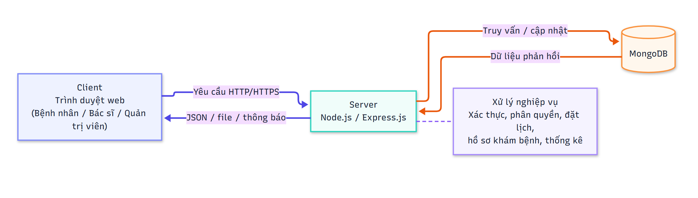

Hình 3.2. Mô hình Client - Server trong hệ thống

### 3.3. Kiến trúc hệ thống đề xuất

Kiến trúc hệ thống của đề tài được thiết kế theo hướng tách biệt rõ ràng giữa giao diện người dùng, xử lý nghiệp vụ và lưu trữ dữ liệu. Cách tổ chức này giúp hệ thống dễ phát triển, dễ bảo trì và thuận tiện khi mở rộng thêm các chức năng mới trong tương lai. Với đặc thù là một ứng dụng đặt lịch khám bệnh cho phòng khám nhỏ, kiến trúc được lựa chọn cần đảm bảo tính gọn nhẹ, ổn định và phù hợp với nhiều nhóm người dùng khác nhau.

Trong hệ thống ứng dựng đặt lich khám bệnh cho phòng khám nhỏ, lớp giao diện người dùng được xây dựng bằng ReactJS, cho phép khách truy cập, bệnh nhân, bác sĩ và quản trị viên tương tác với hệ thống thông qua trình duyệt web. Khi người dùng thực hiện các thao tác như đăng nhập, tìm kiếm thông tin khám, đặt lịch, xử lý lịch hẹn hoặc xem hồ sơ khám bệnh, dữ liệu sẽ được gửi đến tầng backend để xử lý.

Tầng backend được xây dựng bằng Node.js và Express.js, đóng vai trò tiếp nhận các yêu cầu từ frontend, kiểm tra dữ liệu, xử lý các nghiệp vụ và trả kết quả về cho người dùng. Tầng này đồng thời đảm nhiệm các chức năng như xác thực, phân quyền, quản lý lịch hẹn, nhập hồ sơ khám bệnh, xuất PDF, gửi thông báo và xử lý các chức năng hỗ trợ khác.

Tầng cơ sở dữ liệu sử dụng MongoDB để lưu trữ thông tin người dùng, bác sĩ, chuyên khoa, cơ sở khám, gói khám, lịch hẹn, hồ sơ khám bệnh, đơn thuốc, kết quả cận lâm sàng, bài viết và thông báo. Việc sử dụng cơ sở dữ liệu tập trung giúp hệ thống dễ truy xuất, đồng bộ thông tin và phù hợp với mô hình quản lý của phòng khám nhỏ.

Ngoài ba thành phần chính, hệ thống còn tích hợp một số dịch vụ hỗ trợ như upload tệp đính kèm, xuất phiếu kết quả khám dưới dạng PDF, thông báo thời gian thực và tư vấn triệu chứng bằng AI. Các thành phần này giúp hoàn thiện trải nghiệm người dùng và tăng tính thực tiễn cho hệ thống.

Sơ đồ dưới đây mô tả kiến trúc tổng thể của hệ thống.

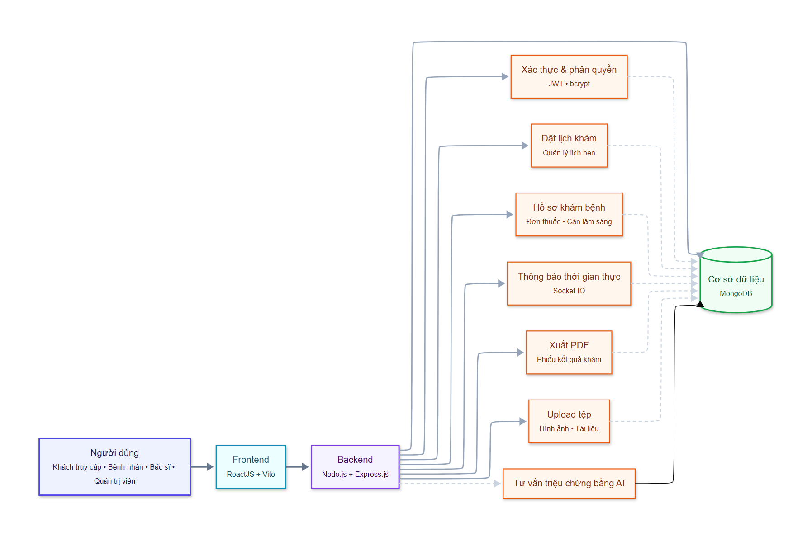

Hình 3.3. Kiến trúc tổng thể hệ thống

#### 3.3.1. Frontend

Frontend là lớp giao diện người dùng của hệ thống, đóng vai trò trực tiếp trong việc hiển thị thông tin và tiếp nhận các thao tác từ người dùng. Trong đề tài “Ứng dụng đặt lịch khám bệnh cho phòng khám nhỏ”, frontend được xây dựng bằng ReactJS kết hợp với Vite nhằm tạo ra giao diện web hiện đại, phản hồi nhanh và dễ mở rộng. Giao diện được thiết kế để phục vụ đồng thời nhiều nhóm người dùng gồm khách truy cập, bệnh nhân, bác sĩ và quản trị viên, mỗi nhóm có một khu vực làm việc và chức năng phù hợp với vai trò của mình.

Phần frontend chịu trách nhiệm hiển thị các trang chức năng như trang tìm kiếm thông tin khám, trang đặt lịch khám, trang lịch hẹn của tôi, trang hồ sơ khám bệnh, trang bác sĩ và trang quản trị. Người dùng có thể thực hiện các thao tác như đăng nhập, đăng ký, chọn bác sĩ, chọn khung giờ khám, theo dõi lịch hẹn, xem hồ sơ khám bệnh hoặc quản lý dữ liệu hệ thống thông qua giao diện trực quan. Để điều hướng giữa các trang, hệ thống sử dụng React Router, giúp tổ chức luồng chuyển trang rõ ràng và thuận tiện.

Bên cạnh đó, frontend sử dụng Axios để gửi và nhận dữ liệu từ backend thông qua các API. Dữ liệu phản hồi từ máy chủ được hiển thị lên giao diện theo thời gian thực hoặc gần thời gian thực, giúp người dùng theo dõi trạng thái lịch hẹn, hồ sơ khám bệnh và các thông báo liên quan. Hệ thống cũng tích hợp Bootstrap và CSS để xây dựng giao diện có tính đáp ứng, đảm bảo hiển thị tốt trên nhiều kích thước màn hình khác nhau như máy tính, máy tính bảng và điện thoại.

Ngoài các thành phần giao diện cơ bản, frontend còn sử dụng thêm một số thư viện hỗ trợ như Recharts để hiển thị biểu đồ thống kê và Socket.IO client để nhận thông báo thời gian thực từ hệ thống. Việc tổ chức frontend theo hướng module hóa giúp từng trang và từng thành phần giao diện có thể được phát triển, kiểm thử và bảo trì độc lập, đồng thời tạo nền tảng thuận lợi cho việc mở rộng thêm các chức năng mới trong tương lai.

#### 3.3.2. Backend

Backend là tầng xử lý nghiệp vụ của hệ thống, có nhiệm vụ tiếp nhận các yêu cầu từ frontend, kiểm tra dữ liệu, thực hiện logic nghiệp vụ và trả kết quả phản hồi về cho người dùng. Trong đề tài “Ứng dụng đặt lịch khám bệnh cho phòng khám nhỏ”, backend được xây dựng bằng Node.js kết hợp với Express.js, tạo thành một máy chủ xử lý các API phục vụ toàn bộ hệ thống.

Tầng backend chịu trách nhiệm xử lý các chức năng chính như đăng ký, đăng nhập, phân quyền người dùng, tìm kiếm thông tin khám, đặt lịch khám, quản lý lịch hẹn, nhập và cập nhật hồ sơ khám bệnh, xuất phiếu kết quả khám PDF, gửi thông báo và hỗ trợ tư vấn triệu chứng bằng AI. Khi người dùng thao tác trên giao diện, dữ liệu sẽ được gửi đến backend để kiểm tra tính hợp lệ trước khi thực hiện lưu trữ hoặc truy xuất từ cơ sở dữ liệu.

Để tổ chức mã nguồn rõ ràng và dễ bảo trì, backend được xây dựng theo hướng phân tách thành các thành phần như route, controller, service, middleware và model. Cách tổ chức này giúp mã nguồn dễ đọc, dễ kiểm thử và thuận tiện khi mở rộng thêm chức năng mới. Các API được xây dựng theo chuẩn RESTful, cho phép frontend giao tiếp với backend thông qua các phương thức HTTP như GET, POST, PUT và DELETE.

Ngoài ra, backend còn tích hợp các thư viện hỗ trợ như jsonwebtoken để xác thực người dùng, bcryptjs để mã hóa mật khẩu, multer để xử lý file tải lên, pdfkit để xuất PDF, socket.io để gửi thông báo thời gian thực và nodemailer để gửi email thông báo. Nhờ đó, backend không chỉ thực hiện chức năng xử lý nghiệp vụ trung tâm mà còn đảm bảo hệ thống hoạt động ổn định, an toàn và phù hợp với yêu cầu thực tế của phòng khám nhỏ.

#### 3.3.3. Database

Cơ sở dữ liệu là thành phần dùng để lưu trữ, quản lý và truy xuất toàn bộ thông tin của hệ thống. Trong đề tài “Ứng dụng đặt lịch khám bệnh cho phòng khám nhỏ”, cơ sở dữ liệu được xây dựng bằng MongoDB, kết hợp với Mongoose ở phía backend để định nghĩa cấu trúc dữ liệu và thao tác với các bảng dữ liệu dưới dạng tài liệu JSON.

Việc lựa chọn MongoDB phù hợp với đặc thù của hệ thống vì dữ liệu trong ứng dụng có nhiều nhóm thông tin khác nhau như người dùng, bác sĩ, bệnh nhân, chuyên khoa, cơ sở khám, lịch hẹn, hồ sơ khám bệnh, đơn thuốc, kết quả cận lâm sàng, bài viết cẩm nang và thông báo. Các dữ liệu này có cấu trúc linh hoạt, thay đổi theo từng nghiệp vụ và có thể mở rộng thêm trong tương lai, do đó mô hình NoSQL của MongoDB mang lại sự thuận tiện trong quá trình phát triển.

Trong hệ thống, dữ liệu được tổ chức theo từng collection riêng biệt để đảm bảo việc lưu trữ và truy xuất được rõ ràng, thuận tiện. Các collection chính bao gồm thông tin tài khoản người dùng, thông tin bác sĩ, lịch làm việc, lịch hẹn, hồ sơ khám bệnh, đơn thuốc, tệp đính kèm và các dữ liệu phục vụ quản trị. Mỗi collection được liên kết với nhau thông qua các trường tham chiếu phù hợp, giúp hệ thống dễ dàng tra cứu và đồng bộ thông tin giữa các chức năng.

Bên cạnh khả năng lưu trữ linh hoạt, MongoDB còn hỗ trợ tốt cho các thao tác đọc ghi nhanh, phù hợp với hệ thống có nhiều truy vấn theo lịch hẹn, hồ sơ khám bệnh và dữ liệu người dùng. Kết hợp với Mongoose, hệ thống có thể kiểm soát được cấu trúc dữ liệu, ràng buộc cần thiết và thuận tiện hơn trong việc xác thực dữ liệu đầu vào trước khi lưu vào cơ sở dữ liệu.

#### 3.3.4. File storage/upload

Trong hệ thống “Ứng dụng đặt lịch khám bệnh cho phòng khám nhỏ”, chức năng lưu trữ và tải lên tệp được sử dụng để phục vụ việc đính kèm các tài liệu liên quan đến hồ sơ khám bệnh. Đây là một thành phần quan trọng vì trong quá trình khám bệnh, bác sĩ có thể cần lưu ảnh chụp, kết quả xét nghiệm, siêu âm, X-quang hoặc các tài liệu y khoa khác để bổ sung vào hồ sơ của bệnh nhân.

Hệ thống sử dụng cơ chế upload file ở phía backend để tiếp nhận các tệp do bác sĩ tải lên từ giao diện làm việc. Sau khi người dùng chọn tệp, hệ thống sẽ kiểm tra định dạng, dung lượng và thông tin liên quan trước khi lưu trữ. Các tệp sau khi được tải lên sẽ được gắn với hồ sơ khám bệnh tương ứng để bệnh nhân và bác sĩ có thể xem lại khi cần thiết.

Việc lưu trữ tệp được thiết kế theo hướng đơn giản, dễ quản lý và phù hợp với quy mô phòng khám nhỏ. Hệ thống chỉ hỗ trợ các định dạng cần thiết cho nghiệp vụ khám bệnh, giúp tránh tình trạng lưu trữ dữ liệu không liên quan. Thông tin về tệp đính kèm được lưu trong cơ sở dữ liệu, còn nội dung tệp được lưu trữ tại vị trí phù hợp trên máy chủ hoặc hạ tầng lưu trữ của hệ thống.

Cơ chế upload file giúp việc cập nhật hồ sơ khám bệnh trở nên đầy đủ và trực quan hơn, đồng thời hỗ trợ bệnh nhân tra cứu lại các kết quả cận lâm sàng khi xem hồ sơ trong tài khoản cá nhân. Đây cũng là nền tảng để hệ thống có thể mở rộng thêm các tính năng nâng cao như lưu trữ ảnh, tài liệu PDF hoặc các file kết quả khác trong tương lai.

#### 3.3.5. Notification/PDF export

Trong hệ thống “Ứng dụng đặt lịch khám bệnh cho phòng khám nhỏ”, chức năng thông báo và xuất tệp PDF là hai thành phần hỗ trợ quan trọng nhằm nâng cao trải nghiệm người dùng và hoàn thiện quy trình khám chữa bệnh. Đây là các chức năng giúp hệ thống không chỉ lưu trữ dữ liệu mà còn chủ động truyền tải thông tin cần thiết đến người dùng trong quá trình sử dụng.

Chức năng thông báo được sử dụng để cập nhật các thay đổi quan trọng như xác nhận lịch hẹn, thay đổi trạng thái lịch khám, nhắc lịch tái khám hoặc thông báo từ hệ thống. Thông báo có thể được hiển thị trực tiếp trên giao diện người dùng hoặc gửi theo thời gian thực thông qua cơ chế kết nối giữa frontend và backend. Nhờ đó, bệnh nhân, bác sĩ và quản trị viên có thể nhanh chóng nắm bắt thông tin liên quan mà không cần phải kiểm tra thủ công nhiều lần.

Bên cạnh đó, hệ thống còn hỗ trợ xuất phiếu kết quả khám bệnh dưới dạng PDF. Sau khi bác sĩ hoàn tất hồ sơ khám, hệ thống có thể tạo ra một tệp PDF chứa các thông tin quan trọng như chẩn đoán, kết luận điều trị, đơn thuốc, kết quả cận lâm sàng và lịch tái khám nếu có. Tệp PDF này giúp bệnh nhân dễ dàng lưu trữ, in ấn hoặc sử dụng lại khi cần thiết, đồng thời tạo sự chuyên nghiệp và thống nhất cho hồ sơ khám bệnh.

Việc kết hợp hai chức năng này giúp hệ thống hoạt động đầy đủ hơn theo đúng quy trình thực tế của một phòng khám nhỏ. Thông báo hỗ trợ cập nhật thông tin kịp thời, còn xuất PDF hỗ trợ lưu trữ và chia sẻ kết quả khám bệnh một cách thuận tiện. Đây là những chức năng quan trọng góp phần hoàn thiện hệ thống và tăng tính ứng dụng trong thực tế.

### 3.4. Công nghệ Frontend

Frontend là phần giao diện người dùng của hệ thống, được xây dựng bằng các công nghệ hiện đại để đảm bảo tính trực quan, dễ sử dụng và phản hồi nhanh. Trong đề tài này, frontend đóng vai trò hiển thị thông tin, tiếp nhận thao tác và trao đổi dữ liệu với backend.

#### 3.4.1. ReactJS

Hình 3.4. Logo ReactJS

ReactJS là một thư viện JavaScript mã nguồn mở được sử dụng để xây dựng giao diện người dùng cho các ứng dụng web. Thư viện này cho phép phát triển giao diện theo hướng chia nhỏ thành các thành phần độc lập, từ đó giúp mã nguồn dễ quản lý, tái sử dụng và mở rộng. Đây là một trong những công nghệ phổ biến hiện nay khi xây dựng các ứng dụng web có giao diện động và cần cập nhật dữ liệu linh hoạt.

Trong đề tài “Ứng dụng đặt lịch khám bệnh cho phòng khám nhỏ”, ReactJS được sử dụng để xây dựng toàn bộ phần giao diện phía người dùng như trang tìm kiếm thông tin khám, trang đặt lịch, trang lịch hẹn của tôi, trang hồ sơ khám bệnh, trang bác sĩ và trang quản trị. Nhờ cơ chế cập nhật giao diện theo trạng thái dữ liệu, ReactJS giúp hệ thống phản hồi nhanh, hiển thị dữ liệu mượt mà và tạo trải nghiệm sử dụng tốt cho nhiều nhóm người dùng khác nhau.

Một ưu điểm quan trọng của ReactJS là khả năng tổ chức giao diện theo dạng component. Mỗi thành phần như form đăng nhập, danh sách bác sĩ, thẻ lịch hẹn hay bảng thống kê có thể được xây dựng riêng biệt và tái sử dụng ở nhiều vị trí khác nhau trong hệ thống. Điều này đặc biệt phù hợp với một ứng dụng có nhiều chức năng như đặt lịch khám bệnh, vì giúp giảm trùng lặp mã nguồn và thuận tiện khi bảo trì.

Ngoài ra, ReactJS còn hỗ trợ tích hợp tốt với các thư viện khác như React Router, Axios và các thư viện biểu đồ, giúp hệ thống dễ dàng điều hướng trang, gọi API và hiển thị dữ liệu thống kê. Với các đặc điểm trên, ReactJS là lựa chọn phù hợp để xây dựng giao diện cho hệ thống đặt lịch khám bệnh của phòng khám nhỏ.

#### 3.4.2. Vite

Hình 3.5. Logo Vite

Vite là một công cụ xây dựng dự án frontend hiện đại, được sử dụng để khởi tạo và phát triển ứng dụng web với tốc độ nhanh và cấu hình gọn nhẹ. So với các công cụ truyền thống, Vite cho phép khởi động dự án nhanh hơn, cập nhật giao diện tức thì khi thay đổi mã nguồn và hỗ trợ tốt cho quá trình phát triển ứng dụng ReactJS.

Trong đề tài “Ứng dụng đặt lịch khám bệnh cho phòng khám nhỏ”, Vite được sử dụng làm môi trường phát triển cho phần frontend. Công cụ này giúp quá trình chạy ứng dụng trong môi trường phát triển trở nên nhanh chóng, đồng thời hỗ trợ việc đóng gói mã nguồn tối ưu khi đưa hệ thống vào môi trường triển khai. Nhờ đó, quá trình xây dựng giao diện và kiểm thử chức năng được thực hiện thuận tiện hơn.

Một ưu điểm của Vite là cấu hình đơn giản, dễ sử dụng và tích hợp tốt với các thư viện frontend hiện đại. Điều này giúp rút ngắn thời gian thiết lập dự án, đồng thời tạo điều kiện để tập trung nhiều hơn vào việc phát triển các chức năng chính của hệ thống như tìm kiếm thông tin khám, đặt lịch, quản lý lịch hẹn và theo dõi hồ sơ khám bệnh.

Với những đặc điểm trên, Vite là công cụ phù hợp để phát triển frontend cho hệ thống đặt lịch khám bệnh của phòng khám nhỏ, đặc biệt trong bối cảnh cần một môi trường phát triển nhanh, nhẹ và hiệu quả.

#### 3.4.3. React Router

Hình 3.6. Logo React Router

React Router là thư viện hỗ trợ điều hướng trang trong ứng dụng React, cho phép xây dựng các tuyến đường (route) để chuyển đổi giữa nhiều giao diện khác nhau mà không cần tải lại toàn bộ trang. Thư viện này đặc biệt phù hợp với các ứng dụng web một trang, nơi người dùng có thể di chuyển giữa các màn hình một cách nhanh chóng và mượt mà.

Trong đề tài “Ứng dụng đặt lịch khám bệnh cho phòng khám nhỏ”, React Router được sử dụng để quản lý điều hướng giữa các trang chức năng như trang tìm kiếm thông tin khám, trang đặt lịch, trang lịch hẹn của tôi, trang hồ sơ khám bệnh, trang bác sĩ và trang quản trị viên. Mỗi vai trò người dùng sẽ được điều hướng đến khu vực tương ứng sau khi đăng nhập, giúp hệ thống tổ chức giao diện rõ ràng và thuận tiện trong quá trình sử dụng.

Việc sử dụng React Router giúp tách biệt từng màn hình chức năng thành các route riêng, từ đó làm cho mã nguồn dễ quản lý và dễ mở rộng hơn. Khi cần bổ sung thêm trang mới hoặc thay đổi luồng điều hướng, hệ thống vẫn có thể cập nhật thuận tiện mà không ảnh hưởng lớn đến các thành phần khác.

Nhờ khả năng điều hướng linh hoạt và phù hợp với kiến trúc React, React Router là công nghệ quan trọng giúp hệ thống đặt lịch khám bệnh có trải nghiệm sử dụng mạch lạc, trực quan và thân thiện với người dùng.

#### 3.4.4. CSS va Responsive UI

CSS là ngôn ngữ được sử dụng để định dạng giao diện cho các trang web, bao gồm màu sắc, bố cục, kích thước, khoảng cách, kiểu chữ và hiệu ứng hiển thị. Trong hệ thống “Ứng dụng đặt lịch khám bệnh cho phòng khám nhỏ”, CSS được sử dụng kết hợp với các thành phần giao diện của ReactJS để xây dựng giao diện trực quan, dễ sử dụng và phù hợp với đặc thù của một hệ thống đặt lịch khám bệnh.

Responsive UI là thiết kế giao diện có khả năng tự điều chỉnh theo kích thước màn hình của thiết bị. Với hệ thống đặt lịch khám bệnh, người dùng có thể truy cập bằng nhiều thiết bị khác nhau như máy tính, máy tính bảng hoặc điện thoại. Vì vậy, giao diện cần được thiết kế linh hoạt để các chức năng như tìm kiếm bác sĩ, đặt lịch khám, xem lịch hẹn, nhập hồ sơ khám bệnh và quản lý dữ liệu vẫn hiển thị rõ ràng, dễ thao tác trên nhiều kích thước màn hình.

Trong đồ án này, giao diện được xây dựng theo hướng đơn giản, rõ ràng và ưu tiên trải nghiệm người dùng. Các khu vực chức năng được bố trí thành từng khối hợp lý, màu sắc được sử dụng nhất quán, các nút thao tác và biểu mẫu được thiết kế dễ nhận biết. Điều này giúp bệnh nhân dễ dàng đặt lịch, bác sĩ thuận tiện xử lý lịch hẹn và quản trị viên dễ theo dõi dữ liệu hệ thống.

Việc áp dụng CSS và Responsive UI giúp hệ thống có giao diện đồng bộ, chuyên nghiệp và thân thiện hơn với người dùng. Đây là yếu tố quan trọng đối với một ứng dụng web phục vụ nhiều nhóm người dùng khác nhau, đặc biệt trong môi trường phòng khám nhỏ cần thao tác nhanh, rõ ràng và dễ tiếp cận.

### 3.5. Công nghệ Backend

Backend là phần xử lý phía máy chủ, có nhiệm vụ tiếp nhận yêu cầu từ frontend, xử lý nghiệp vụ, truy xuất cơ sở dữ liệu và trả kết quả cho người dùng. Trong đề tài này, backend được xây dựng bằng Node.js và Express.js, cung cấp các API phục vụ những chức năng như đăng nhập, đặt lịch khám, quản lý lịch hẹn, lưu hồ sơ khám bệnh, gửi thông báo và xuất PDF.

Các API được thiết kế theo hướng RESTful, giúp việc trao đổi dữ liệu giữa frontend và backend rõ ràng, dễ quản lý và dễ mở rộng. Ngoài ra, backend còn sử dụng middleware để xác thực, phân quyền, kiểm tra dữ liệu, xử lý lỗi và quản lý file tải lên. Nhờ đó, hệ thống có thể vận hành ổn định và đáp ứng các nghiệp vụ chính của phòng khám nhỏ.

#### 3.5.1. Node.js

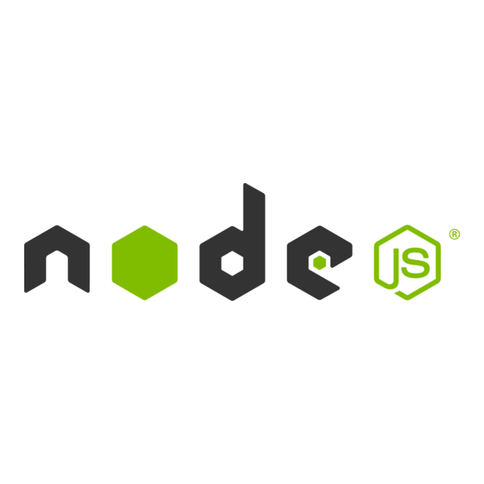

Hình 3.7. Logo Node.js

Node.js là môi trường chạy JavaScript phía máy chủ, cho phép xây dựng các ứng dụng backend có khả năng xử lý nhiều yêu cầu đồng thời. Với ưu điểm nhẹ, linh hoạt và phù hợp với các hệ thống web, Node.js được sử dụng phổ biến trong việc xây dựng API và xử lý nghiệp vụ phía server.

Trong đề tài “Ứng dụng đặt lịch khám bệnh cho phòng khám nhỏ”, Node.js được sử dụng để xây dựng phần backend của hệ thống. Node.js tiếp nhận các yêu cầu từ frontend, xử lý các chức năng như xác thực người dùng, đặt lịch khám, quản lý lịch hẹn, lưu hồ sơ khám bệnh, gửi thông báo và xuất phiếu kết quả khám. Việc sử dụng Node.js giúp backend hoạt động nhanh, dễ mở rộng và phù hợp với mô hình ứng dụng web hiện đại.

#### 3.5.2. Express.js

Hình 3.8. Logo Express

Express.js là một framework web được xây dựng trên nền tảng Node.js, hỗ trợ phát triển các API và ứng dụng web phía máy chủ một cách nhanh chóng, gọn nhẹ. Express.js cung cấp cơ chế định tuyến, middleware và xử lý request/response, giúp việc xây dựng backend trở nên rõ ràng và dễ quản lý hơn.

Trong đề tài “Ứng dụng đặt lịch khám bệnh cho phòng khám nhỏ”, Express.js được sử dụng để xây dựng các API phục vụ cho frontend. Các chức năng như đăng nhập, đặt lịch khám, quản lý lịch hẹn, nhập hồ sơ khám bệnh, quản lý dữ liệu và xuất PDF đều được xử lý thông qua các route và controller của Express.js. Việc sử dụng Express.js giúp hệ thống backend có cấu trúc rõ ràng, dễ mở rộng và phù hợp với quy mô của một ứng dụng đặt lịch khám bệnh cho phòng khám nhỏ.

#### 3.5.3. RESTful API

RESTful API là phương thức thiết kế API dựa trên các chuẩn HTTP, cho phép frontend và backend trao đổi dữ liệu một cách rõ ràng, thống nhất. Các thao tác thường được thực hiện thông qua các phương thức như GET, POST, PUT và DELETE, tương ứng với việc lấy dữ liệu, tạo mới, cập nhật và xóa dữ liệu.

Trong đề tài “Ứng dụng đặt lịch khám bệnh cho phòng khám nhỏ”, RESTful API được sử dụng để kết nối giao diện người dùng với máy chủ. Các chức năng như đăng nhập, tìm kiếm thông tin khám, đặt lịch, quản lý lịch hẹn, nhập hồ sơ khám bệnh, quản lý dữ liệu và gửi thông báo đều được thực hiện thông qua API. Việc áp dụng RESTful API giúp hệ thống có cấu trúc giao tiếp rõ ràng, dễ kiểm thử, dễ bảo trì và thuận tiện khi mở rộng thêm chức năng mới.

#### 3.5.4. Middleware và xử lý lỗi

Middleware là các hàm trung gian trong Express.js, được thực thi trong quá trình server tiếp nhận và xử lý yêu cầu từ client. Middleware có thể được sử dụng để kiểm tra dữ liệu, xác thực người dùng, phân quyền, ghi log, xử lý file tải lên hoặc chặn các yêu cầu không hợp lệ trước khi chuyển đến controller xử lý nghiệp vụ.

Trong đề tài “Ứng dụng đặt lịch khám bệnh cho phòng khám nhỏ”, middleware được sử dụng để hỗ trợ các chức năng như kiểm tra token đăng nhập, xác định vai trò người dùng, kiểm tra dữ liệu đầu vào và xử lý tệp tải lên. Nhờ đó, hệ thống có thể kiểm soát tốt quyền truy cập của bệnh nhân, bác sĩ và quản trị viên, đồng thời hạn chế các lỗi phát sinh do dữ liệu không hợp lệ.

Bên cạnh middleware, hệ thống cũng cần cơ chế xử lý lỗi tập trung để trả về thông báo phù hợp khi xảy ra sự cố như đăng nhập sai, không đủ quyền truy cập, dữ liệu không tồn tại hoặc lỗi máy chủ. Việc xử lý lỗi rõ ràng giúp frontend hiển thị thông báo chính xác cho người dùng và giúp quá trình bảo trì hệ thống thuận tiện hơn.

### 3.6. Cơ sở dữ liệu

Cơ sở dữ liệu là thành phần quan trọng dùng để lưu trữ và quản lý toàn bộ thông tin của hệ thống. Trong đề tài “Ứng dụng đặt lịch khám bệnh cho phòng khám nhỏ”, cơ sở dữ liệu được sử dụng để lưu các dữ liệu như tài khoản người dùng, thông tin bác sĩ, bệnh nhân, chuyên khoa, cơ sở khám, gói khám, lịch làm việc, lịch hẹn, hồ sơ khám bệnh, đơn thuốc, kết quả cận lâm sàng, thông báo và bài viết cẩm nang.

Hệ thống sử dụng MongoDB kết hợp với Mongoose để lưu trữ và thao tác dữ liệu. MongoDB phù hợp với hệ thống vì có khả năng lưu trữ dữ liệu linh hoạt dưới dạng tài liệu, dễ mở rộng và thuận tiện khi quản lý nhiều nhóm dữ liệu khác nhau. Mongoose được sử dụng để định nghĩa cấu trúc dữ liệu, thiết lập ràng buộc và hỗ trợ backend thao tác với MongoDB một cách rõ ràng hơn.

#### 3.6.1. MongoDB

Hình 3.9. Logo MongoDB

MongoDB là hệ quản trị cơ sở dữ liệu NoSQL, lưu trữ dữ liệu dưới dạng tài liệu thay vì các bảng quan hệ truyền thống. Dữ liệu trong MongoDB được tổ chức theo collection và document, có cấu trúc linh hoạt, dễ mở rộng và phù hợp với các ứng dụng web hiện đại.

Trong đề tài “Ứng dụng đặt lịch khám bệnh cho phòng khám nhỏ”, MongoDB được sử dụng để lưu trữ các thông tin chính của hệ thống như tài khoản người dùng, bác sĩ, bệnh nhân, chuyên khoa, cơ sở khám, lịch hẹn, hồ sơ khám bệnh, đơn thuốc, kết quả cận lâm sàng, bài viết và thông báo. Việc sử dụng MongoDB giúp hệ thống dễ dàng quản lý nhiều loại dữ liệu khác nhau và thuận tiện khi mở rộng thêm các chức năng mới trong tương lai.

#### 3.6.2. Mongoose

Mongoose là thư viện hỗ trợ làm việc với MongoDB trong môi trường Node.js, giúp định nghĩa cấu trúc dữ liệu, kiểm tra dữ liệu đầu vào và thao tác với cơ sở dữ liệu một cách thuận tiện hơn. Thay vì xử lý trực tiếp các document trong MongoDB, Mongoose cho phép xây dựng các schema và model rõ ràng, giúp mã nguồn dễ quản lý và nhất quán hơn.

Trong đề tài “Ứng dụng đặt lịch khám bệnh cho phòng khám nhỏ”, Mongoose được sử dụng để định nghĩa các đối tượng dữ liệu như người dùng, bác sĩ, bệnh nhân, lịch hẹn, hồ sơ khám bệnh, đơn thuốc và thông báo. Nhờ Mongoose, hệ thống có thể kiểm soát tốt cấu trúc dữ liệu, hỗ trợ xác thực thông tin trước khi lưu và thuận tiện khi truy xuất dữ liệu từ MongoDB.

#### 3.6.3. Lý do lựa chọn cơ sở dữ liệu NoSQL

Hệ thống được lựa chọn xây dựng trên cơ sở dữ liệu NoSQL, cụ thể là MongoDB, vì phù hợp với đặc thù dữ liệu của ứng dụng đặt lịch khám bệnh. Trong hệ thống này, dữ liệu gồm nhiều nhóm khác nhau như người dùng, bác sĩ, lịch hẹn, hồ sơ khám bệnh, đơn thuốc, kết quả cận lâm sàng, bài viết và thông báo. Các nhóm dữ liệu này có cấu trúc linh hoạt, có thể thay đổi theo từng chức năng và dễ phát sinh thêm trường mới trong quá trình phát triển.

So với cơ sở dữ liệu quan hệ, NoSQL cho phép lưu trữ dữ liệu dưới dạng tài liệu, thuận tiện hơn khi quản lý các thông tin không hoàn toàn cố định. Điều này đặc biệt phù hợp với hồ sơ khám bệnh, nơi mỗi lần khám có thể có dữ liệu khác nhau như triệu chứng, chẩn đoán, kết quả cận lâm sàng hoặc lịch tái khám. Bên cạnh đó, NoSQL còn hỗ trợ tốt cho việc mở rộng hệ thống khi số lượng người dùng và dữ liệu tăng lên.

Ngoài ra, MongoDB giúp việc truy xuất và cập nhật dữ liệu trở nên linh hoạt, phù hợp với mô hình ứng dụng web cần phản hồi nhanh. Vì vậy, việc sử dụng cơ sở dữ liệu NoSQL là lựa chọn hợp lý cho hệ thống đặt lịch khám bệnh của phòng khám nhỏ.

### 3.7. Xác thực và phân quyền

Xác thực và phân quyền là thành phần quan trọng giúp hệ thống kiểm soát người dùng và bảo vệ dữ liệu. Trong đề tài “Ứng dụng đặt lịch khám bệnh cho phòng khám nhỏ”, cơ chế này được sử dụng để đảm bảo chỉ những người dùng hợp lệ mới có thể truy cập vào các chức năng phù hợp với vai trò của mình.

Hệ thống hỗ trợ nhiều nhóm người dùng như khách truy cập, bệnh nhân, bác sĩ và quản trị viên. Sau khi đăng nhập, hệ thống xác thực thông tin tài khoản và xác định vai trò người dùng để phân quyền truy cập tương ứng. Nhờ đó, bệnh nhân chỉ có thể sử dụng các chức năng dành cho bệnh nhân, bác sĩ có thể truy cập khu vực làm việc của bác sĩ, còn quản trị viên có quyền quản lý dữ liệu và theo dõi vận hành hệ thống.

Cơ chế xác thực và phân quyền giúp tăng tính an toàn cho hệ thống, bảo vệ thông tin cá nhân và hồ sơ khám bệnh, đồng thời hạn chế truy cập trái phép vào các chức năng quan trọng. Đây là phần không thể thiếu trong một hệ thống quản lý khám bệnh có nhiều nhóm người dùng cùng tham gia.

Sơ đồ dưới đây mô tả quá trình xác thực tài khoản và phân quyền truy cập theo vai trò người dùng trong hệ thống.

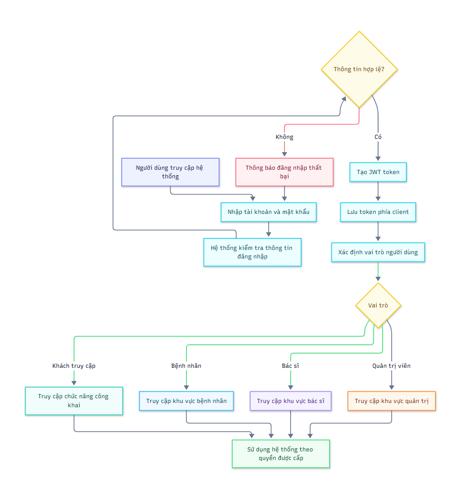

Hình 3.10. Luồng xác thực và phân quyền người dùng

#### 3.7.1. Xác thực người dùng

Xác thực người dùng là quá trình kiểm tra và xác nhận danh tính của người dùng khi truy cập hệ thống. Trong đề tài “Ứng dụng đặt lịch khám bệnh cho phòng khám nhỏ”, chức năng này được sử dụng để đảm bảo chỉ những tài khoản hợp lệ mới có thể đăng nhập và sử dụng các tính năng tương ứng.

Khi người dùng nhập tên đăng nhập và mật khẩu, hệ thống sẽ kiểm tra thông tin với dữ liệu đã được lưu trong cơ sở dữ liệu. Mật khẩu người dùng không được lưu dưới dạng thuần văn bản mà được mã hóa trước khi lưu trữ để tăng tính bảo mật. Nếu thông tin đăng nhập hợp lệ, hệ thống tạo phiên truy cập hoặc token xác thực để người dùng tiếp tục sử dụng hệ thống mà không cần đăng nhập lại ở mỗi thao tác.

Cơ chế xác thực giúp hệ thống kiểm soát tốt tài khoản người dùng, hạn chế truy cập trái phép và bảo vệ các thông tin quan trọng như hồ sơ khám bệnh, lịch hẹn và dữ liệu quản lý nội bộ. Đây là nền tảng quan trọng để hệ thống vận hành an toàn và ổn định.

#### 3.7.2. Phân quyền theo vai trò

Phân quyền theo vai trò là cơ chế xác định quyền truy cập của từng nhóm người dùng trong hệ thống. Trong đề tài “Ứng dụng đặt lịch khám bệnh cho phòng khám nhỏ”, hệ thống được thiết kế với nhiều vai trò khác nhau như khách truy cập, bệnh nhân, bác sĩ và quản trị viên. Mỗi vai trò sẽ được cấp quyền sử dụng các chức năng phù hợp với nhiệm vụ của mình.

Sau khi người dùng đăng nhập, hệ thống sẽ xác định vai trò tương ứng và điều hướng đến giao diện phù hợp. Khách truy cập chỉ có thể xem các thông tin công khai, bệnh nhân được sử dụng các chức năng đặt lịch và theo dõi hồ sơ khám bệnh, bác sĩ có quyền xử lý lịch hẹn và nhập hồ sơ khám bệnh, còn quản trị viên có quyền quản lý dữ liệu nền và theo dõi hoạt động hệ thống.

Cơ chế phân quyền giúp hệ thống đảm bảo tính an toàn, tránh việc người dùng truy cập vào các chức năng không thuộc phạm vi của mình. Đồng thời, phân quyền theo vai trò cũng giúp giao diện và nghiệp vụ của hệ thống được tổ chức rõ ràng, dễ quản lý và phù hợp với thực tế vận hành của phòng khám nhỏ.

#### 3.7.3. Bảo vệ dữ liệu người dùng

Bảo vệ dữ liệu người dùng là một yêu cầu quan trọng trong hệ thống đặt lịch khám bệnh, vì hệ thống có lưu trữ nhiều thông tin nhạy cảm như tài khoản, lịch hẹn, hồ sơ khám bệnh, đơn thuốc và kết quả cận lâm sàng. Trong đề tài “Ứng dụng đặt lịch khám bệnh cho phòng khám nhỏ”, các dữ liệu này cần được quản lý an toàn để tránh truy cập trái phép và đảm bảo quyền riêng tư cho người dùng.

Hệ thống áp dụng các cơ chế bảo vệ như mã hóa mật khẩu, xác thực người dùng, phân quyền theo vai trò và kiểm soát truy cập đến từng chức năng. Chỉ những người dùng có quyền phù hợp mới được xem hoặc chỉnh sửa dữ liệu liên quan. Ngoài ra, các thông tin quan trọng được xử lý thông qua backend thay vì để hiển thị trực tiếp trên giao diện, giúp giảm nguy cơ lộ dữ liệu.

Việc bảo vệ dữ liệu người dùng không chỉ giúp hệ thống an toàn hơn mà còn tạo sự tin tưởng cho bệnh nhân, bác sĩ và quản trị viên khi sử dụng. Đây là một trong những yếu tố cần thiết để hệ thống hoạt động ổn định và phù hợp với môi trường y tế thực tế.

### 3.8. Các công nghệ hỗ trợ khác

Ngoài các công nghệ chính dùng để xây dựng giao diện, xử lý nghiệp vụ và lưu trữ dữ liệu, hệ thống còn tích hợp một số công nghệ hỗ trợ nhằm hoàn thiện các chức năng đặc thù của ứng dụng đặt lịch khám bệnh. Đây là những thành phần giúp hệ thống vận hành đầy đủ hơn, nâng cao trải nghiệm người dùng và đáp ứng tốt hơn quy trình khám chữa bệnh thực tế tại phòng khám nhỏ.

Trong đề tài “Ứng dụng đặt lịch khám bệnh cho phòng khám nhỏ”, các công nghệ hỗ trợ khác bao gồm chức năng upload file và xử lý ảnh, xuất phiếu kết quả khám dưới dạng PDF, hiển thị biểu đồ thống kê, gửi và nhận thông báo hệ thống, đồng thời tích hợp tư vấn triệu chứng bằng AI. Các công nghệ này không chỉ hỗ trợ bác sĩ và quản trị viên trong quá trình làm việc mà còn giúp bệnh nhân dễ dàng theo dõi kết quả khám bệnh và nhận thông tin cập nhật kịp thời.

#### 3.8.1. Upload file và xử lý ảnh

Chức năng upload file và xử lý ảnh được sử dụng để lưu trữ các tệp đính kèm liên quan đến hồ sơ khám bệnh của bệnh nhân. Trong quá trình khám, bác sĩ có thể cần bổ sung các hình ảnh hoặc tài liệu như ảnh chụp kết quả cận lâm sàng, phiếu xét nghiệm, siêu âm, X-quang hoặc các tệp PDF liên quan. Các tệp này giúp hồ sơ khám bệnh đầy đủ hơn và thuận tiện cho việc tra cứu lại sau này.

Khi người dùng tải tệp lên hệ thống, backend sẽ kiểm tra định dạng, dung lượng và tính hợp lệ của file trước khi lưu trữ. Sau đó, thông tin tệp được gắn với hồ sơ khám bệnh tương ứng để bác sĩ và bệnh nhân có thể xem lại khi cần thiết. Việc xử lý tệp được thực hiện tập trung ở phía máy chủ nhằm đảm bảo tính an toàn, thống nhất và dễ quản lý dữ liệu.

Chức năng này đặc biệt quan trọng trong hệ thống đặt lịch khám bệnh, vì nó cho phép lưu trữ các minh chứng y khoa một cách trực quan và khoa học. Nhờ đó, bác sĩ có thể cập nhật hồ sơ khám bệnh đầy đủ hơn, còn bệnh nhân có thể theo dõi lại thông tin khám chữa bệnh một cách thuận tiện.

Sơ đồ dưới đây mô tả quy trình upload tệp kết quả cận lâm sàng trong hệ thống.

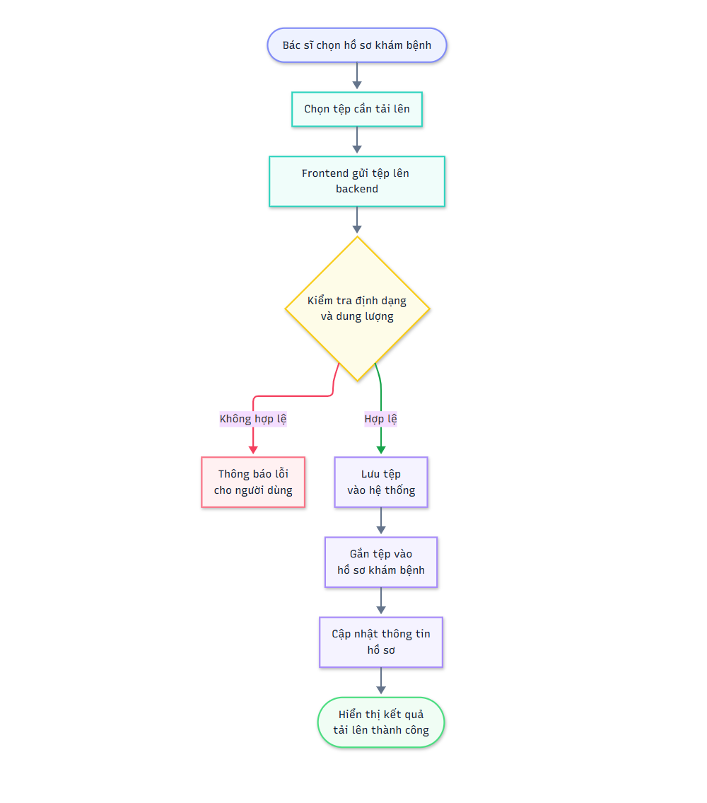

Hình 3.11. Quy trình Upload file và xử lý ảnh

#### 3.8.2. Xuất phiếu kết quả khám PDF

Chức năng xuất phiếu kết quả khám dưới dạng PDF được sử dụng để tạo ra một tài liệu hoàn chỉnh chứa các thông tin quan trọng sau khi buổi khám kết thúc. Tài liệu này thường bao gồm thông tin bệnh nhân, bác sĩ phụ trách, chẩn đoán, kết luận điều trị, đơn thuốc, kết quả cận lâm sàng và lịch tái khám nếu có.

Trong hệ thống “Ứng dụng đặt lịch khám bệnh cho phòng khám nhỏ”, sau khi bác sĩ hoàn tất hồ sơ khám bệnh, hệ thống sẽ tự động hoặc theo yêu cầu xuất ra một tệp PDF để lưu trữ và in ấn. Việc sử dụng định dạng PDF giúp phiếu kết quả khám được hiển thị thống nhất trên nhiều thiết bị, dễ dàng chia sẻ và thuận tiện cho bệnh nhân khi cần xem lại thông tin khám bệnh.

Chức năng này giúp quá trình quản lý hồ sơ khám bệnh trở nên chuyên nghiệp và rõ ràng hơn. Đồng thời, nó hỗ trợ bệnh nhân có thể lưu lại tài liệu khám chữa bệnh một cách thuận tiện, còn phòng khám có thể sử dụng lại dữ liệu khi cần tra cứu hoặc đối chiếu.

Sơ đồ dưới đây mô tả quy trình xuất phiếu kết quả khám PDF trong hệ thống.

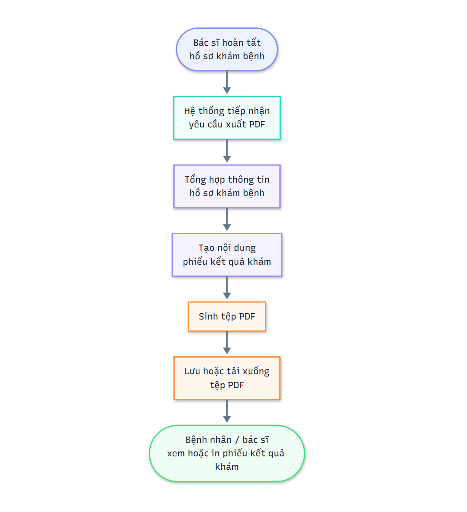

Hình 3.12. Quy trình xuất phiếu kết quả khám PDF

#### 3.8.3. Tư vấn triệu chứng bằng AI

Chức năng tư vấn triệu chứng bằng AI được tích hợp nhằm hỗ trợ người dùng trong việc tìm hiểu thông tin sức khỏe trước khi đặt lịch khám. Khi người dùng nhập mô tả triệu chứng hoặc nhu cầu tư vấn, hệ thống sẽ phân tích nội dung và đưa ra gợi ý sơ bộ về chuyên khoa phù hợp, mức độ cần đi khám và một số lưu ý ban đầu. Đây là chức năng hỗ trợ giúp bệnh nhân định hướng nhanh hơn khi chưa xác định rõ nên khám ở đâu.

Trong đề tài “Ứng dụng đặt lịch khám bệnh cho phòng khám nhỏ”, chức năng này được triển khai thông qua Gemini API. Dữ liệu đầu vào từ người dùng sẽ được gửi đến dịch vụ AI để xử lý, sau đó hệ thống nhận kết quả phản hồi và hiển thị lại cho người dùng dưới dạng gợi ý tư vấn. Từ đó, người dùng có thể tiếp tục xem thông tin bác sĩ, chuyên khoa hoặc tiến hành đặt lịch khám phù hợp.

Việc tích hợp AI giúp hệ thống tăng tính tiện ích và hiện đại hơn, đồng thời nâng cao trải nghiệm sử dụng. Tuy nhiên, kết quả từ AI chỉ mang tính chất tham khảo và không thay thế cho chẩn đoán của bác sĩ chuyên môn. Vì vậy, hệ thống vẫn định hướng người dùng đến cơ sở khám bệnh để được thăm khám chính xác khi cần thiết.

Sơ đồ dưới đây minh họa luồng tư vấn triệu chứng bằng AI trong hệ thống.

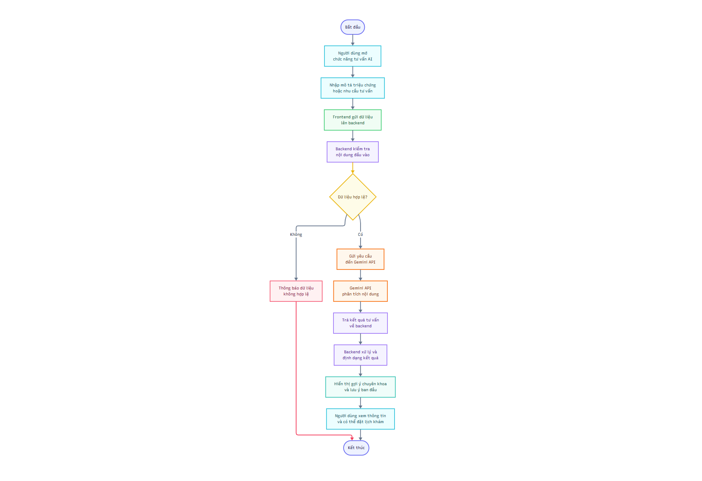

Hình 3.12. Luồng tư vấn triệu chứng bằng AI

#### 3.8.4. Thông Báo Hệ Thống

Thông báo hệ thống là thành phần hỗ trợ truyền tải kịp thời các thay đổi quan trọng trong quá trình đặt lịch, xử lý lịch hẹn, quản lý hàng đợi và cập nhật hồ sơ khám bệnh. Đối với ứng dụng đặt lịch khám bệnh, thông báo giúp bệnh nhân nắm được trạng thái lịch khám, giúp bác sĩ theo dõi các yêu cầu mới và giúp quản trị viên giám sát các sự kiện vận hành cần xử lý.

Trong hệ thống, thông báo được lưu trữ trong cơ sở dữ liệu MongoDB thông qua collection `Notifications`. Mỗi thông báo bao gồm các thông tin chính như người nhận, vai trò nhận thông báo, tiêu đề, nội dung, loại thông báo, trạng thái đã đọc hoặc chưa đọc, đường dẫn điều hướng liên quan và dữ liệu bổ sung phục vụ xử lý nghiệp vụ. Cách thiết kế này giúp hệ thống vừa hiển thị được danh sách thông báo lịch sử, vừa có thể phân loại thông báo theo từng ngữ cảnh như xác nhận lịch hẹn, hủy lịch, yêu cầu đổi lịch, gọi vào phòng khám, cập nhật hồ sơ khám bệnh, nhắc tái khám hoặc thông báo từ danh sách chờ.

Ở phía backend, hệ thống sử dụng Node.js và Express.js để xây dựng các API phục vụ việc lấy danh sách thông báo, đánh dấu một thông báo là đã đọc và đánh dấu toàn bộ thông báo là đã đọc. Các API này được bảo vệ bởi middleware xác thực và phân quyền, bảo đảm bệnh nhân, bác sĩ hoặc quản trị viên chỉ truy cập được các thông báo thuộc phạm vi của mình. Với bệnh nhân, thông báo được lọc theo tài khoản người dùng; với bác sĩ, hệ thống có thể lọc theo tài khoản hoặc hồ sơ bác sĩ; với quản trị viên, hệ thống hỗ trợ nhận các thông báo theo vai trò quản trị.

Bên cạnh việc lưu thông báo vào cơ sở dữ liệu, hệ thống còn sử dụng Socket.IO để gửi thông báo theo thời gian thực. Khi có sự kiện nghiệp vụ phát sinh, chẳng hạn bệnh nhân đặt lịch mới, bác sĩ xác nhận lịch, bệnh nhân gửi yêu cầu hủy lịch, hồ sơ khám bệnh được tạo hoặc lịch tái khám sắp đến hạn, backend tạo bản ghi thông báo và phát sự kiện `notification:new` đến đúng phòng kết nối của người dùng hoặc vai trò tương ứng. Nhờ đó, người dùng có thể nhận được thông báo mới ngay khi đang sử dụng hệ thống mà không cần tải lại trang.

Ở phía frontend, ReactJS hiển thị thông báo thông qua biểu tượng chuông trên thanh điều hướng. Thành phần này tải danh sách thông báo từ API, hiển thị số lượng thông báo chưa đọc, cho phép lọc thông báo, đánh dấu đã đọc và điều hướng người dùng đến màn hình liên quan khi bấm vào từng thông báo. Ngoài danh sách thông báo, hệ thống còn hiển thị toast để nhấn mạnh các sự kiện cần chú ý như lịch khám được cập nhật, hồ sơ khám bệnh đã có kết quả, bác sĩ có lịch mới hoặc bệnh nhân nhận được lời mời từ danh sách chờ.

Việc kết hợp giữa lưu trữ thông báo trong MongoDB và gửi thông báo thời gian thực bằng Socket.IO giúp hệ thống đáp ứng cả hai nhu cầu: đảm bảo dữ liệu thông báo không bị mất khi người dùng không trực tuyến và nâng cao tính tức thời khi người dùng đang thao tác trên ứng dụng. Đây là một thành phần quan trọng giúp quy trình đặt lịch và khám bệnh diễn ra rõ ràng hơn, giảm khả năng bỏ sót thông tin và cải thiện trải nghiệm sử dụng cho bệnh nhân, bác sĩ cũng như quản trị viên.
